# Modulo 1 – Esercizio 1: MFA e Conditional Access

[← Indice modulo](README.md) · [Esercizio 2 →](Esercizio-02.md)

## Passo 1 – Copiare il materiale del corso sul desktop della VM

1. Aprire il browser web sulla VM SEA-DEV1.
2. Copiare il **link del materiale** (fornito dal docente) e scaricare il materiale.

## Passo 2 – Accedere a Microsoft Entra

1. Accedere come **amministratore del tenant Microsoft 365** al portale:

   ```text
   https://entra.microsoft.com
   ```

2. Se richiesto, **impostare la MFA (Multi-Factor Authentication)** seguendo la procedura guidata proposta dal portale.

## Passo 3 – Verificare/configurare i metodi di autenticazione

Entrare su **Entra ID > Authentication methods > Policy**.

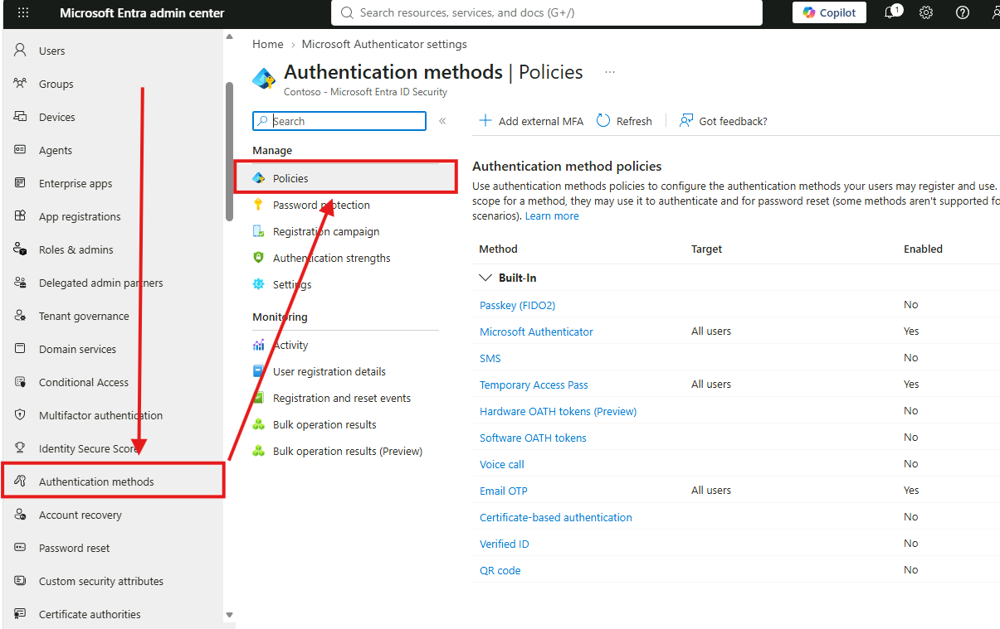

1. Verificare che **Microsoft Authenticator** sia impostato su **All users**.

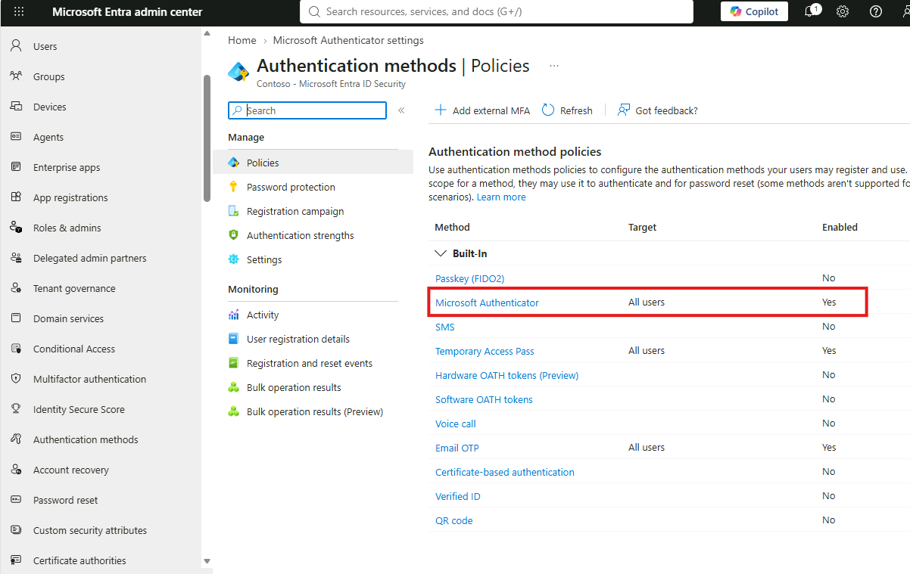

   - In caso contrario, **abilitarlo per tutti gli utenti**.

2. **Disattivare** i seguenti metodi di autenticazione:

- **Passkey**
- **Software OATH token**
- **Email OTP**

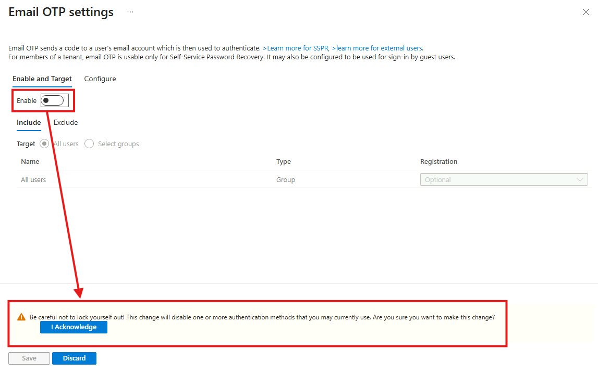
 Procedura: cliccare sul metodo interessato → nella sezione **Enable and target** selezionare **Disable**


> [!TIP]
> Microsoft consiglia di gestire i metodi dalla policy unificata **Authentication methods** e di preferire metodi resistenti al phishing (Authenticator, passkey). La disattivazione di Passkey/OATH/Email OTP qui serve solo a semplificare il lab.
>
> 📖 [Gestire i metodi di autenticazione in Microsoft Entra ID](https://learn.microsoft.com/entra/identity/authentication/concept-authentication-methods-manage)

## Passo 4 – Creare la Conditional Access Policy per la MFA

Entrare su **Entra ID > Conditional Access > + Create new policy**.

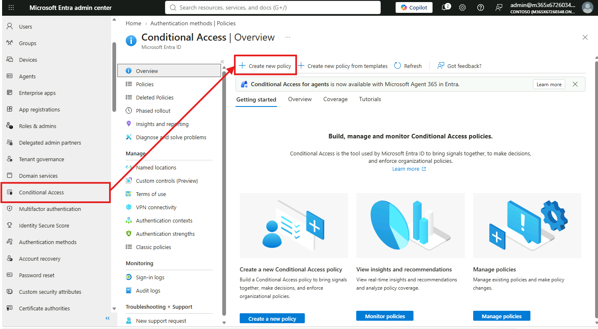

Inserire nel campo Name:

```text
MFA Required - All User (exclude administrator)
```

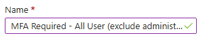
In Users configurare:

- **Include:** `All users`

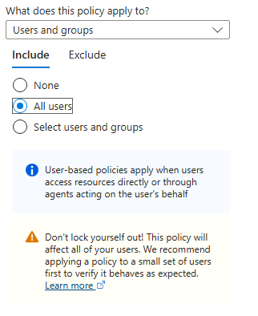

- **Exclude:** `Users and groups` → selezionare **`administrator@XXXXXX`** (dove `XXXXXX` è il suffisso del proprio tenant)

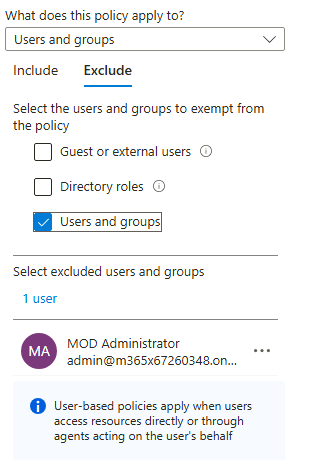

> [!WARNING]
> **IMPORTANTE:** non dimenticare di escludere l'account amministratore, per evitare il rischio di lockout dal tenant.

In **Target resources** configurare:
- **Include:** `All resources` _(in precedenza denominato "All cloud apps")_

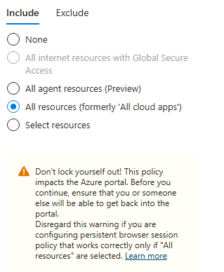

Andare su **Grant** e configurare:

- **Grant access**
- Selezionare: **Require multifactor authentication**

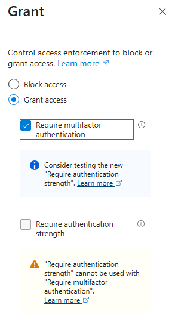

Mettere **Enable policy** su `On`

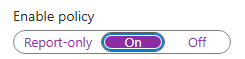

> [!NOTE]
>**Chiamare il docente per conferma della corretta configurazione** prima di procedere.

Premere **Create** per salvare la policy.

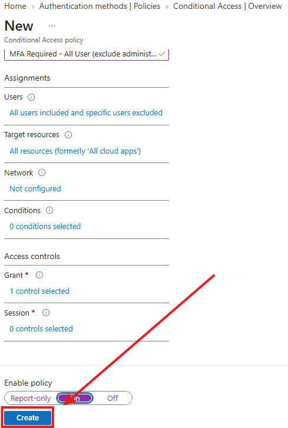

> [!CAUTION]
> In produzione l'esclusione va fatta su **account di emergenza (break-glass)** dedicati, non sull'account amministrativo di uso quotidiano. Microsoft raccomanda inoltre di creare le nuove policy in **Report-only**, verificarne l'impatto e solo dopo portarle su **On**.
>
> 📖 [Gestire gli account di accesso di emergenza](https://learn.microsoft.com/entra/identity/role-based-access-control/security-emergency-access) · [Modalità report-only](https://learn.microsoft.com/entra/identity/conditional-access/concept-conditional-access-report-only)

> [!IMPORTANT]
> Conditional Access richiede licenze **Microsoft Entra ID P1** (incluse in Microsoft 365 E3/E5). Prima di creare policy personalizzate, verificare che i **Security defaults** siano disabilitati: le due funzionalità non possono coesistere.
>
> 📖 [Policy comuni di Conditional Access](https://learn.microsoft.com/entra/identity/conditional-access/concept-conditional-access-policy-common)

---

[← Indice modulo](README.md) · [Esercizio 2 →](Esercizio-02.md)
