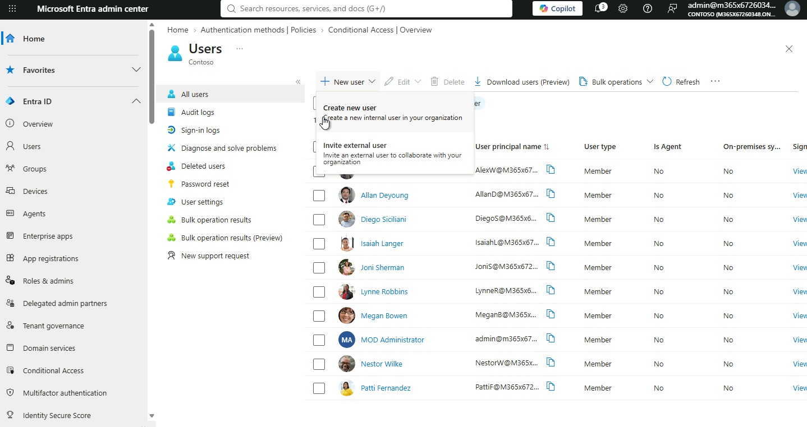
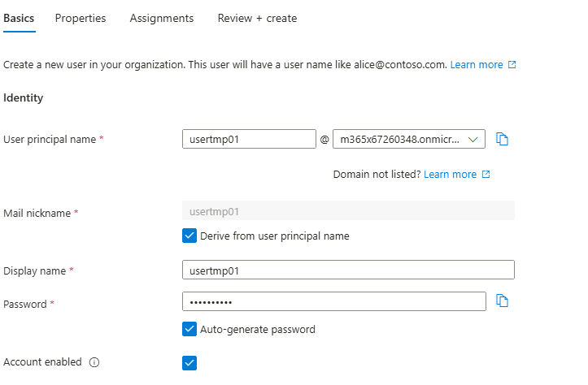
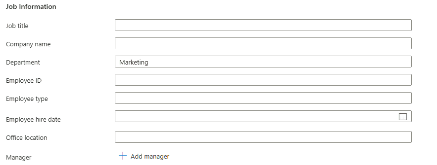
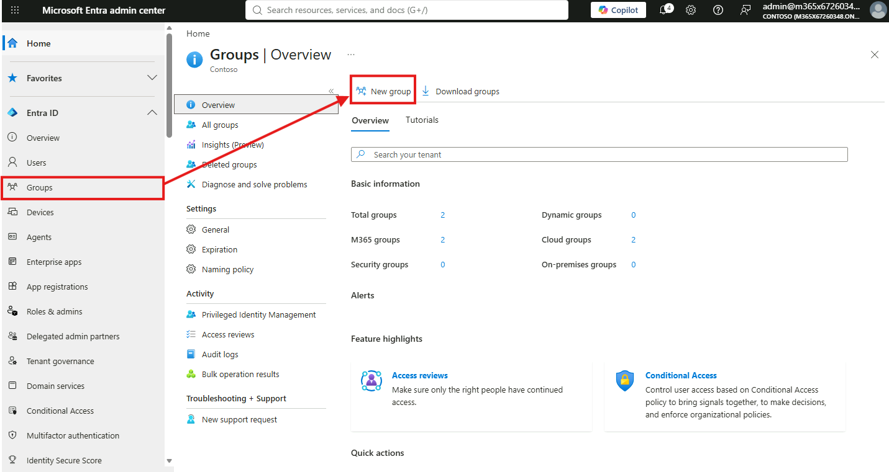
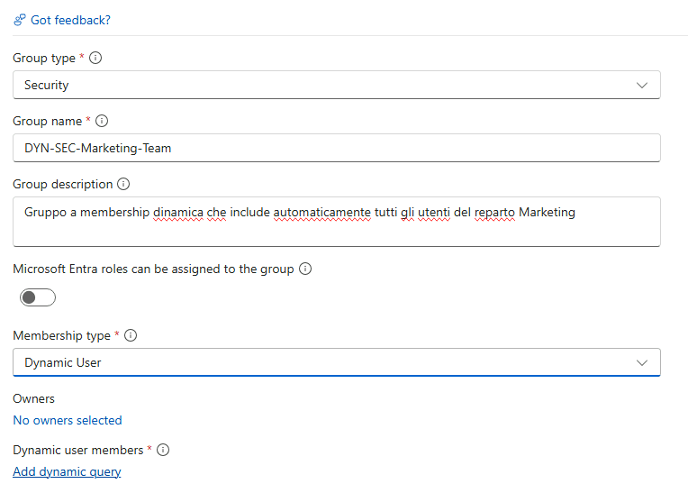
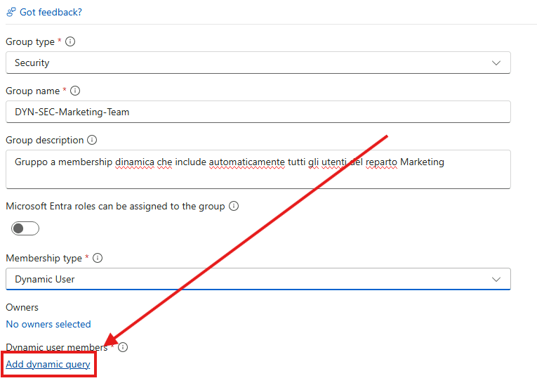
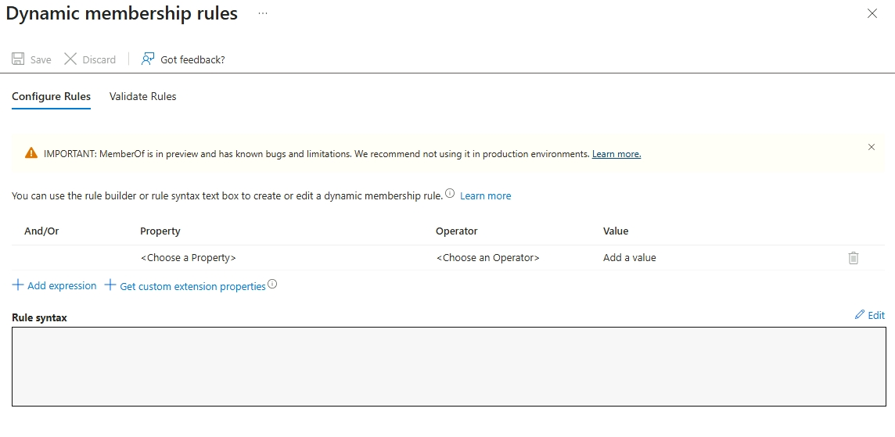
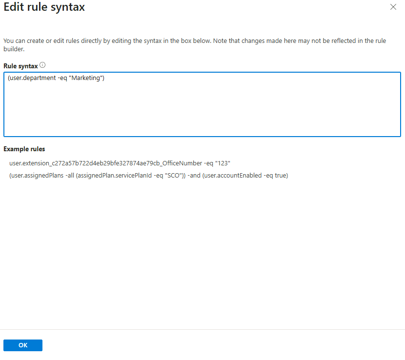
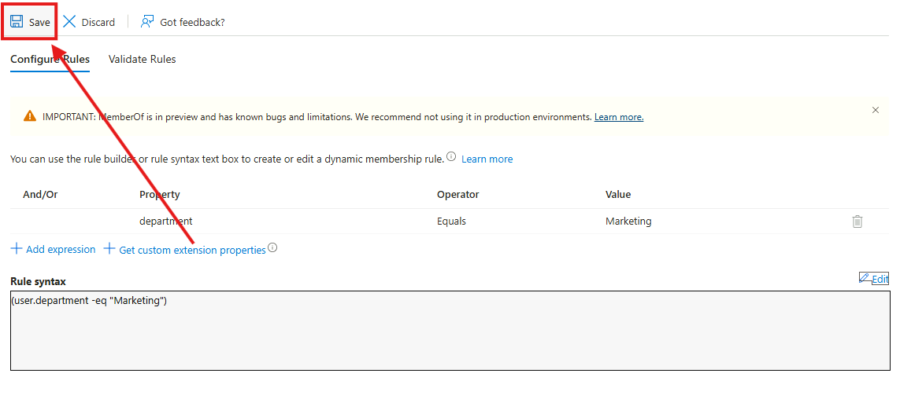
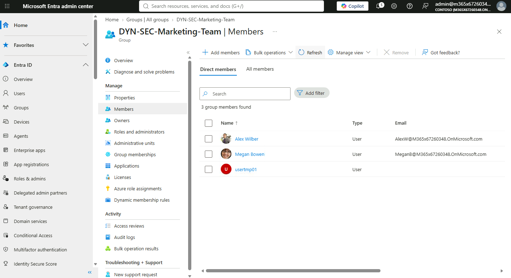

# Modulo 1 – Esercizio 2: Utenti e gruppi dinamici

[← Esercizio 1](Esercizio-01.md) · [Indice modulo](README.md) · [Esercizio 3 →](Esercizio-03.md)

## Passo 1 – Accesso a Microsoft Entra

1. Aprire il browser web sulla VM SEA-DEV1, dopo aver effettuato l'accesso come **administrator locale**.
2. Accedere come **amministratore del tenant Microsoft 365** al portale:

   ```text
   https://entra.microsoft.com
   ```

3. Se richiesto, **impostare la MFA (Multi-Factor Authentication)** seguendo la procedura guidata proposta dal portale.

## Passo 2 – Creazione del nuovo utente

Entrare su **Entra ID > Users > New user > Create new user**.



1. Impostare come **User principal name**: `usertmp01@XXXXXX` (dove `XXXXXX` è il suffisso del proprio tenant).

   ```text
   usertmp01@XXXXXX
   ```



2. Nella sezione **Properties**, compilare gli attributi richiesti impostando un **attributo "parlante"**  `Department` con un valore riconoscibile, questo attributo sarà usato al Passo 3 come criterio di appartenenza per il gruppo dinamico.



3. Completare la procedura e selezionare **Create** per salvare il nuovo utente.

> [!NOTE]
> Prendere nota del valore esatto scelto per l'attributo (es. `Department = Marketing`): dovrà essere riutilizzato **identico** nella regola del gruppo dinamico al passo successivo.

## Passo 3 – Creazione del gruppo dinamico

Andare su **Entra ID > Groups > New group**.



Configurare il gruppo seguendo queste specifiche:

1. **Group type:** `Security`
2. **Group name:**

   ```text
   DYN-SEC-Marketing-Team
   ```

3. **Group description:**

   ```text
   Gruppo a membership dinamica che include automaticamente tutti gli utenti del reparto Marketing
   ```

4. **Membership type:** selezionare **Dynamic User**.



1. Selezionare **Add dynamic query**.



2. Nell'editor della regola (**Rule builder** oppure **Edit** per la sintassi avanzata), impostare la condizione in base all'attributo scelto per `usertmp01`, ad esempio:

```text
(user.department -eq "Marketing")
```



3. Selezionare **Save**, poi **Create** per creare il gruppo.




> [!WARNING]
> La creazione e la valutazione dei **gruppi a membership dinamica** richiede una licenza **Microsoft Entra ID P1 o P2** assegnata al tenant.

> [!TIP]
> Nel **Rule builder** si possono combinare più condizioni con `-and`/`-or`. Usare **Validate rules** per testare la regola su utenti specifici prima di salvare.
>
> [Regole di membership dinamica per i gruppi](https://learn.microsoft.com/entra/identity/users/groups-dynamic-membership)

## Passo 4 – Verifica dell'appartenenza al gruppo

1. Andare su **Entra ID > Groups**, selezionare il gruppo dinamico appena creato.
2. Aprire la sezione **Members**.
3. Verificare che **`usertmp01`** compaia tra i membri del gruppo.



> [!NOTE]
> La valutazione della regola dinamica **non è istantanea**: può richiedere alcuni minuti prima che l'utente compaia effettivamente tra i membri del gruppo. Se non compare subito, attendere e aggiornare la pagina.

> [!NOTE]
> Nei gruppi dinamici **non è possibile aggiungere o rimuovere membri manualmente**: la membership è governata esclusivamente dalla regola. Per togliere un utente occorre modificarne l'attributo (o la regola).

---

[← Esercizio 1](Esercizio-01.md) · [Indice modulo](README.md) · [Esercizio 3 →](Esercizio-03.md)
