# Modulo 1 · Esercizio 3: Gruppi, licenze e utenti guest

[← Esercizio 2](Esercizio-02.md) · [Indice modulo](README.md) · [Esercizio 4 →](Esercizio-04.md)

> [!NOTE]
> In questo esercizio le password temporanee sono valori **di laboratorio**: non riutilizzarle in ambienti reali.

## Passo 1 · Creazione di USER02 e primo accesso da SEA-DEV2

1. Ripartendo dalla VM `SEA-DEV1` andare su https://entra.microsoft.com/.
2. Andare su **Users > All Users > Create new user.**
3. Creare **USER02**, compilando gli attributi richiesti:

| Campo                 | Valore            |
| --------------------- | ----------------- |
| **Nome visualizzato** | `User02`          |
| **Nome utente**       | `User02@XXXXXX`   |
| **Password**          | `TempPassword02!` |
| **Usage Location**    | Italy             |

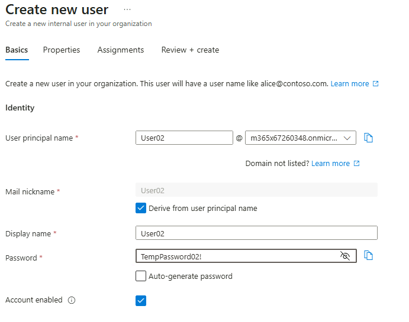

4. Accedere alla **VM `SEA-DEV2` come administrator locale**.
5. Aprire il browser e accedere a `https://portal.office.com` **via Web** con le credenziali di **USER02**.

   ```text
   https://portal.office.com
   ```

6. Seguire il flusso guidato al primo accesso:
    - **Configurazione MFA** (es. Microsoft Authenticator), se richiesta dalle policy configurate negli esercizi precedenti.

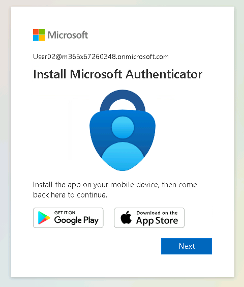

7. Cambiare **password** come da procedura guidata e salvarla.

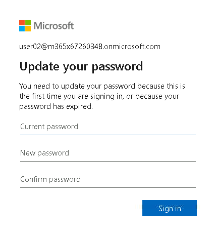

## Passo 2 · Creazione di USER03 e primo accesso da SEA-DEV3

1. Ripartendo dalla VM `SEA-DEV1` andare su https://entra.microsoft.com/.
2. Andare su **Users > All Users > Create new user.**
3. Creare **USER03**, compilando gli attributi richiesti:

| Campo                 | Valore            |
| --------------------- | ----------------- |
| **Nome visualizzato** | `User03`          |
| **Nome utente**       | `User03@XXXXXX`   |
| **Password**          | `TempPassword03!` |
| **Usage Location**    | Italy             |

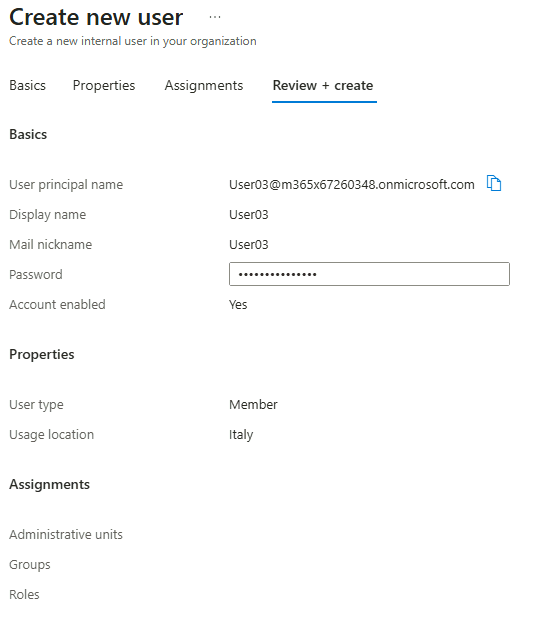

4. Accedere alla **VM `SEA-DEV3` come administrator locale**.
5. Aprire il browser e accedere a `https://portal.office.com` **via Web** con le credenziali di **USER03**.

   ```text
   https://portal.office.com
   ```

6. Seguire il flusso guidato di **cambio password** e **configurazione MFA** se richiesta.

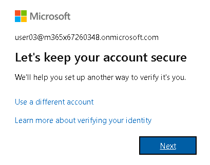

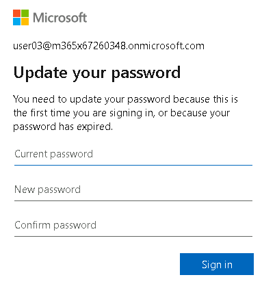

## Passo 3 · Creazione del Security Group statico

1. Riaprire la VM `SEA-DEV1` e recarsi su https://entra.microsoft.com/.

2. Andare su **Groups > All groups > New group**

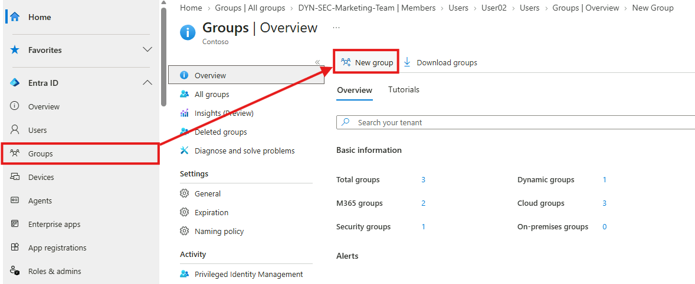

3. Configurare il gruppo con le seguenti specifiche:
4. **Group type:** `Security`
5. **Membership type:** `Assigned` (statico).
6. **Group name**:

   ```text
   GRP_SEC_STATIC
   ```

7. **Group description**:

   ```text
   Gruppo di sicurezza statico per l'assegnazione centralizzata delle licenze Microsoft 365 E5
   ```

8. In **Members**, aggiungere manualmente:
    - **User02**
    - **User03**

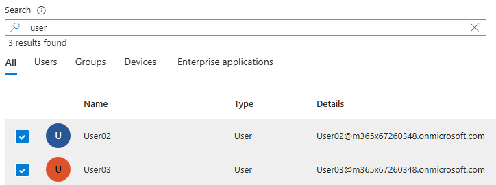

9. Selezionare **Create** per salvare il gruppo.

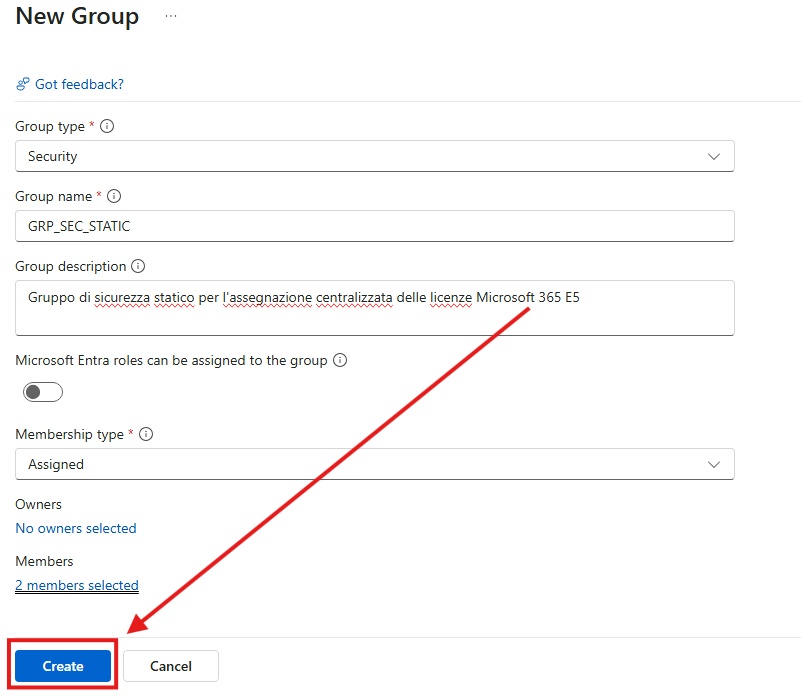

## Passo 4 · Assegnazione licenze Microsoft 365 E5 al gruppo

1. Andare su https://admin.cloud.microsoft/ , **Billing** e successivamente **Licenses**.

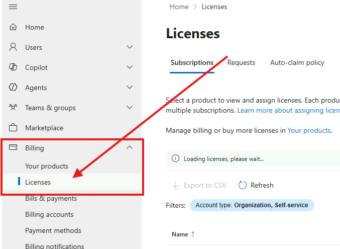

2. Selezionare il prodotto **Office 365 E5** e premere **Assign licenses**.

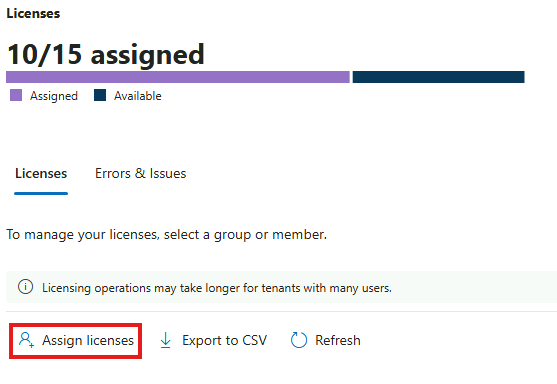

3. Aggiungere il gruppo **`GRP_SEC_STATIC`** come destinatario della licenza.

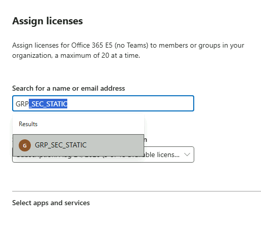

4. Confermare l'assegnazione con **Assign**.

> [!NOTE]
> L'assegnazione tramite gruppo può richiedere alcuni minuti prima che le licenze risultino effettivamente attive sugli account di **User02** e **User03**.

5. Ripetere anche per le licenze **Microsoft Teams Enterprise**.

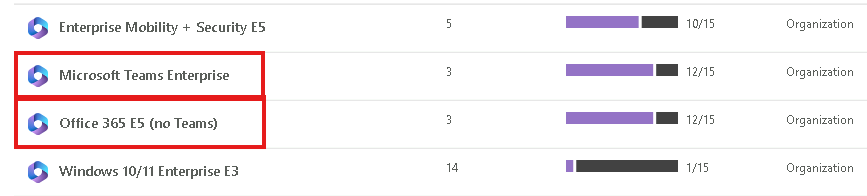

6. Controllare che l'assegnazione delle licenze ai due utenti sia andata a buon fine.

> [!IMPORTANT]
> L'assegnazione delle licenze **basata su gruppo** richiede **Microsoft Entra ID P1** (o superiore). Per assegnare licenze è necessario impostare la **Usage location** dell'utente, altrimenti l'assegnazione fallisce.
>
> [Assegnare licenze tramite appartenenza a gruppi](https://learn.microsoft.com/entra/identity/users/licensing-groups-assign)

## Passo 5 · Creazione del gruppo Microsoft 365 (GRP_365_STATIC)

1. Tornare su https://admin.cloud.microsoft/ e procedere su **Teams & Groups > Active Teams & Groups > Add a Microsoft 365 group** con le seguenti specifiche:

2. **Group name** `GRP_365_STATIC`
3. **Group description** `Gruppo Microsoft 365 statico per collaborazione tra User02 e User03`

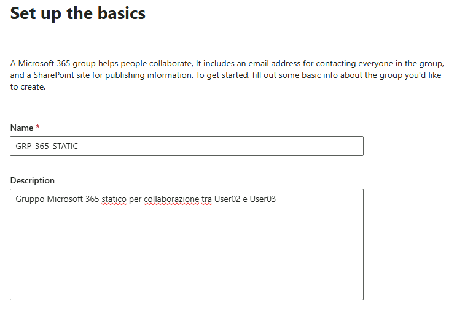

4. Inserire **User02** come **Owner**; come **Member** inserire **User02** e **User03**.
5. Come **Group mail** mettere: GRP_365_STATIC
6. Impostare **Privacy Private**.

 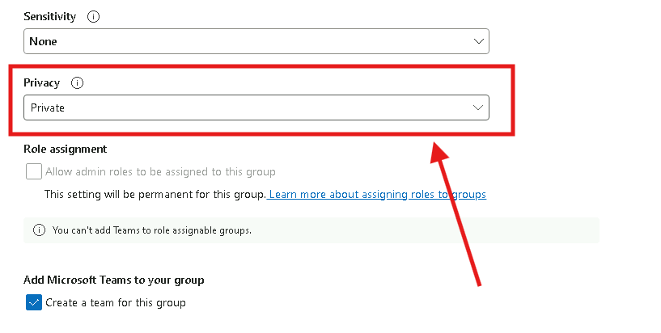

7. Selezionare **Create Group** per salvare il gruppo.

## Passo 6 · Verifica lato USER03 (da SEA-DEV3) e invito guest

1. Accedere alla **VM `SEA-DEV3` come administrator locale**.
2. Aprire il browser e accedere a `https://outlook.com` **via Web** con le credenziali di **User03**.

   ```text
   https://outlook.com
   ```

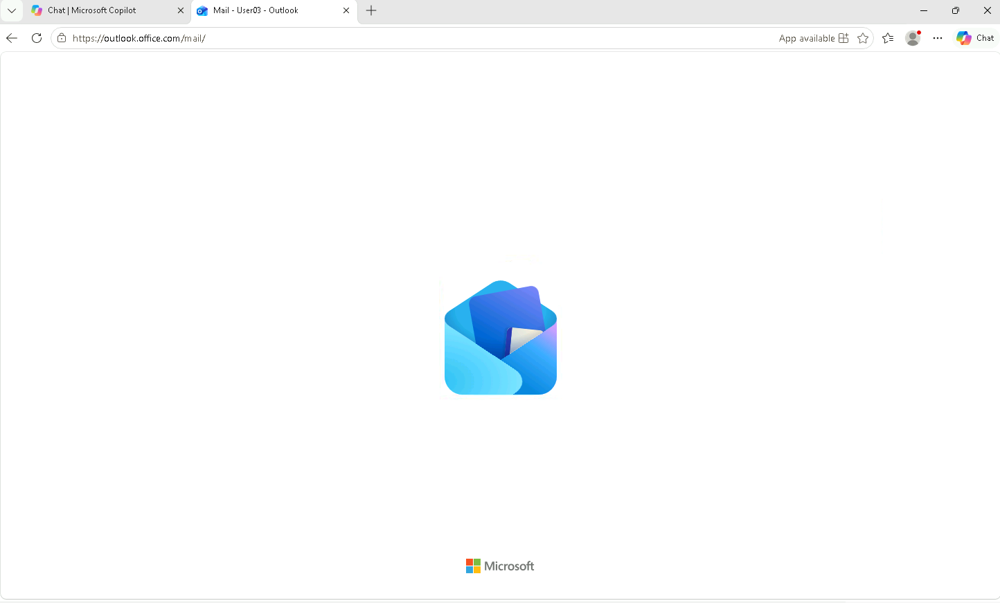

3. Verificare che **User03**:
- Riesca ad accedere alla propria posta e a quella del **gruppo GRP_365_STATIC** (cartella gruppo in Outlook).
- Abbia un **calendario condiviso** del gruppo visibile in Outlook.
- Veda il gruppo **GRP_365_STATIC** tra i gruppi a cui appartiene (barra laterale sinistra).

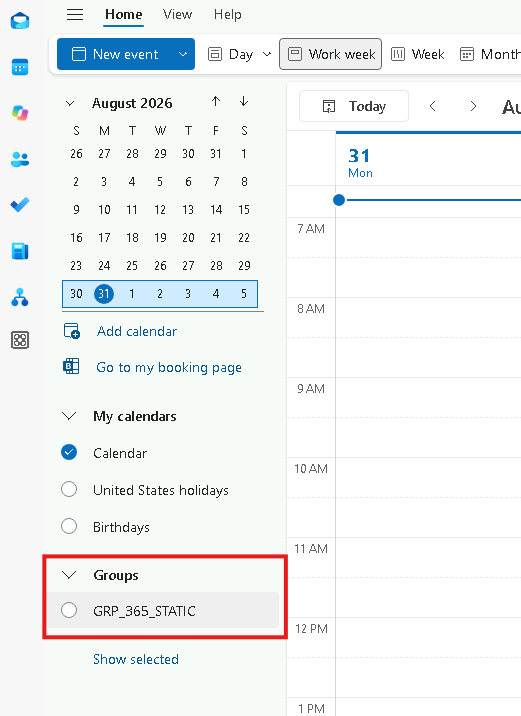

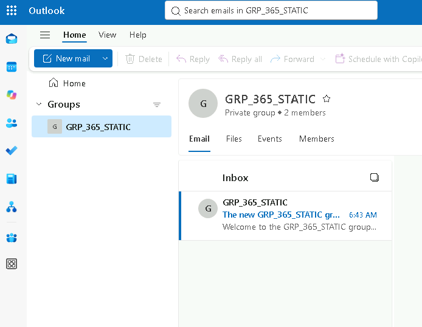

4. Dalla pagina del gruppo **GRP_365_STATIC** di Outlook andare nella sezione **Members**, selezionare **Add members** e **invitare un guest** inserendo il proprio indirizzo email personale, come `personal@xxx.com`.

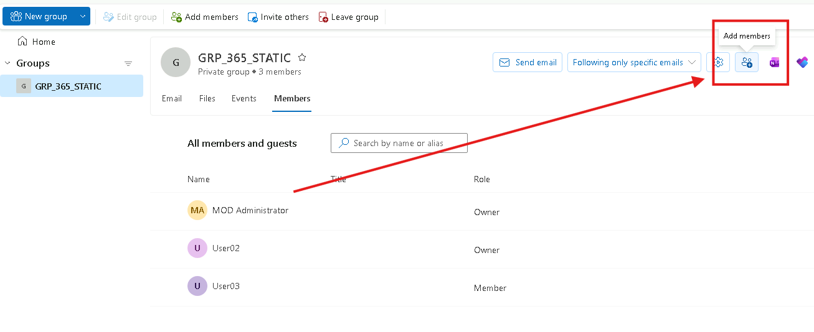

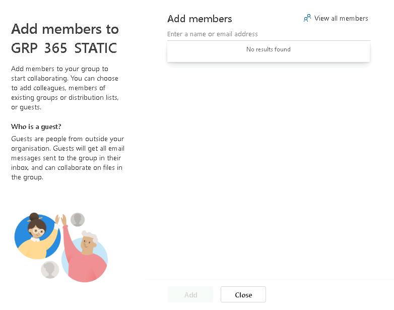

> [!WARNING]
>Un **membro** del gruppo può solo *proporre* l'aggiunta di un guest: la richiesta deve essere approvata da un **owner** (vedi Passo 7). Solo l'owner può invitare direttamente utenti esterni (Passo 8).

5. Provare ora a invitare **Alex Wilber** tramite il suo UPN:

   ```text
   alexw@XXXXXX
   ```

> [!TIP]
> Chi può invitare guest è definito dalle **External collaboration settings** di Microsoft Entra ID, che si combinano con le impostazioni di condivisione di Microsoft 365 Groups e SharePoint.
>
> [Configurare le impostazioni di collaborazione esterna](https://learn.microsoft.com/entra/external-id/external-collaboration-settings-configure)

## Passo 7 · Verifica lato USER02 (da SEA-DEV2): approvazione della richiesta

1. Accedere alla **VM `SEA-DEV2` come administrator locale**.
2. Aprire il browser e accedere a `https://outlook.com` **via Web** con le credenziali di **User02**.

   ```text
   https://outlook.com
   ```

3. Controllare l'arrivo della mail di richiesta e andare sul gruppo.

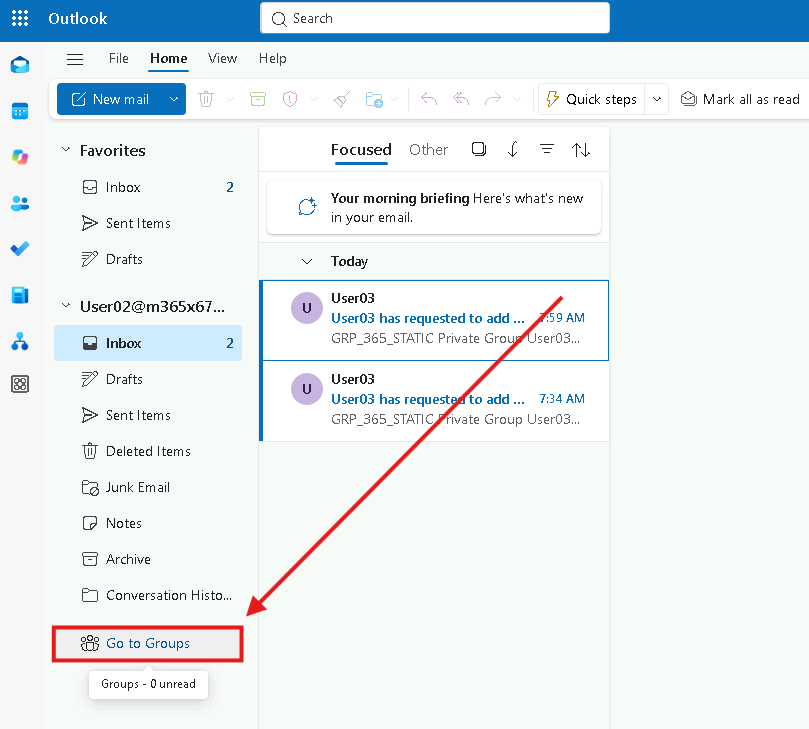

4. Verificare l'arrivo di una **richiesta di autorizzazione** per l'accesso di membro al gruppo (in quanto **owner** di GRP_365_STATIC, User02 riceve la richiesta di approvazione per l'aggiunta del membri).


5. **Autorizzare** la richiesta.

## Passo 8 · Invitare external users da Owner

1. Accedere alla **VM `SEA-DEV2` come administrator locale**.
2. Aprire il browser e accedere a `https://outlook.com` **via Web** con le credenziali di **User02**.

   ```text
   https://outlook.com
   ```

3. Andare sul gruppo **GRP_365_STATIC** e andare su **members**.
4. Premere su **Add members** e invitare una mail personale del tipo:

   ```text
   personal@xxx.com
   ```

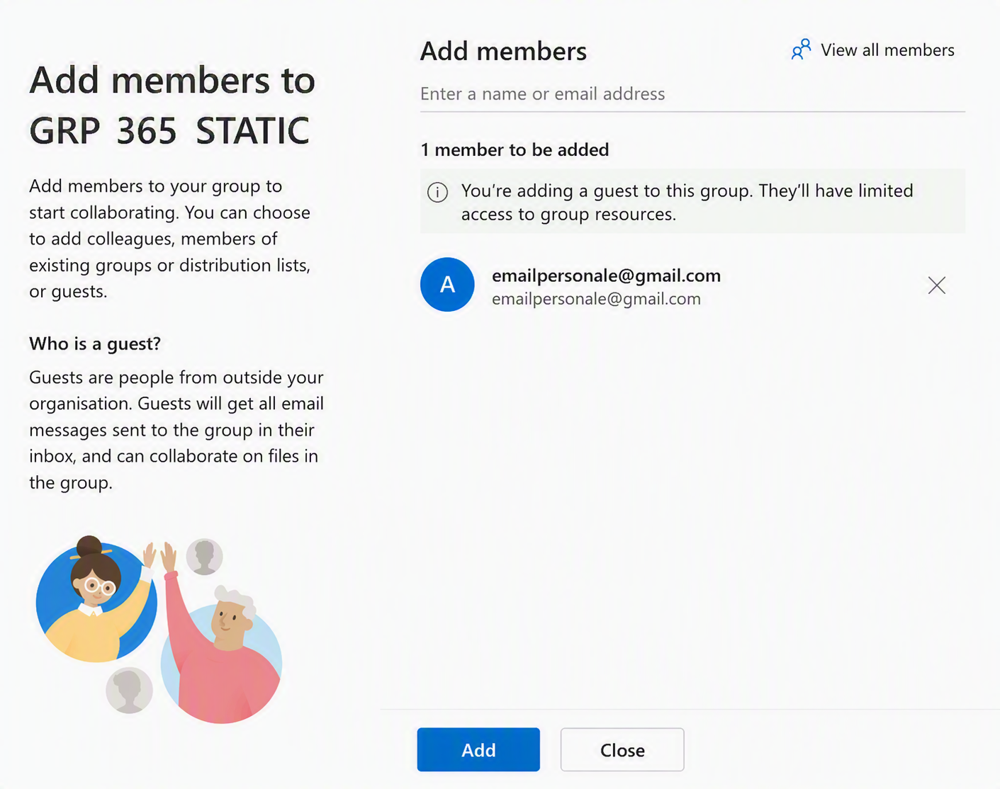

5. Sulla casella di posta personale **`personal@xxx.com`**, verificare la ricezione dell'email di invito ("Microsoft Invitations" per conto del tenant).

   ```text
   personal@xxx.com
   ```

6. Aprire l'email e selezionare **Accept invitation**.

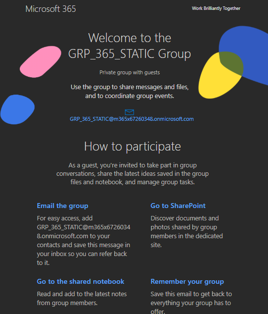

7. Accedere con le proprie credenziali (account Microsoft personale o, se non presente, crearne uno seguendo la procedura guidata).
8. Completare il **consenso** alle informazioni richieste dal tenant.
9. Se richiesto dalle policy del tenant, **configurare la MFA** per l'account guest.

---

[← Esercizio 2](Esercizio-02.md) · [Indice modulo](README.md) · [Esercizio 4 →](Esercizio-04.md)
