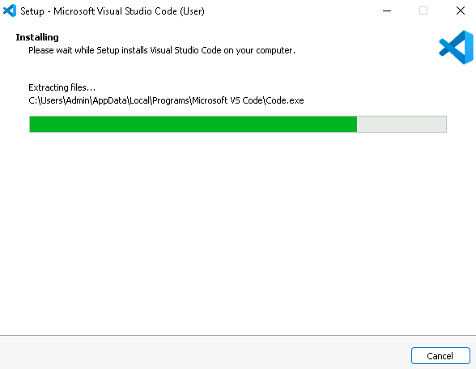
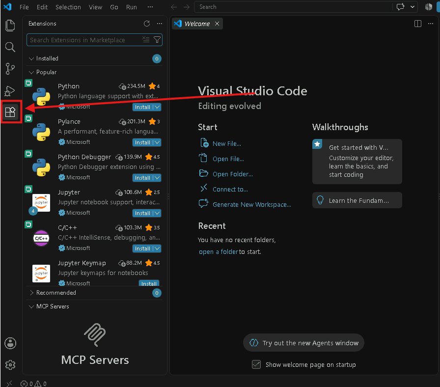
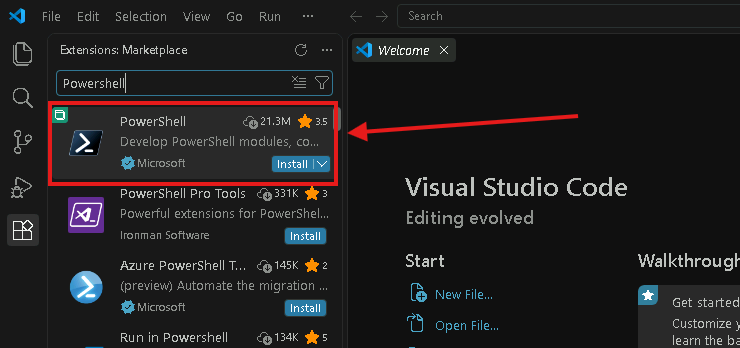
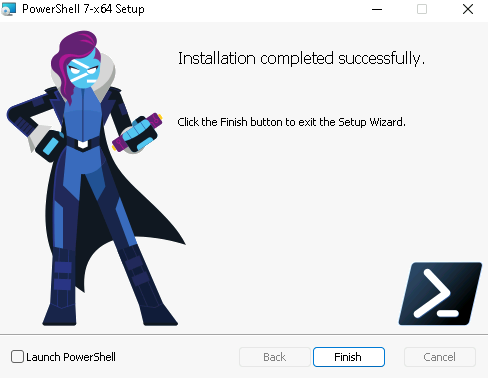
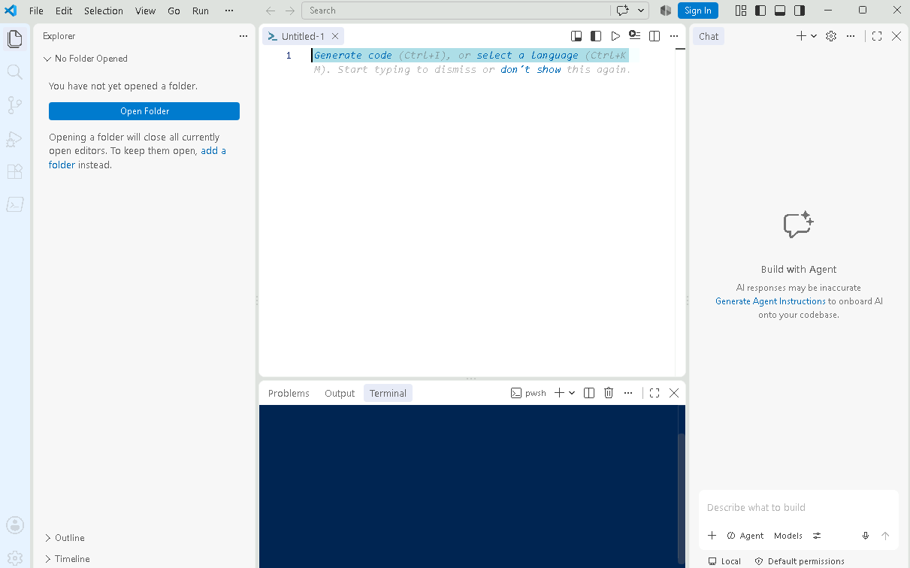
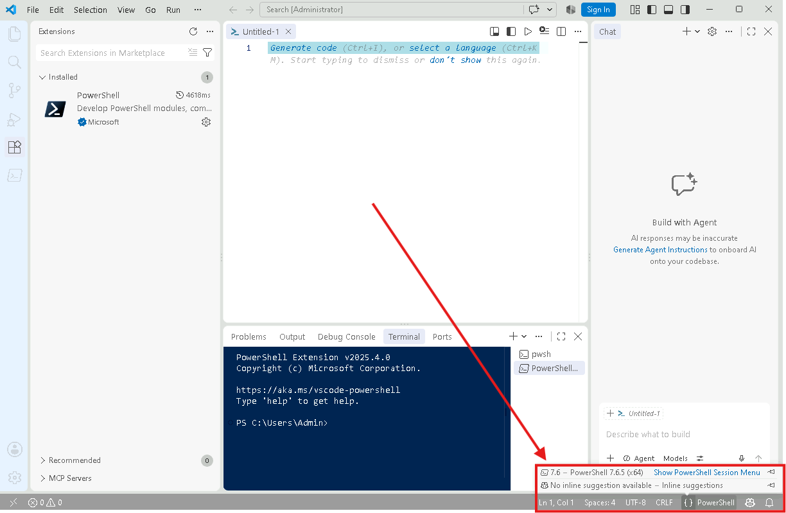
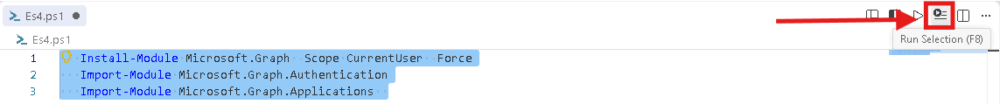
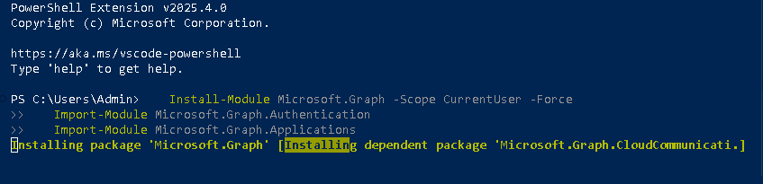
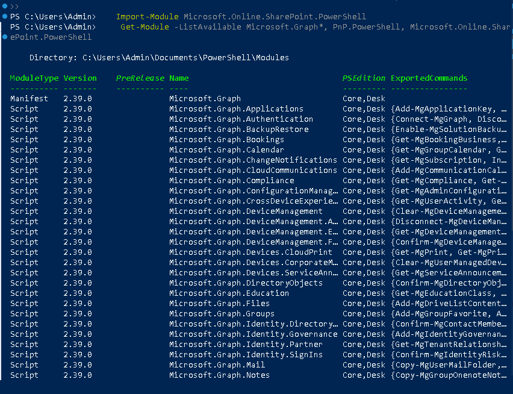
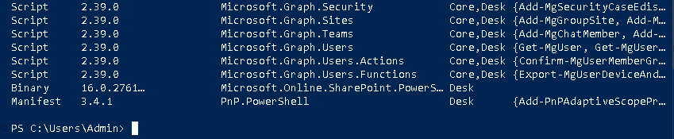

# Modulo 1 – Esercizio 4: Strumenti PowerShell (Graph, PnP, SPO)

[← Esercizio 3](Esercizio-03.md) · [Indice modulo](README.md) · [Esercizio 5 →](Esercizio-05.md)

## Passo 1 – Installazione strumenti dal pacchetto del corso

Accedere alla VM `SEA-DEV1` come administrator locale.

Gli installer di Visual Studio Code e PowerShell non sono nello zip del Modulo 1 perché superano i 100 MB: si scaricano dai siti ufficiali indicati sotto.

1. Scaricare e avviare l'installer di **Visual Studio Code** (User Installer, Windows x64) da [code.visualstudio.com](https://code.visualstudio.com/download).
2. Completare l'installazione guidata.



3. Scaricare e avviare l'installer `.msi` di **PowerShell 7** (x64) dalla pagina [Installare PowerShell in Windows](https://learn.microsoft.com/powershell/scripting/install/install-powershell-on-windows).
4. Completare l'installazione guidata.
5. Riavviare la VM.

## Passo 2 – Abilitare la modalità "PowerShell ISE" in VS Code

1. Aprire **Visual Studio Code**.
2. Nella barra laterale sinistra, selezionare l'icona **Estensioni** (quella con i quattro quadratini).



3. Nella barra di ricerca digitare **`powershell`** e selezionare l'estensione ufficiale **PowerShell** (Microsoft) → **Install**.



4. Una volta installata l'estensione, andare sul menu in alto: **View > Command Palette...** (oppure `Ctrl+Shift+P`).



5. Digitare e selezionare **`PowerShell: Enable ISE Mode`** (modalità PowerShell ISE) per applicare il layout/tema in stile ISE all'interno di VS Code.



6. Controllare che **Visual Studio Code** abbia riconosciuto l'ultima versione di **Powershell** come in figura.



## Passo 3 – Installazione dei moduli PowerShell (MS Graph, PnP, SPO)

1. In VS Code, aprire il file di script fornito dal corso:

   ```text
   LAB/Modulo1/Script/Es4.ps1
   ```

2. Selezionare ed **eseguire i comandi** presenti nello script per installare i moduli richiesti e importarli in sessione.
3. Usare **Run Selection** (`F8`) per eseguire i comandi dopo aver evidenziato.



**Microsoft Graph PowerShell SDK**
```powershell
   Install-Module Microsoft.Graph -Scope CurrentUser -Force
   Import-Module Microsoft.Graph.Authentication
   Import-Module Microsoft.Graph.Applications
```



**PnP PowerShell** (gestione siti/moduli SharePoint Online e Microsoft 365 in stile PnP)
 ```powershell
Install-Module PnP.PowerShell -Scope CurrentUser -Force
Import-Module PnP.PowerShell
 ```

**SharePoint Online Management Shell (SPO)**
```powershell
Install-Module Microsoft.Online.SharePoint.PowerShell -Scope CurrentUser -Force
Import-Module Microsoft.Online.SharePoint.PowerShell
```

4. Verificare che i moduli risultino installati e importati correttamente, ad esempio con:

 ```powershell
 Get-Module -ListAvailable Microsoft.Graph*, PnP.PowerShell, Microsoft.Online.SharePoint.PowerShell
 ```





> [!NOTE]
> `PnP.PowerShell` è un progetto open source della community, senza SLA di supporto ufficiale Microsoft, ma ampiamente utilizzato per l'amministrazione di SharePoint Online e Microsoft 365.

> [!WARNING]
> I moduli hanno requisiti diversi:
> - **PnP.PowerShell** (v2 e successive) richiede **PowerShell 7.4** o superiore.
> - **Microsoft.Online.SharePoint.PowerShell** è pensato per **Windows PowerShell 5.1**; in PowerShell 7 può essere necessario importarlo con `Import-Module Microsoft.Online.SharePoint.PowerShell -UseWindowsPowerShell`.
>
> [Introduzione a SharePoint Online Management Shell](https://learn.microsoft.com/powershell/sharepoint/sharepoint-online/connect-sharepoint-online)

> [!IMPORTANT]
> Dal 2024 PnP PowerShell **non fornisce più un'app multi-tenant condivisa**: per connettersi è necessario registrare una propria app in Microsoft Entra ID (cosa che faremo nell'[Esercizio 5](Esercizio-05.md)), oppure usare `Register-PnPEntraIDAppForInteractiveLogin`.
>
> [Register an Entra ID application for PnP PowerShell](https://pnp.github.io/powershell/articles/registerapplication.html)

---

[← Esercizio 3](Esercizio-03.md) · [Indice modulo](README.md) · [Esercizio 5 →](Esercizio-05.md)
