# Modulo 1 – Esercizio 5: App registration e autenticazione con certificato

[← Esercizio 4](Esercizio-04.md) · [Indice modulo](README.md) · [Esercizio 6 →](Esercizio-06.md)

## Passo 1 – Registrazione della nuova Enterprise Application (App ID)

Ripartendo dalla VM **SEA-DEV1**  andare su https://entra.microsoft.com/ e successivamente **Entra ID > App registrations > New registration**

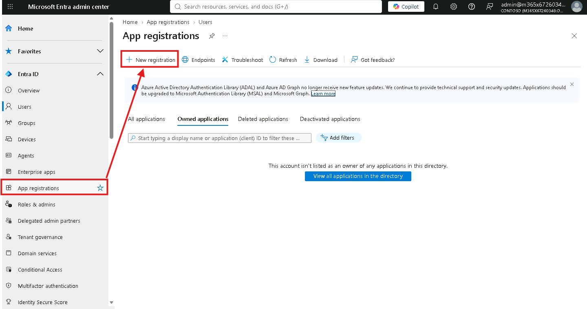

1. Assegnare un nome all'applicazione, ad esempio `App-Graph-CertAuth`.
2. Lasciare il tipo di account supportato sull'impostazione predefinita per il tenant singolo (**Accounts in this organizational directory only**).
3. Selezionare **Register** per creare l'app.

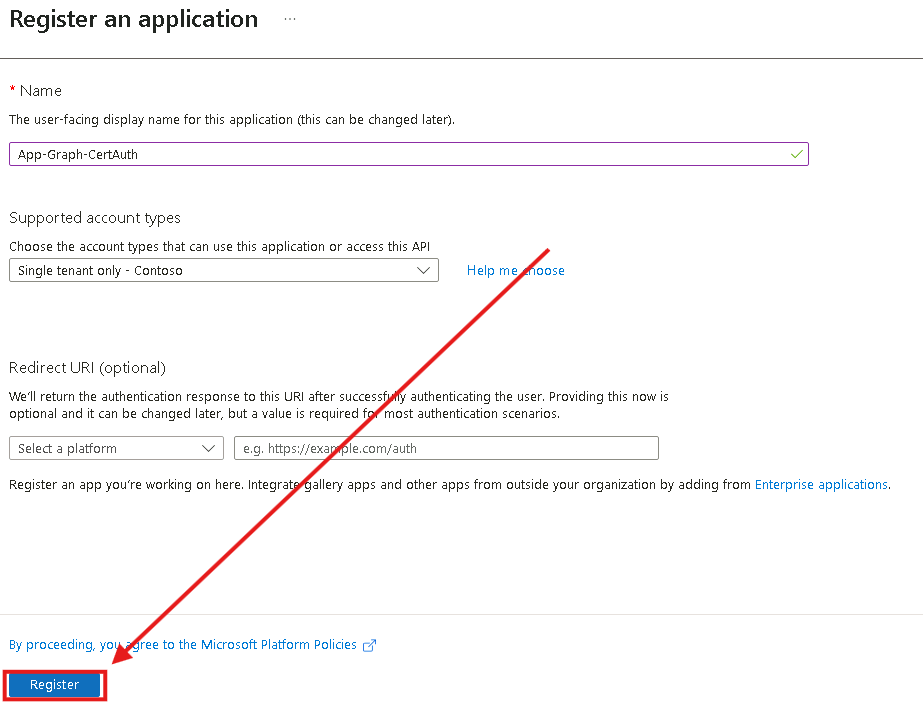

4. Aprire l'app appena creata e andare su **API permissions > Add a permission > Microsoft Graph > Application permissions**.

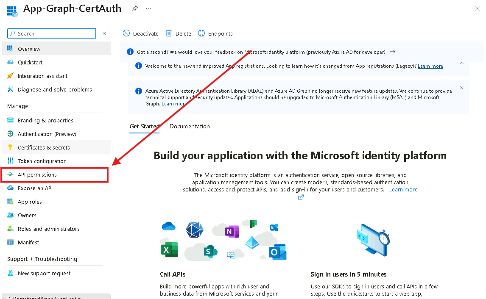

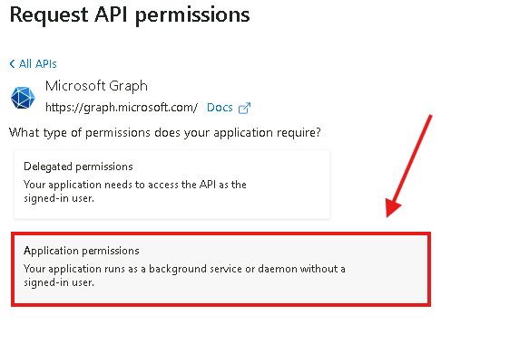

5. Aggiungere i seguenti permessi applicativi :

**Microsoft Graph**:
- `Group.ReadWrite.All`
- `Sites.FullControl.All`
- `TermStore.ReadWrite.All`
- `User.ReadWrite.All`
**Sharepoint**:
- `Sites.FullControl.All`
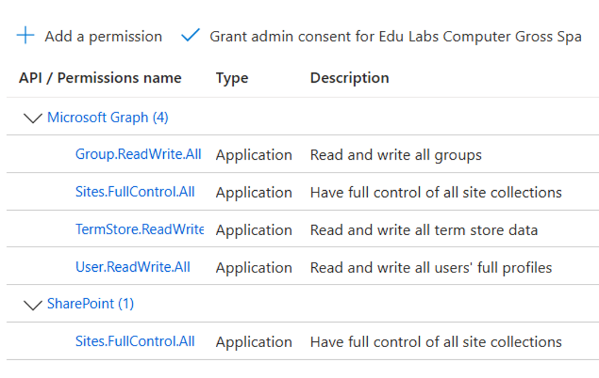
6. Aggiungere anche quello di SharePoint e proseguire.

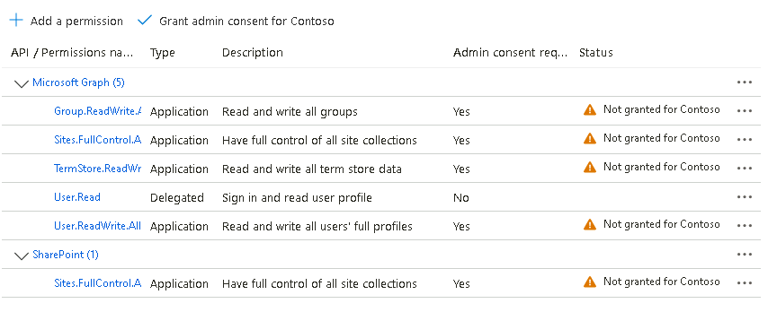

7. Selezionare **Grant admin consent for** per approvare i permessi a livello di amministratore: tutti devono risultare con stato **Granted for** (segno di spunta verde).

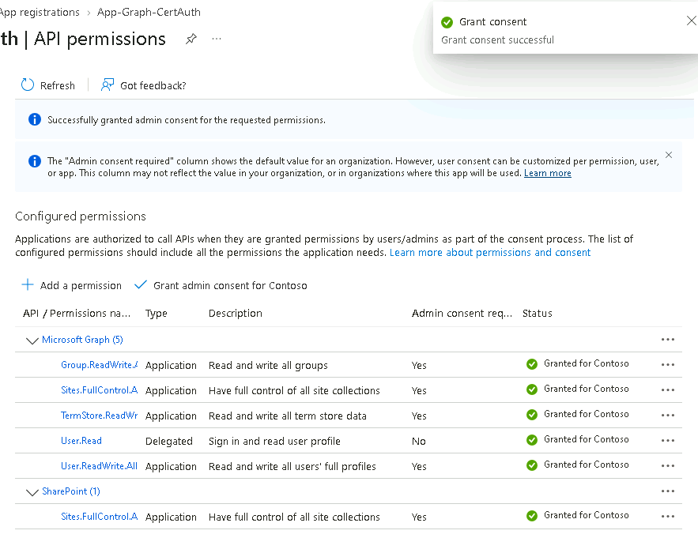

> [!WARNING]
> Senza il **Grant admin consent**, i permessi applicativi restano "Not granted" e le chiamate Graph con l'app falliranno con un errore di autorizzazione.

> [!CAUTION]
> `Sites.FullControl.All`, `User.ReadWrite.All` e `Group.ReadWrite.All` sono permessi applicativi **molto ampi**: l'app agisce su tutto il tenant senza utente connesso. In produzione applicare il principio del **least privilege** (es. `Sites.Selected` per limitare l'accesso a siti specifici).
>
> 📖 [Panoramica dei permessi Microsoft Graph](https://learn.microsoft.com/graph/permissions-overview)
## Passo 2 – Generazione del certificato da PowerShell

1. Aprire su Visual Studio Code il file: `LAB/Modulo1/Script/Es5.ps1`
2. Sulla VM SEA-DEV1, aprire **PowerShell (Run as administrator)** da VSC.
3. Creare la cartella **C:\Cert**.
4. Eseguire il comando per generare il certificato in formato PFX e CER:

```powershell
New-PnPAzureCertificate -OutPfx "C:\Cert\cert.pfx" -OutCert "C:\Cert\cert.cer"
```

5. Al termine, verranno generati due file:
    - **`cert.pfx`**:  contiene la chiave privata, va importato **sulla VM** (nel certificate store locale).
    - **`cert.cer`**: contiene solo la parte pubblica, va caricato **sull'Enterprise Application** in Entra ID.

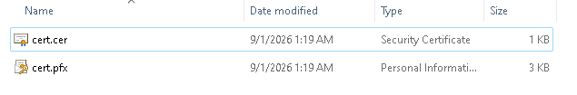

## Passo 3 – Importazione del certificato PFX sulla VM

1. Fare doppio clic sul file **`cert.pfx`** generato al passo precedente.
2. Si apre la procedura guidata **Certificate Import Wizard**.
3. Selezionare come archivio  **Local Machine**.
4. Lasciare **Automatically select the certificate store** .
5. Completare l'importazione.

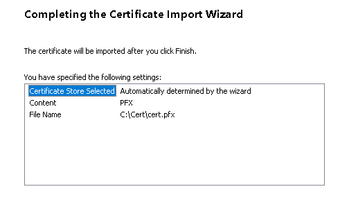
6. Verificare l'importazione da PowerShell:
 ```powershell
 Get-ChildItem Cert:\LocalMachine\My
 ```

Annotare il valore di **Thumbprint** del certificato appena importato: servirà  per autenticarsi con Microsoft Graph.

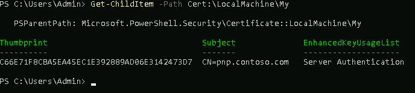

## Passo 4 – Caricamento del certificato pubblico sull'Enterprise Application

1. Tornare su **Entra ID > App registrations**, selezionare l'app creata al Passo 1.
2. Andare su **Certificates & secrets > Certificates > Upload certificate**.

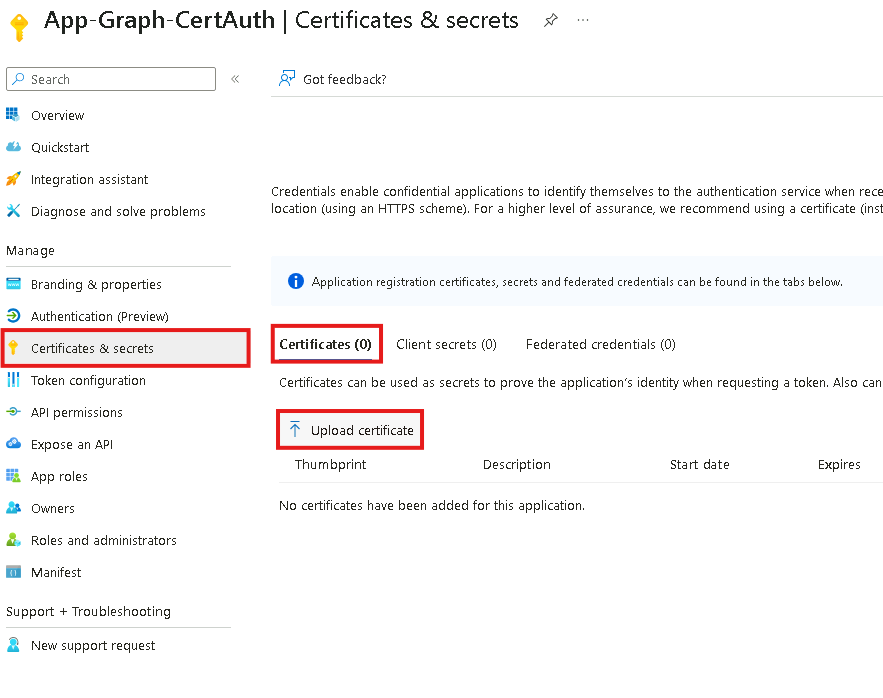
3. Selezionare il file **`cert.cer`** generato al Passo 2 e caricarlo manualmente.
4. Selezionare **Add**.

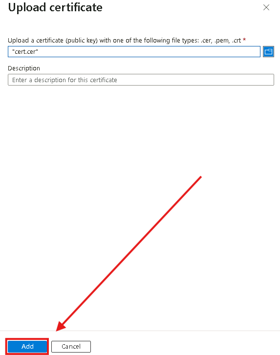

5. Verificare che il certificato compaia nell'elenco con **thumbprint**, data di inizio e data di scadenza corrette.

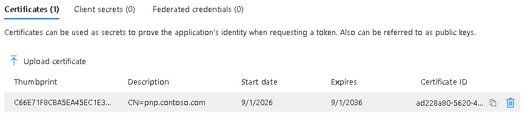

> [!NOTE]
> Il file `.cer` (parte pubblica) va caricato sull'app in Entra ID; il file `.pfx` (parte privata, protetta da password) resta solo sulla macchina che dovrà autenticarsi, non va mai caricato sul portale.

> [!TIP]
> Microsoft raccomanda i **certificati** al posto dei client secret per l'autenticazione app-only. Tenere traccia della **data di scadenza** e pianificare la rotazione prima che il certificato scada.
>
> 📖 [Credenziali con certificato per le applicazioni](https://learn.microsoft.com/entra/identity-platform/certificate-credentials)
## Passo 5 – Verifica con comandi Microsoft Graph tramite l'Enterprise Application

1. Tornare su **Visual Studio Code**  con il seguente file aperto: `LAB/Modulo1/Script/Es5.ps1`
2. Eseguire sul **PowerShell** i seguenti comandi:

```powershell
 Import-Module Microsoft.Graph.Authentication
 Import-Module Microsoft.Graph.Users
```

3. Connettersi a Microsoft Graph usando **l'app registrata** e il **certificato** (autenticazione app-only, senza login utente):

```powershell
Connect-MgGraph -ClientId "<APP_ID_dell'Enterprise_Application>" `
-TenantId "<TENANT_ID>" `
-CertificateThumbprint "<THUMBPRINT_annotato_al_Passo_3>"
```

4. Verificare che l'autenticazione sia avvenuta in modalità **app-only**:

```powershell
Get-MgContext
```

Nell'output, il campo **AuthType** deve risultare `AppOnly`.

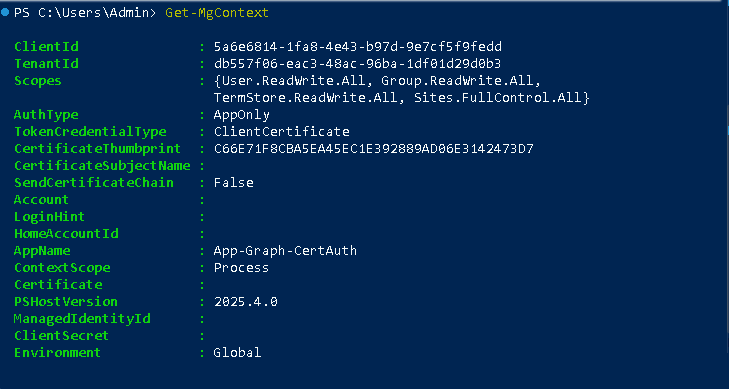

5. Per test provare a **listare gli utenti del tenant:**

```powershell
Get-MgUser -All | Select-Object DisplayName, UserPrincipalName, Id
```

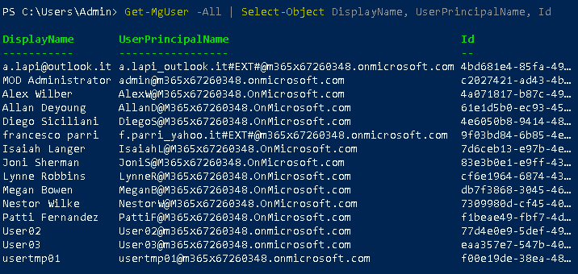

6. Provare a **creare un nuovo utente da Graph:**

(Cambiare XXXXXX con il proprio primary domain)

```powershell
    $PasswordProfile = @{
      Password = "P@ssw0rd-Temp!2026"
      ForceChangePasswordNextSignIn = $true
    }

    New-MgUser -DisplayName "User Test Graph" `
      -PasswordProfile $PasswordProfile `
      -AccountEnabled `
      -MailNickname "UserTestGraph" `
      -UserPrincipalName "usertestgraph@XXXXXX"
```

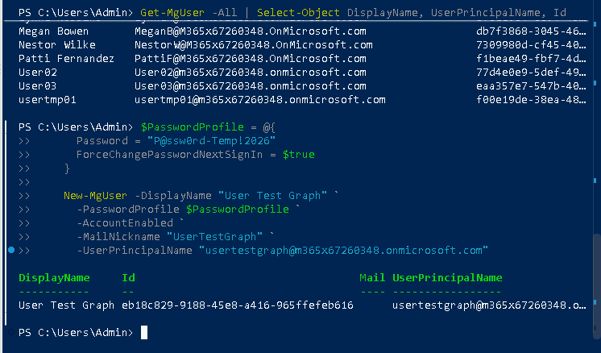

7. **Come ulteriore verifica a scelta**, ad esempio elencare i gruppi del tenant o verificare le licenze assegnate a un utente:

(Sostituire "User" con l'Object id di un utente)

```powershell
    # Elencare i gruppi del tenant
    Get-MgGroup -All | Select-Object DisplayName, Id

    # Oppure, verificare le licenze assegnate a un utente specifico
    Get-MgUserLicenseDetail -UserId "User"
```

---

[← Esercizio 4](Esercizio-04.md) · [Indice modulo](README.md) · [Esercizio 6 →](Esercizio-06.md)
