# Modulo 1 – Esercizio 6: Microsoft Entra join, Windows Hello e SSO

[← Esercizio 5](Esercizio-05.md) · [Indice modulo →](README.md)

> [!IMPORTANT]
> Disattivare l'**Enhanced session mode** della VM (Hyper-V) se attiva.

## Blocco 1 · Cloud Join di User02 su `SEA-DEV2`

> [!WARNING]
>Questo blocco deve essere svolto **in parallelo** al [Blocco 2](#blocco-2--cloud-join-di-user03-su-sea-dev3) .

### Passo 1 · Installazione app Microsoft 365 e Cloud Join

1. Accedere alla **VM `SEA-DEV2` come administrator**.
2. **Disinstallare la versione di Office già presente** sulla VM: **Settings > Apps > Installed apps**, selezionare **Microsoft 365 / Office** > **Uninstall** e riavviare se richiesto.
3. Aprire il browser e accedere a `https://portal.office.com` per scaricare e **reinstallare** le **app di Microsoft 365** (Word, Excel, Outlook, ecc.).

   ```text
   https://portal.office.com
   ```

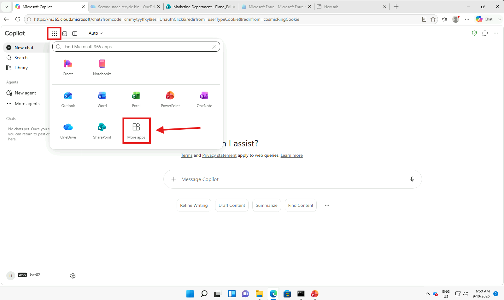

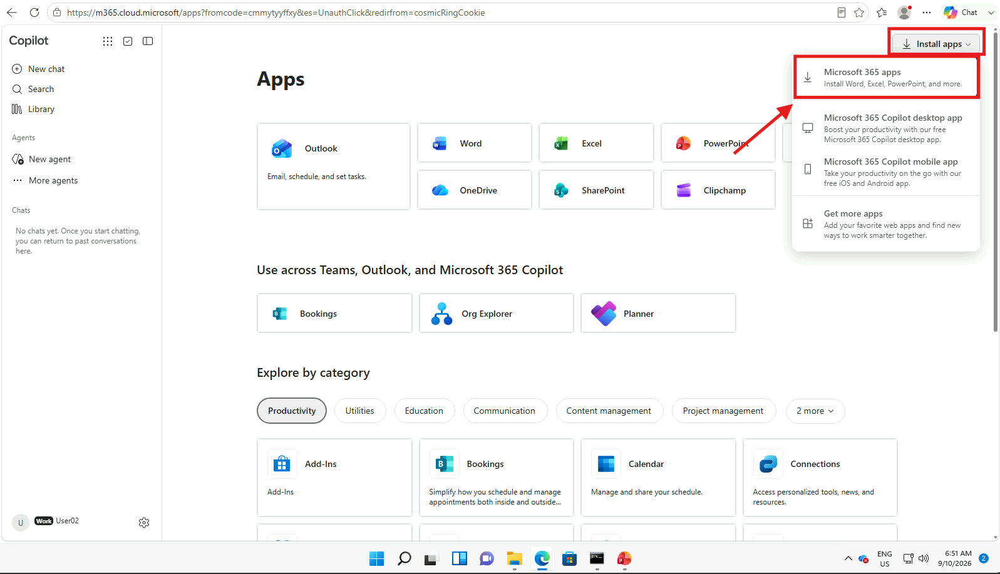

3. Al termine dell'installazione, andare su **Impostazioni (Settings) > Accounts > Access work or school** (in italiano: **Impostazioni > Account > Accesso a lavoro o istituto di istruzione**).

4. Selezionare **Connect** e avviare la procedura di **Cloud Join** (Microsoft Entra join), inserendo le credenziali dell'amministratore del tenant quando richiesto.

 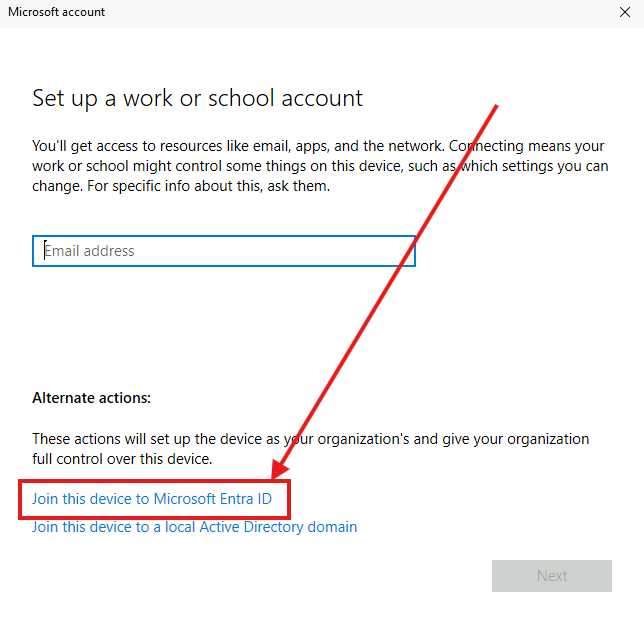

3. Completare la procedura guidata.

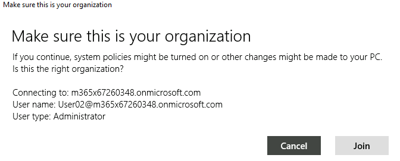

4. **Riavviare (Reboot)** la VM per applicare il join al tenant.
5. Nel frattempo recarsi sulla VM `SEA-DEV1` e aprire Entra ID https://entra.microsoft.com/.
6. Andare su **Devices -> All Devices** e verificare il join type.

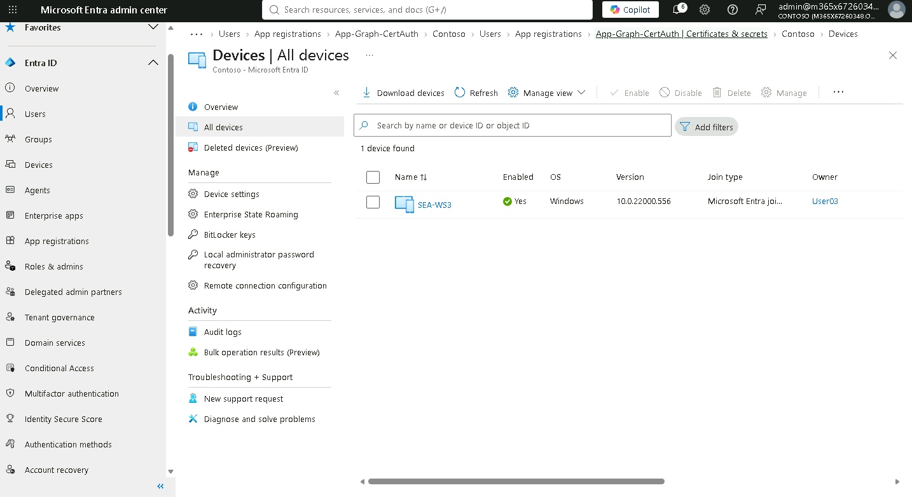

> [!NOTE]
> Con **Microsoft Entra join** il dispositivo è registrato solo nel cloud (nessun Active Directory on-premises). Per default gli utenti autorizzati a eseguire il join sono definiti in **Entra ID > Devices > Device settings**.
>
> [Dispositivi Microsoft Entra joined](https://learn.microsoft.com/entra/identity/devices/concept-directory-join)

### Passo 2 · Primo accesso con User02 (utente non amministratore)

1. Tornare su `SEA-DEV2`.
2. Dopo il riavvio, alla schermata di login selezionare **User02** (utente **non amministratore**, creato nell'Esercizio 3).
3. Accedere con la password di **User02**.

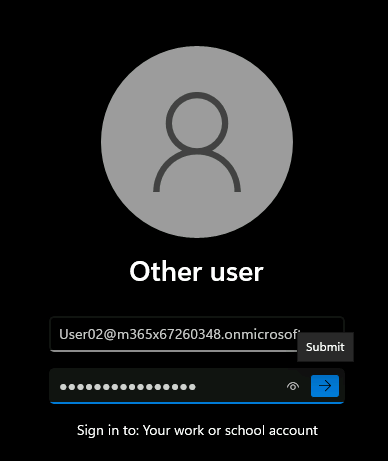

3. Il sistema guiderà l'utente nella configurazione di **Windows Hello for Business (WHFB)**, richiede **MFA** e impostazione del **PIN** mettere `137900`.


> [!NOTE]
> Da questo momento in poi, User02 dovrà accedere alla VM **utilizzando WHFB** (PIN o biometria) invece della password, in quanto il dispositivo è ora unito al tenant tramite Cloud Join.

> [!TIP]
> Windows Hello for Business sostituisce la password con una credenziale legata al dispositivo (PIN o biometria) basata su chiavi asimmetriche: il PIN **non lascia mai il dispositivo**.
>
> [Panoramica di Windows Hello for Business](https://learn.microsoft.com/windows/security/identity-protection/hello-for-business/)

### Passo 3 · Verifica del Single Sign-On (SSO)

1. Aspettare 1 minuto dal login sul PC.
2. Aprire **Word** e premere su **Sign in or create account**.

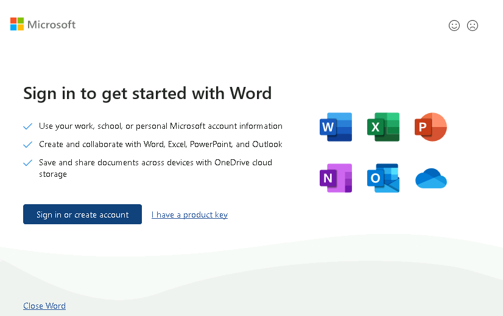

3. Verificare che l'accesso avvenga **senza richiesta di login** (SSO sulle app installate).
4. Se non esegue il **SSO** mettere l'email e chiederà solo **MFA**.

## Blocco 2 · Cloud Join di User03 su `SEA-DEV3`

> [!WARNING]
>Questo blocco deve essere svolto **in parallelo** al [Blocco 1](#blocco-1--cloud-join-di-user02-su-sea-dev2).

### Passo 1 · Installazione app Microsoft 365 e Cloud Join

1. Accedere alla **VM `SEA-DEV3` come administrator**.
2. **Disinstallare la versione di Office già presente** sulla VM: **Settings > Apps > Installed apps**, selezionare **Microsoft 365 / Office** > **Uninstall** e riavviare se richiesto.
3. Aprire il browser e accedere a `https://portal.office.com` per scaricare e **reinstallare** le **app di Microsoft 365**.

   ```text
   https://portal.office.com
   ```

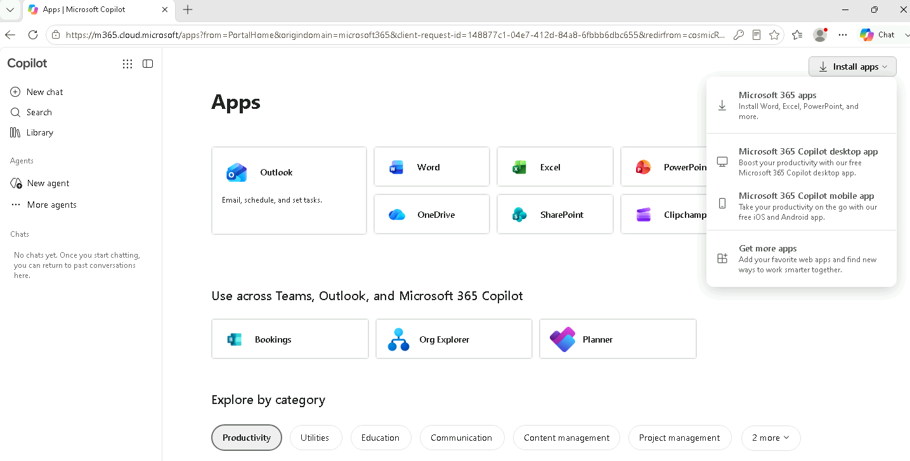

3. Al termine dell'installazione, andare su **Impostazioni (Settings) > Accounts > Access work or school**.
4. Selezionare **Connect** e avviare la procedura di **Cloud Join**, inserendo le credenziali dell'amministratore del tenant quando richiesto.


5. Completare la procedura guidata.
6. **Riavviare (Reboot)** la VM per applicare il join al tenant.

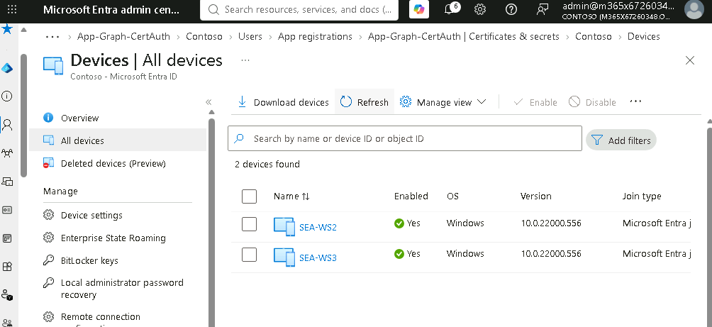

### Passo 2 · Primo accesso con User03 (utente non amministratore)

1. Dopo il riavvio, alla schermata di login selezionare **User03** (utente **non amministratore**, creato nell'Esercizio 3).
2. Accedere con la password di **User03**.

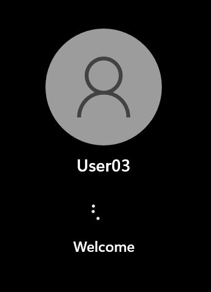

3. Il sistema guiderà l'utente nella configurazione di **Windows Hello for Business (WHFB)**, richiede **MFA** e impostazione del **PIN** mettere `137900`.

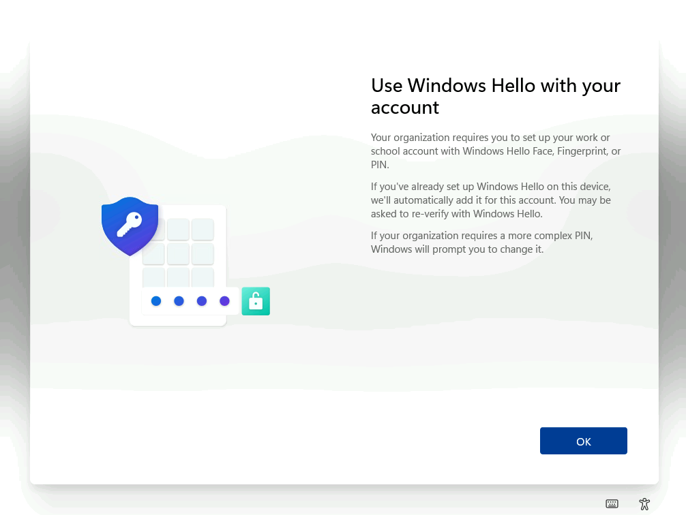

> [!NOTE]
> Da questo momento in poi, User03 dovrà accedere alla VM **utilizzando WHFB** invece della password.

### Passo 3 · Verifica del Single Sign-On (SSO)

1. Aspettare 1 minuto dal login sul PC.
2. Aprire **Word** e premere su Sign in or create account.


3. Verificare che l'accesso avvenga **senza richiesta di login** (SSO sulle app installate).

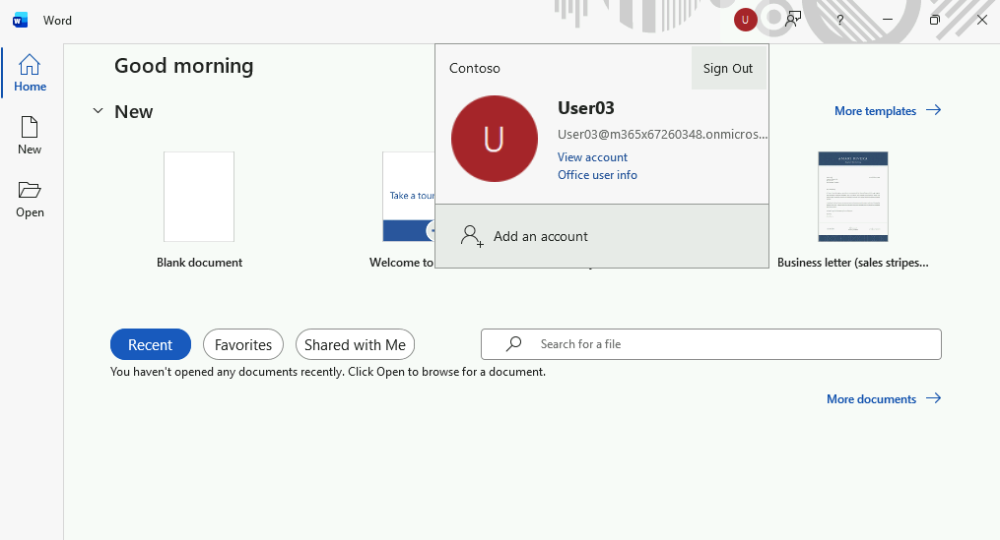

4. Se non esegue il **SSO** mettere l'email e chiederà solo **MFA**.

---

[← Esercizio 5](Esercizio-05.md) · [Indice modulo →](README.md)
