# Modulo 2 – Esercizio 1: Client OneDrive, condivisione e criteri di gruppo

[← Indice modulo](README.md) · [Indice modulo →](README.md)

## Passo 0 – Installazione del client OneDrive da CMD

> [!IMPORTANT]
> La reinstallazione di OneDrive descritta in questo passo va eseguita su **entrambe** le macchine: `SEA-DEV2` (con **User02**) e `SEA-DEV3` (con **User03**).

1. Accedere a `SEA-DEV2` con le credenziali di **User02** (poi ripetere su `SEA-DEV3` con **User03**)
2. Copiare l'eseguibile **`onedrive.exe`** dal pacchetto materiale del corso (**Modulo2/Install/**) sul **desktop** di User02.
3. Disinstallare **OneDrive**.

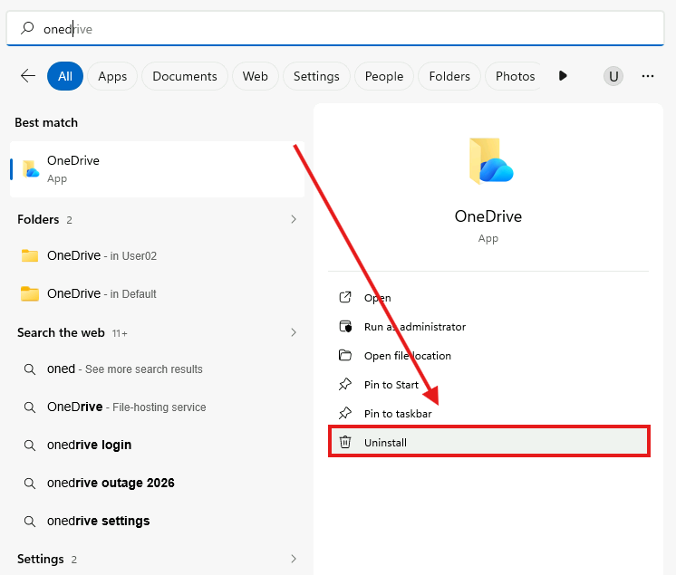

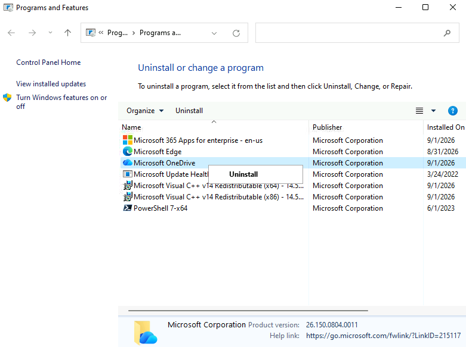

4. Una volta disinstallato **riavviare (Reboot)** la VM.
5. Aprire il **Prompt dei comandi (CMD)** con **Esegui come amministratore** (Run as administrator).
6. Portarsi nella cartella dove si trova l'eseguibile, copiarsi il path dell'eseguibile per il comando ed eseguire il comando di installazione per tutti gli utenti della macchina:

   ```cmd
   cd %userprofile%\Desktop
   onedrive.exe /allusers
   ```

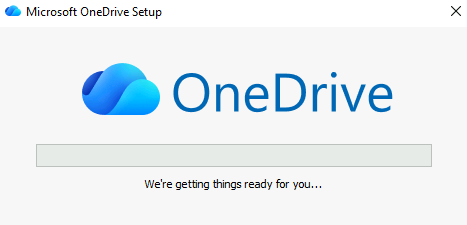

> [!NOTE]
> Lo switch **`/allusers`** installa il client OneDrive in modalità **per-machine** (per tutti gli utenti del dispositivo), invece della modalità predefinita per-utente.

> [!NOTE]
> L'installazione **per-machine** (`/allusers`) installa il client in `Program Files` ed è consigliata per i dispositivi condivisi e per gli ambienti VDI.
>
> [Installare l'app di sincronizzazione per-machine](https://learn.microsoft.com/sharepoint/per-machine-installation)

## Passo 1 – Primo accesso al client OneDrive con User02

1. Avviare il client **OneDrive** (di solito parte automaticamente dopo l'installazione, oppure cercarlo nel menu Start).

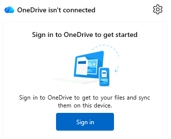

2. Accedere con le credenziali di **User02**, richiede **MFA**.

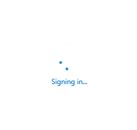

3. Durante la configurazione guidata, alla schermata **"Sync files from your OneDrive"**, selezionare **solo la cartella Documenti** (deselezionare le altre cartelle speciali proposte).

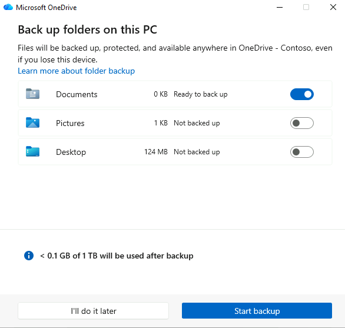

4. Completare la configurazione guidata.

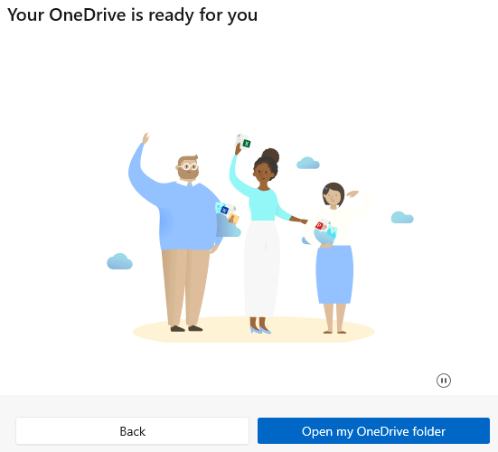

## Passo 2 – Copia dei file da Modulo2/Dati sulla root di OneDrive

1. Aprire la cartella del materiale del corso:

   ```text
   Modulo2/Dati/
   ```

2. Copiare i seguenti elementi sulla **root della cartella OneDrive** di User02:
- File **Word** (es. `Word01.docx`)
- File **PowerPoint** (`Powerpoint01.pptx`)
- Le cartelle **`FOLDER01`** e **`FOLDER02`**
- I file .lock e .tmp .

3. Verificare nell'**Esplora file** che i file/cartelle "normali" (doc, ppt, txt, FOLDER01, FOLDER02) mostrino l'icona di sincronizzazione (spunta verde o nuvola) e vengano effettivamente caricati sul cloud.

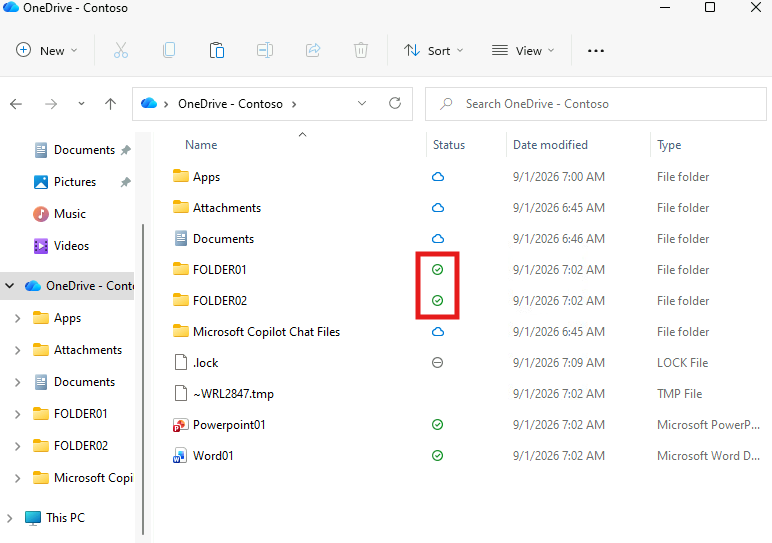

4. Verificare invece che il file chiamato (nel caso rinominarlo solo ".lock") **.lock** e il file che finisce con **.tmp** vengano **copiati sul disco locale ma NON sincronizzati** da **OneDrive** (icona di errore/attenzione, oppure assenti dalla vista web di OneDrive).

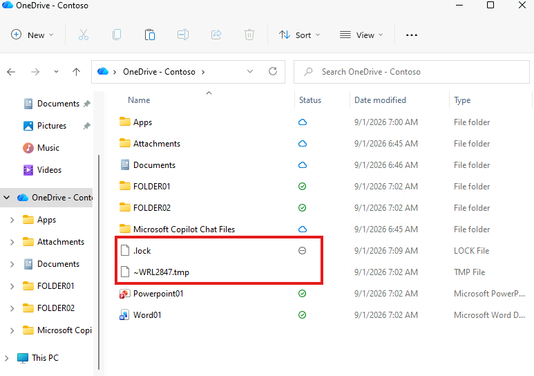

> [!NOTE]
> L'app di sincronizzazione **non sincronizza i file `.tmp` e `.ini`** e rifiuta nomi o tipi di file non validi (es. `.lock`, `desktop.ini`, caratteri non consentiti).
>
> [Nomi e tipi di file non validi in OneDrive e SharePoint](https://support.microsoft.com/office/64883a5d-228e-48f5-b3d2-eb39e07630fa)

## Passo 3 – Condivisione di Powerpoint01.pptx in modifica (Can Edit)

1. Da **User02**, fare clic destro su **`Powerpoint01.pptx`** nella cartella OneDrive e selezionare **Share** (Condividi).

   ```text
   Powerpoint01.pptx
   ```

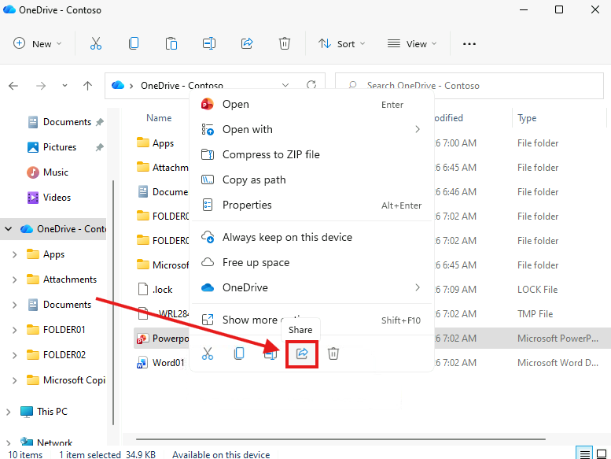

2. Impostare il livello di permesso su **Can Edit** (Può modificare).

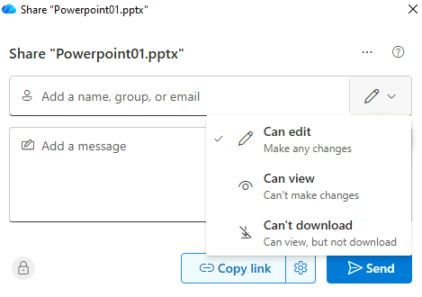

3. Nel campo **People you choose**, selezionare:
   - L'utente interno **User03**
   - L'utente **Guest** (l'account guest invitato nell'esercizio precedente)
3. Selezionare **Send** (non **Copy Link**), in modo che venga inviata un'email di notifica diretta ai destinatari.

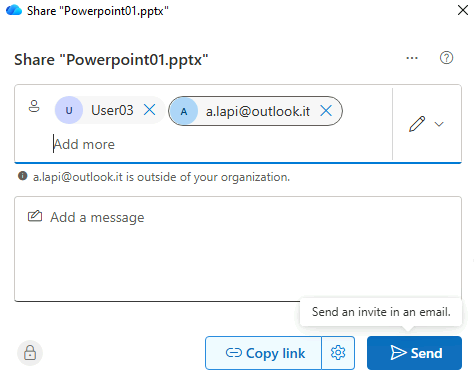

5. Accedere a **`SEA-DEV3` con User03** (login tramite **Windows Hello for Business**, come configurato nell'Esercizio 6).
6. Aprire **Outlook sul Web** e individuare l'email di condivisione ricevuta.

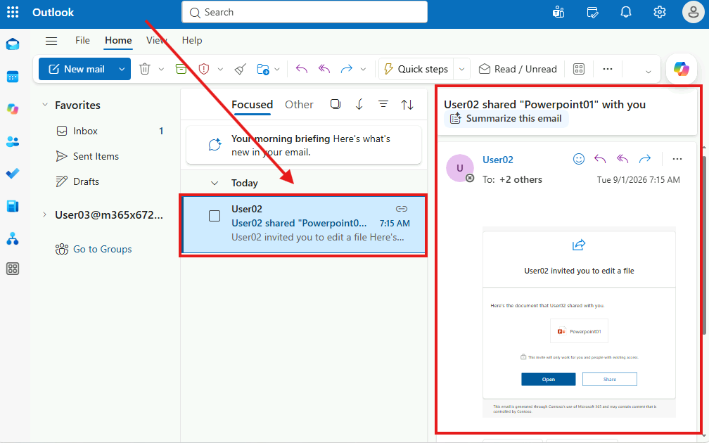

7. Aprire il link al file **Powerpoint01.pptx**: si apre in modalità di modifica online.
8. Scrivere qualcosa su una slide e **salvare** (il salvataggio in OneDrive/PowerPoint per il Web è automatico).

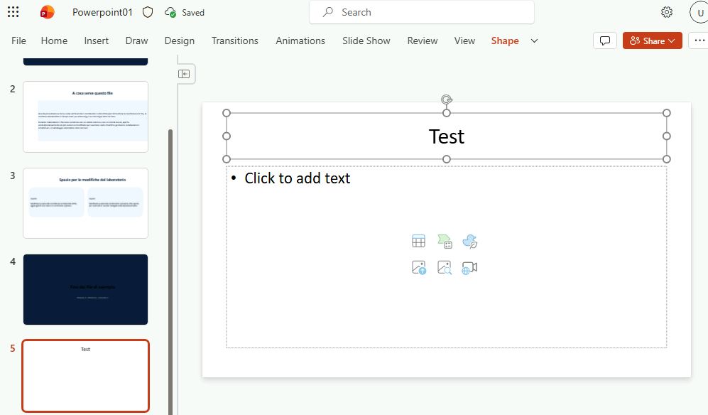

9. **Lasciare il file aperto** nel browser di `SEA-DEV3` (necessario per il Passo 5).

## Passo 4 – Condivisione con link "Can't Download" e scadenza a 1 mese

1. Tornare sulla VM `SEA-DEV2`.
2. Da **User02**, condividere nuovamente **`Powerpoint01.pptx`**, questa volta con l'opzione **Can't Download** (Blocca download).

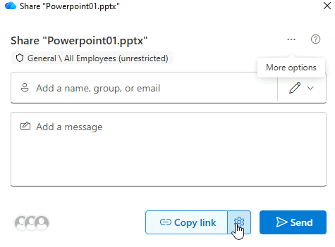

3. Impostare **Set expiration** a **1 mese** dalla data odierna.

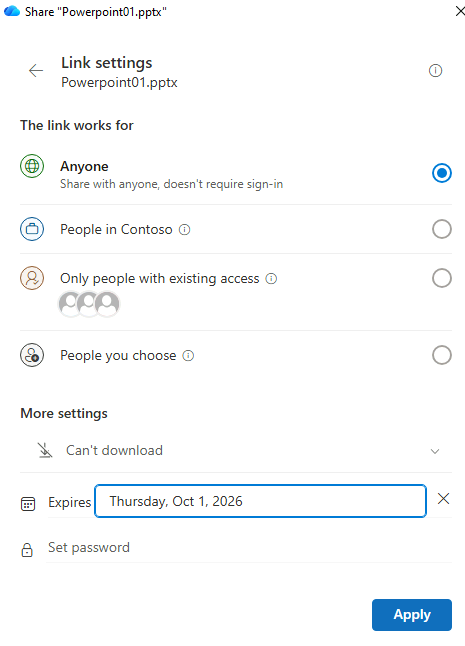

4. Selezionare **Anyone** come opzione di sharing.
5. Questa volta selezionare **Copy Link** (invece di Send), per ottenere l'URL del link di condivisione.

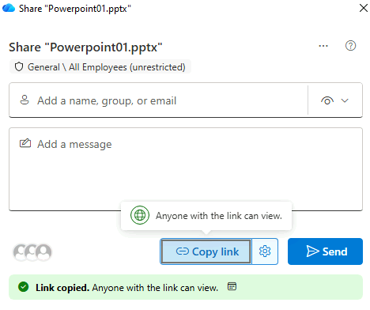

4. Aprire una finestra del browser in **modalità anonima/InPrivate**.
5. Incollare il link copiato e aprirlo.

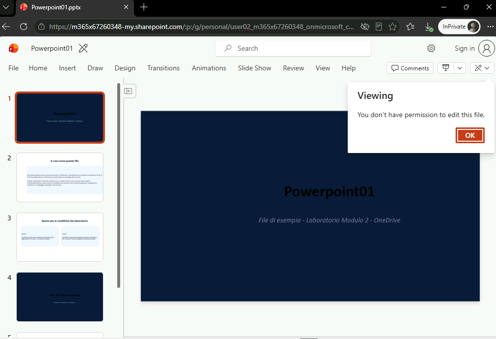

6. Verificare che:
   - **Non venga richiesta alcuna autenticazione** per visualizzare il file.
   - Il file venga mostrato **solo in visualizzazione** (senza possibilità di scaricarlo o modificarlo).
6. **Non chiudere** questa finestra: servirà per il Passo 5 come terzo "spettatore" collegato al file.

> [!WARNING]
> I link **Anyone** non richiedono autenticazione: chiunque riceva il link (anche inoltrato) accede al file e non è possibile tracciare chi lo ha aperto. Usarli solo per contenuti non sensibili e sempre con **scadenza**.
>
> [Best practice per la condivisione con utenti non autenticati](https://learn.microsoft.com/microsoft-365/solutions/best-practices-anonymous-sharing)

## Passo 5 – Co-authoring e cronologia versioni

1. Tornare su `SEA-DEV2` con **User02** e aprire **`Powerpoint01.pptx`** dalla cartella OneDrive locale.
2. Apportare una modifica (es. aggiungere del testo su una slide) e **salvare**.
3. **Lasciare il file aperto.**
4. Con il file ancora aperto su `SEA-DEV2`, andare su **File > Info > Version History** (Cronologia versioni).

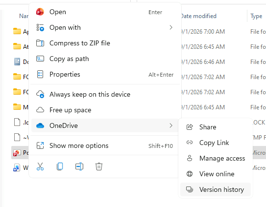

5. Aprire una **versione precedente** del file e osservare il contenuto prima delle ultime modifiche.

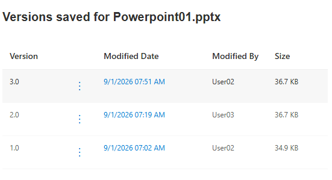

6. **Tornare alla versione più recente** (originale con le modifiche di User02 e User03) senza sovrascrivere la cronologia.
7. Notare che **User03** ha aperto il .pptx in contemporanea ed è possibile visualizzare la modifica effettuata.

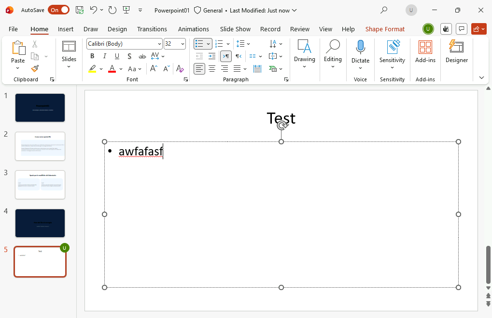

## Passo 6 – Gestione degli accessi condivisi (Manage Access)

1. Sempre da **User02** su `SEA-DEV2`, fare clic destro su **`Powerpoint01.pptx`** > **OneDrive** > **Manage Access** (Gestisci accesso).

   ```text
   Powerpoint01.pptx
   ```

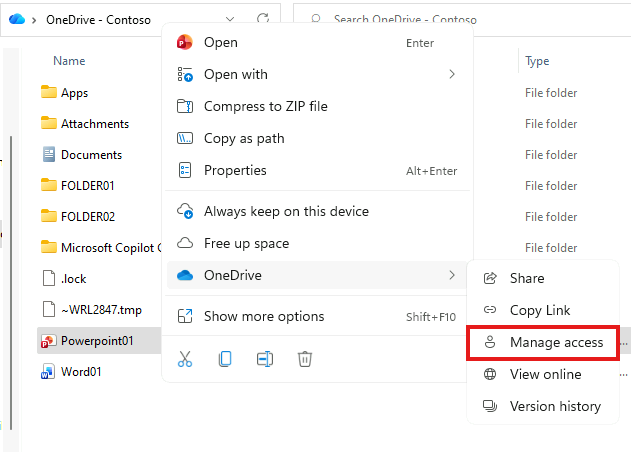

2. Nella sezione **People**, osservare che **User03** compare con diritti di **modifica (edit)** e che **non è disponibile un'opzione di scadenza** per le condivisioni dirette con persone specifiche.

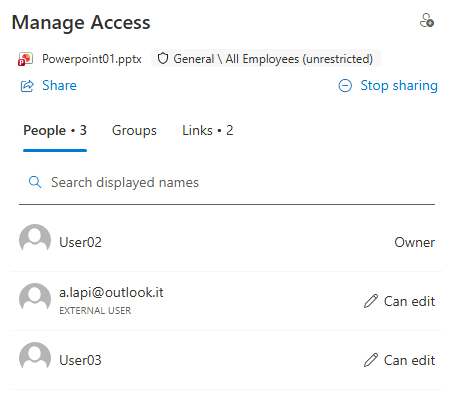

3. Modificare il permesso di **User03** impostandolo su **Can't Download**.

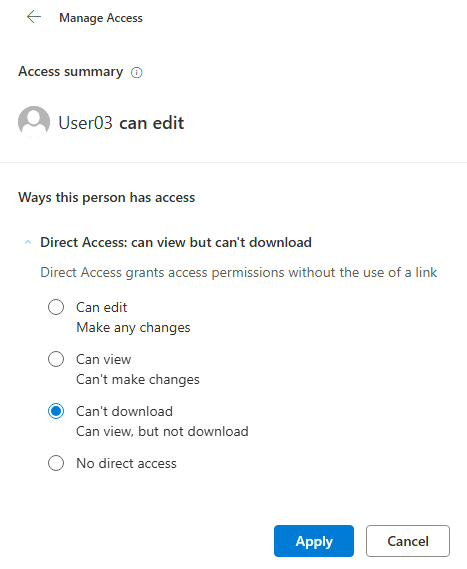

4. Nella sezione **Links**, osservare il **link statico "Anyone"** con permesso **Edit** creato in precedenza: qui è visibile la **data di scadenza** impostata.

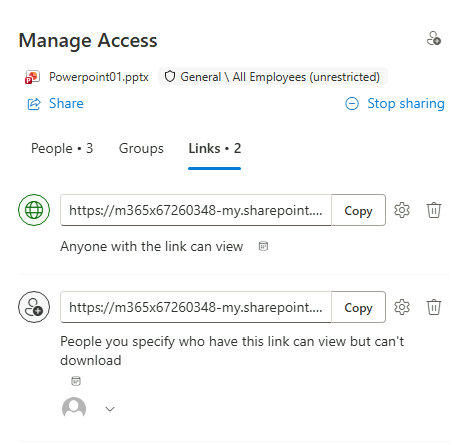

5. **Eliminare (Remove)** questo link e controllare nella scheda in incognito.

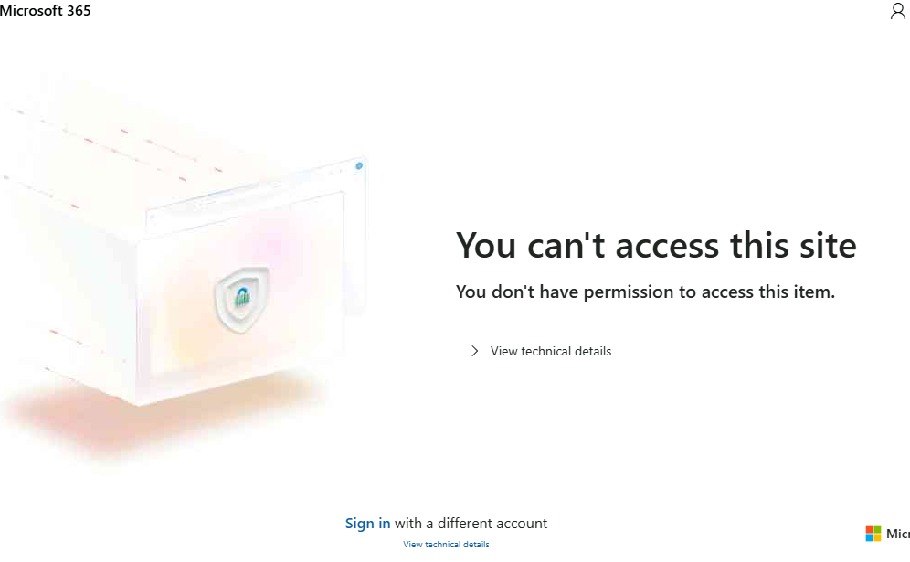

## Passo 7 – OneDrive lato User03 via Web (Edge)

1. Accedere a **`SEA-DEV3` con User03** e aprire **Microsoft Edge**.
2. Accedere a OneDrive via Web (`https://portal.office.com` e poi OneDrive).

   ```text
   https://portal.office.com
   ```

3. Aprire la sezione **Shared > Shared with me** (Condivisi con me): verificare che **`Powerpoint01.pptx`** compaia nell'elenco.

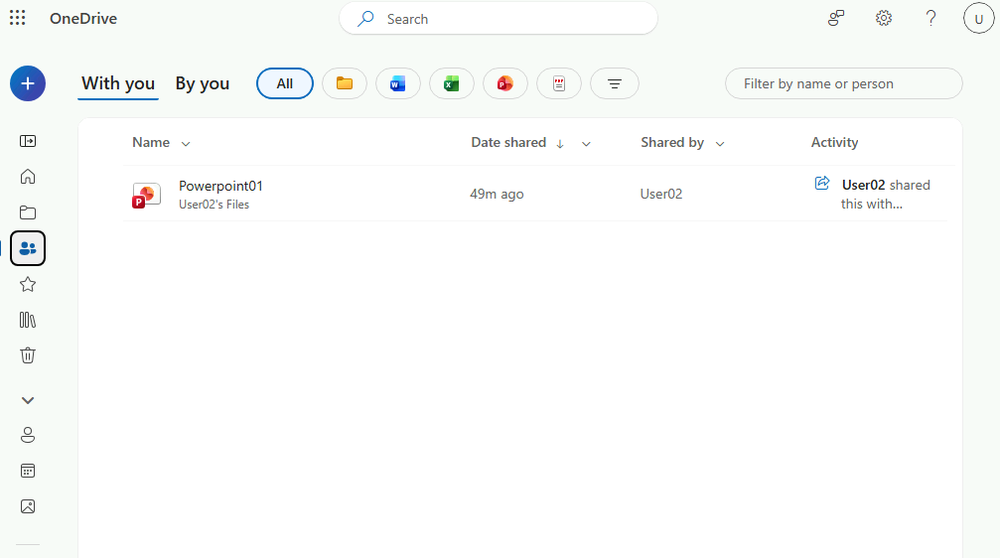

4. Aprire la sezione **Shared > Shared by me** (Condivisi da me): verificare che risulti **vuota**, poiché User03 non ha condiviso nulla.

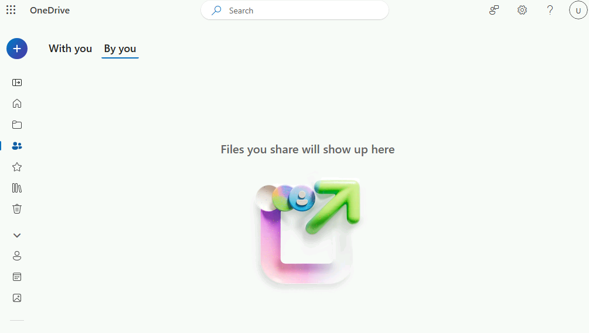

## Passo 8 – Eliminazione cartelle e recupero dal cestino

1. Tornare su `SEA-DEV2` con **User02**.
2. Dalla cartella OneDrive locale, **eliminare** le cartelle **`FOLDER01`** e **`FOLDER02`**.

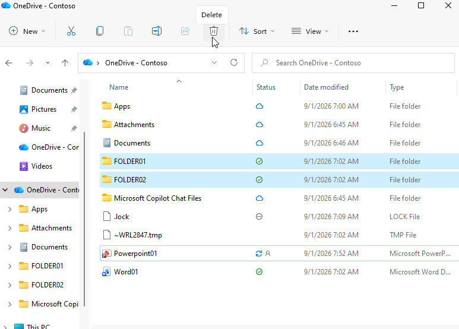

3. Accedere a OneDrive **via Web** e aprire il **cestino di primo livello** (Recycle bin di OneDrive).

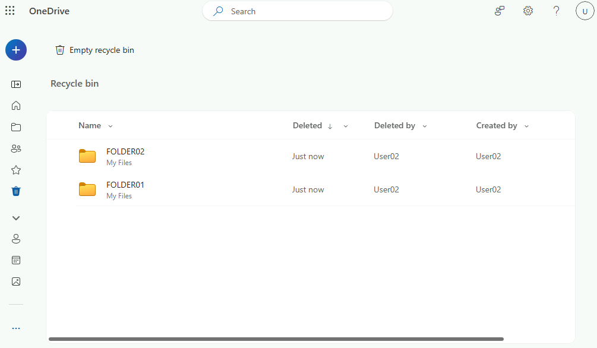

4. Dal **cestino di primo livello**:
   - Selezionare **`FOLDER01`** e scegliere **Restore** (Ripristina): la cartella torna disponibile in OneDrive e si risincronizza sul client.

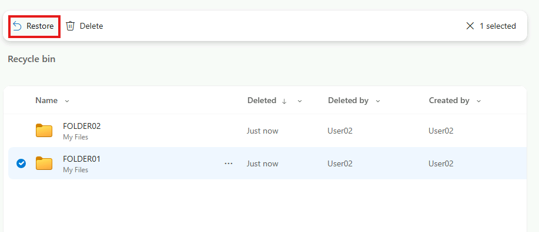

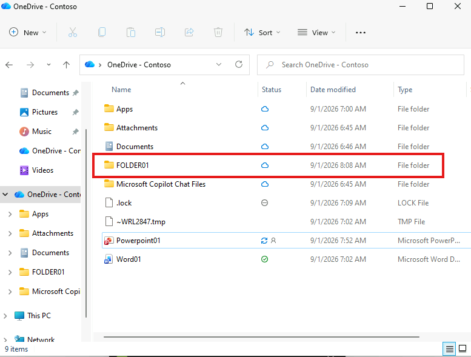

   - Selezionare **`FOLDER02`** ed **eliminarla definitivamente** da qui (Delete).

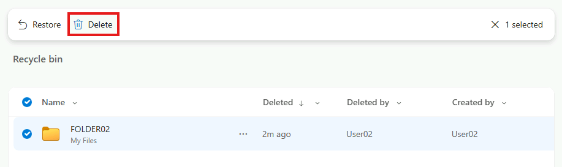

5. Accedere ora al **cestino di secondo livello** (il cestino del sito SharePoint/OneDrive sottostante, raggiungibile dal link "Recycle bin" in fondo al primo cestino).

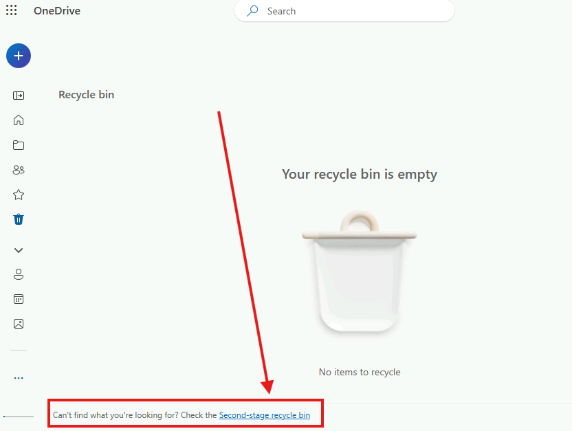

6. Individuare **`FOLDER02`** (ora presente nel secondo cestino) ed **eliminarla definitivamente**.

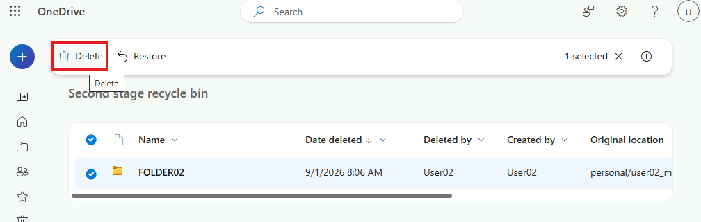

> [!WARNING]
> L'eliminazione dal **cestino di secondo livello** è **permanente**: il file/cartella non può più essere recuperato in alcun modo.

> [!NOTE]
> In SharePoint e OneDrive gli elementi eliminati sono conservati per **93 giorni** complessivi tra cestino di primo e di secondo livello. Il cestino di secondo livello ha una capacità pari al **200%** della quota del sito.
>
> [Ripristinare elementi dal cestino della raccolta siti](https://learn.microsoft.com/sharepoint/restore-deleted-items-from-site-collection-recycle-bin)

## Passo 9 – "Always keep on this device" e "Free up space"

1. Su `SEA-DEV2`, fare clic destro sull'icona **OneDrive** nella barra delle applicazioni (o sulla cartella OneDrive in Esplora file) e selezionare **"Always keep on this device"** (Mantieni sempre su questo dispositivo).

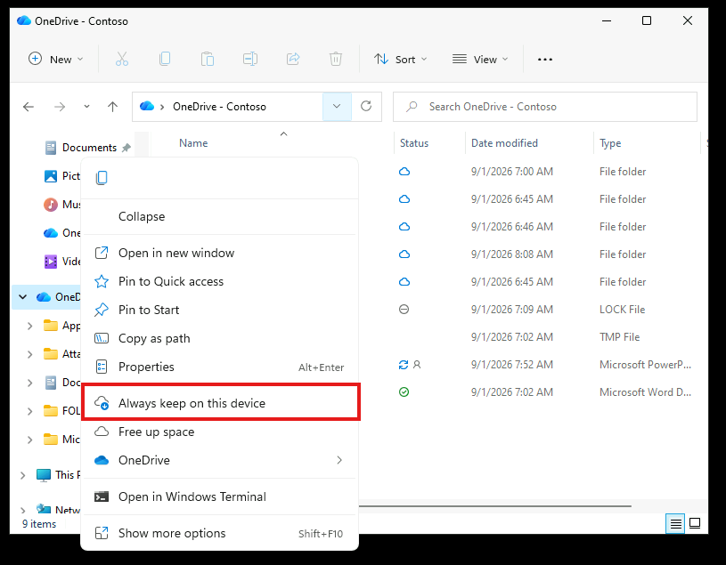

2. Verificare che **tutti i file** nella cartella OneDrive mostrino ora un **pallino verde** (indicano che sono disponibili **offline**, scaricati localmente).

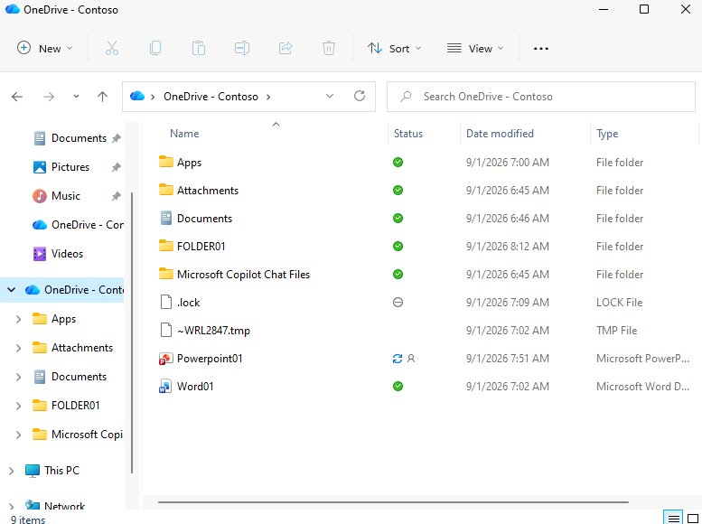

3. Ripetere il click destro e selezionare **"Free up space"** (Libera spazio).

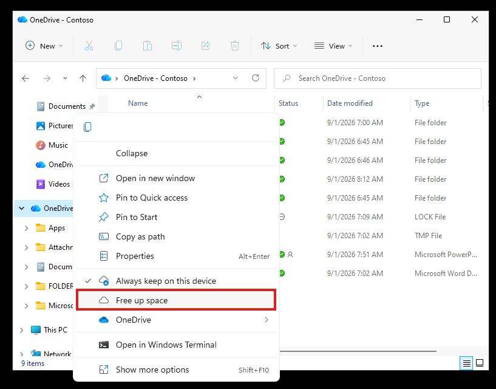

4. Verificare che **tutti i file** mostrino ora l'icona a forma di **nuvola** (indicano che sono disponibili solo **online**, contenuto rimosso dal disco locale mantenendo il segnaposto).

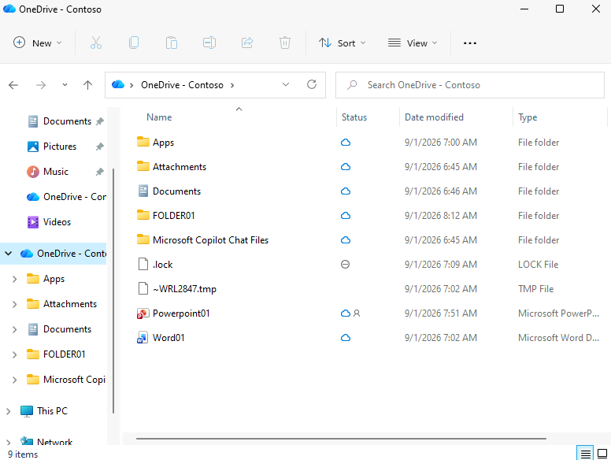

## Passo 10 – Configurazione delle policy OneDrive tramite GPEDIT (da `SEA-DEV3`, User03)

1. Andare su `SEA-DEV3` come **User03**.
2. Copiare il file **`onedrive.admx`** da **Materiale/Modulo2/Installer/** nella cartella locale **`C:\Windows\PolicyDefinitions\`**, richiede permessi da amministratore.

   ```text
   C:\Windows\PolicyDefinitions\
   ```

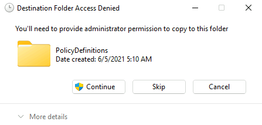

3. Copiare il file **`onedrive.adml`** da **Materiale/Modulo2/Installer/** nella cartella locale **`C:\Windows\PolicyDefinitions\en-US\`**, richiede permessi da amministratore.

   ```text
   C:\Windows\PolicyDefinitions\en-US\
   ```

4. Avviare **`GPEDIT.MSC`** (Editor Criteri di gruppo locali).

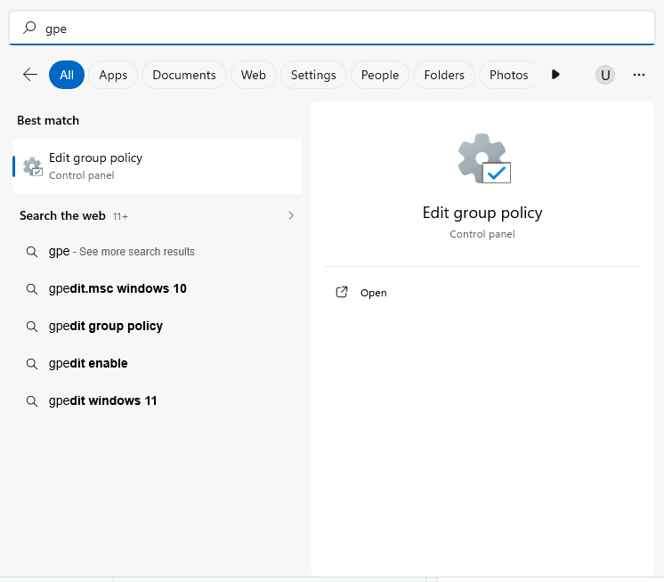

5. Nell'editor, navigare su **User Configuration > Administrative Templates > OneDrive** e configurare le seguenti policy:

**A) Prevent users from synchronizing personal OneDrive accounts**

Entrare in **User Configuration > Policies > Administrative Templates > OneDrive > Prevent users from synchronizing personal OneDrive accounts**

Premere su Edit e poi: **Enabled**. Premere OK.

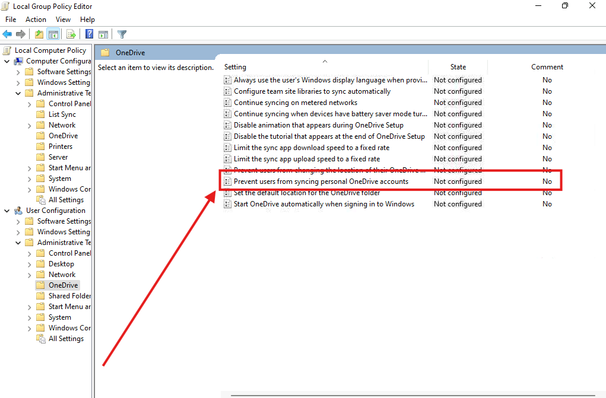

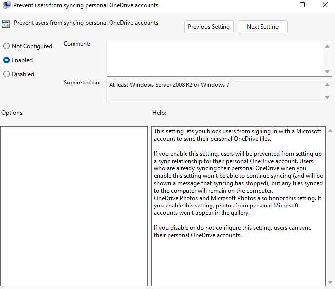

> [!NOTE]
> Impedisce l'aggiunta di **account Microsoft personali** al client OneDrive, obbligando l'uso del solo account aziendale/scolastico.

**B) Allow syncing OneDrive accounts for only specific organizations**

Andare in **Computer Configuration > Policies > Administrative Templates > OneDrive > Allow syncing OneDrive accounts for only specific organizations**

Mettere **Enabled**, e inserire il **Tenant ID** dell'organizzazione consentita (quello del tenant di laboratorio) nel riquadro rosso vuoto dopo aver premuto Show.

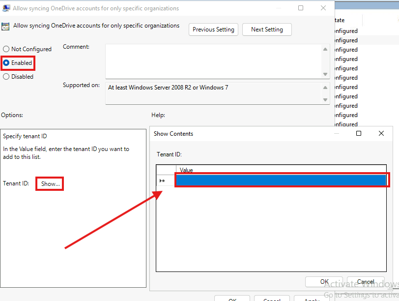

> [!NOTE]
> Impedisce la sincronizzazione di **account business appartenenti ad altri tenant**, limitando il client OneDrive al solo tenant specificato.

**C) Silently sign in users to the OneDrive sync app with their Windows credentials**

Andare su **Computer Configuration > Policies > Administrative Templates > OneDrive > Silently sign in users to the OneDrive sync app with their Windows credentials**

Premere **Enabled** e poi Ok.

> [!NOTE]
> Riduce gli **errori di autenticazione** e le **configurazioni incomplete**, effettuando il login automatico dell'utente Windows già autenticato nel tenant.

> [!TIP]
> I file `OneDrive.admx`/`.adml` aggiornati si trovano anche nella cartella di installazione del client (`...\Microsoft OneDrive\<versione>\adm\`). In ambienti cloud-only le stesse impostazioni si distribuiscono tramite **Intune** (Settings catalog).
>
> [Usare i criteri OneDrive per controllare la sincronizzazione](https://learn.microsoft.com/sharepoint/use-group-policy)

## Passo 11 – Ulteriori policy OneDrive

**D) Use OneDrive Files On-Demand**

Entrare in **Computer Configuration > Policies > Administrative Templates > OneDrive > Use OneDrive Files On-Demand**

Impostare la policy su **Enabled**.

> [!NOTE]
> Rende visibili i file in **Esplora file** senza scaricare automaticamente tutto il contenuto sul dispositivo (i file restano "on-demand", scaricati solo all'apertura).

**E) Silently move Windows known folders to OneDrive**

Andare su **Computer Configuration > Policies > Administrative Templates > OneDrive > Silently move Windows known folders to OneDrive** e configurare **Enabled**, specificando il **Tenant ID** e selezionando **solo Documenti e Immagini** come cartelle da spostare (lasciando **Desktop** deselezionato)

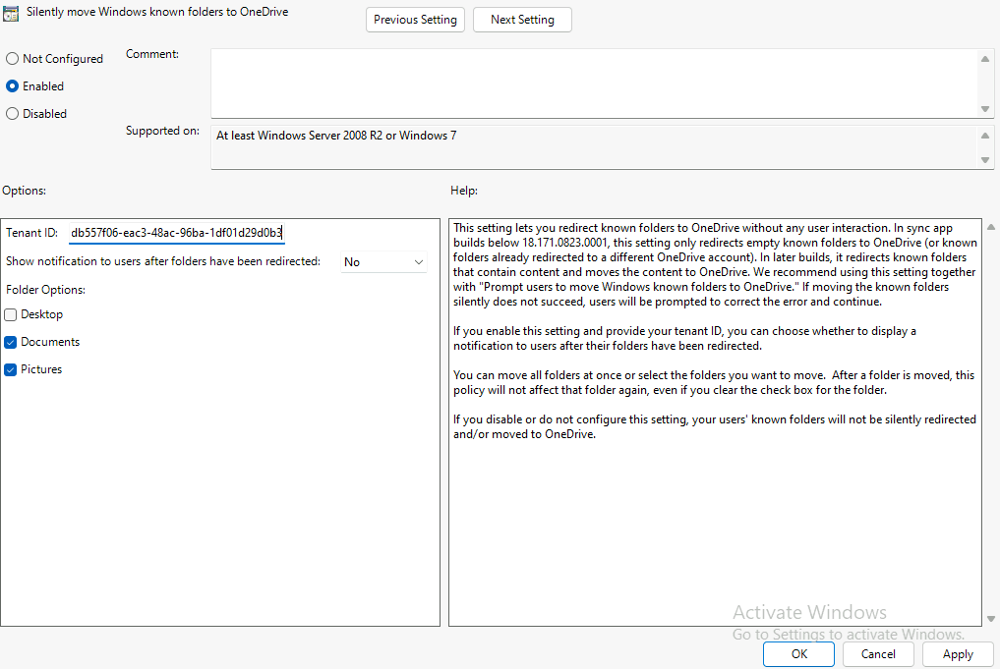

> [!NOTE]
> Reindirizza le cartelle note di Windows supportate (tipicamente Desktop, Documenti e Immagini) verso OneDrive aziendale — in questo esercizio limitato a Documenti e Immagini.

**F) Prevent users from redirecting their Windows known folders to their PC**

Recarsi su **Computer Configuration > Policies > Administrative Templates > OneDrive > Prevent users from redirecting their Windows known folders to their PC** impostare: **Enabled**

> [!NOTE]
> Impedisce agli utenti di **spostare indietro** le cartelle note protette da OneDrive al disco locale del PC.

Riavviare `SEA-DEV3` per applicare tutte le policy configurate ai Passi 10 e 11.

> [!IMPORTANT]
> Il **Tenant ID** si trova in **Entra ID > Overview**. Le policy **Silently move Windows known folders** e **Silent sign-in** funzionano solo con account di lavoro su dispositivi Microsoft Entra joined o ibridi.
>
> [Reindirizzare e spostare le cartelle note di Windows in OneDrive](https://learn.microsoft.com/sharepoint/redirect-known-folders)

## Passo 12 – Login con User03 e verifica delle policy applicate

1. Dopo il riavvio, accedere a **`SEA-DEV3` con le credenziali di User03**.
2. Verificare i seguenti comportamenti automatici, conseguenza delle policy configurate:
   - **Nessuna configurazione richiesta**: avviando OneDrive, il client non chiede alcun setup guidato (login silenzioso grazie alla policy C).

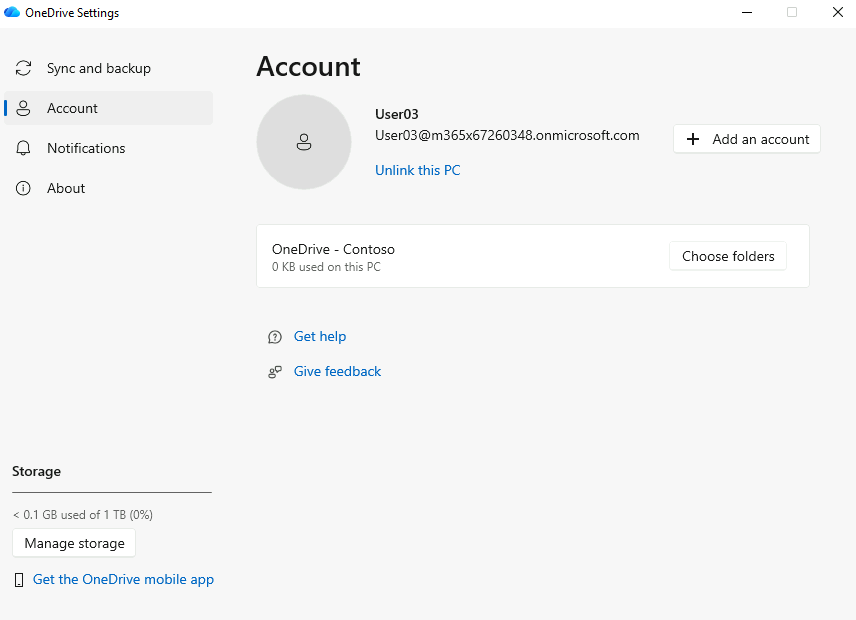

   - **Documenti e Immagini già sincronizzate**: le cartelle sono già reindirizzate e sincronizzate con OneDrive (policy E), e **non è possibile modificarle** dal pannello Impostazioni di OneDrive (l'opzione risulta bloccata/grigia).

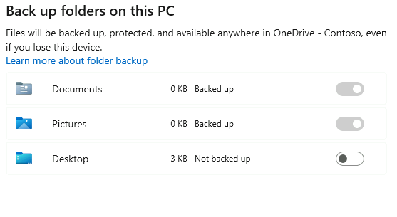

   - **Tentativo di "Always keep on this device" globale**: provando a forzare tutti i file offline, dopo un breve periodo i file **tornano automaticamente online** (cloud-only) comportamento atteso quando la policy Files On-Demand (D) è forzata dall'amministratore.

   - **Nessuna aggiunta di account personale**: tentando di aggiungere un account Microsoft personale al client OneDrive, l'operazione viene **bloccata** (policy A).

---

[← Indice modulo](README.md) · [Indice modulo →](README.md)
