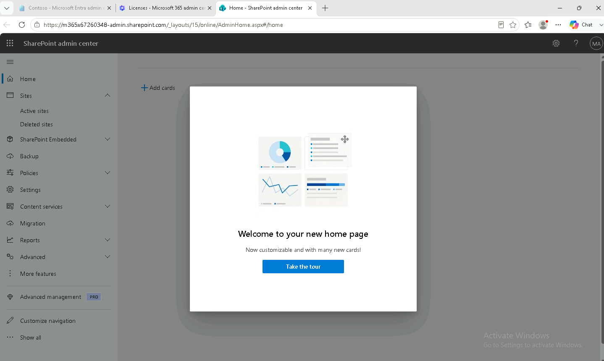
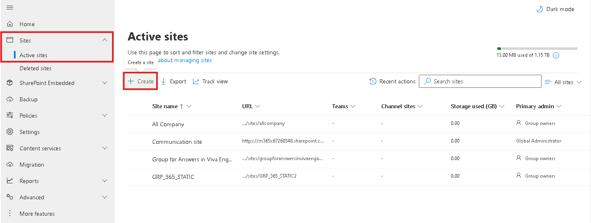
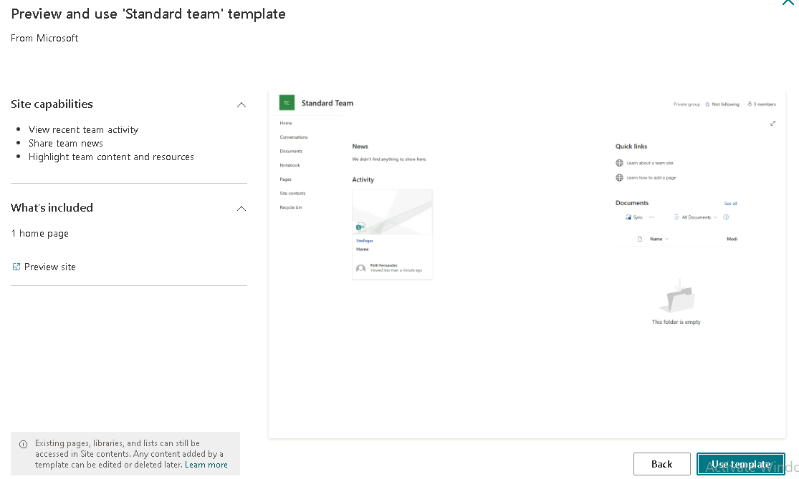
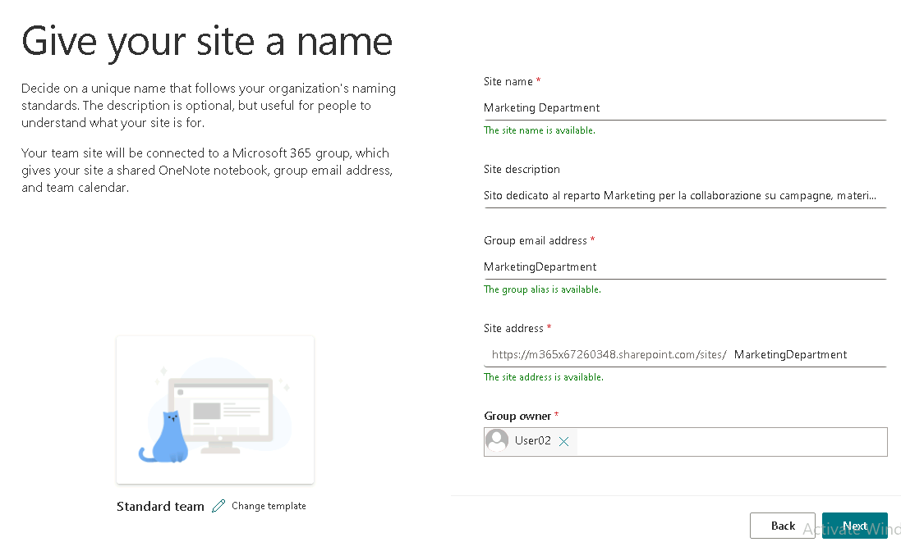
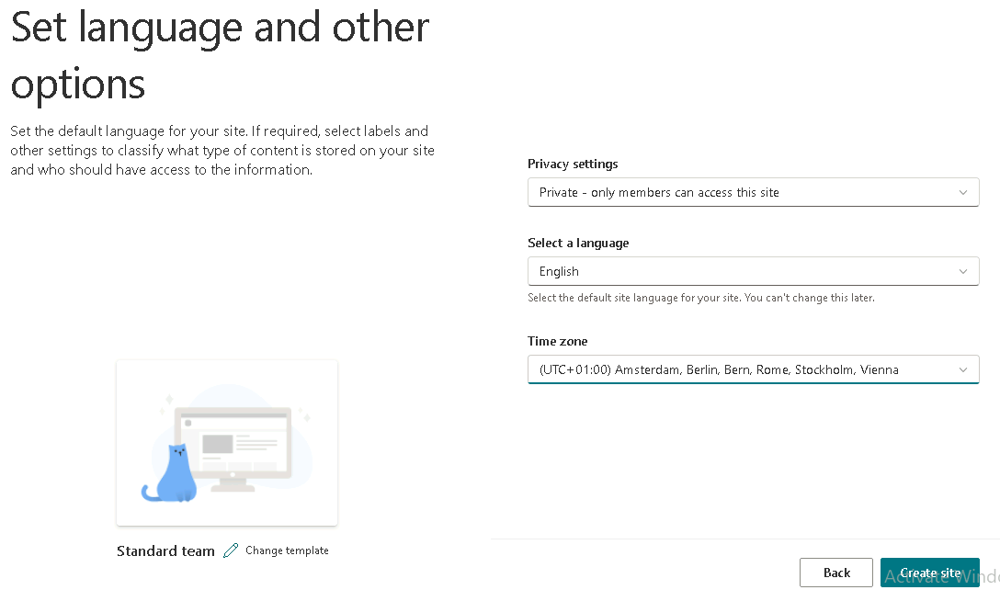
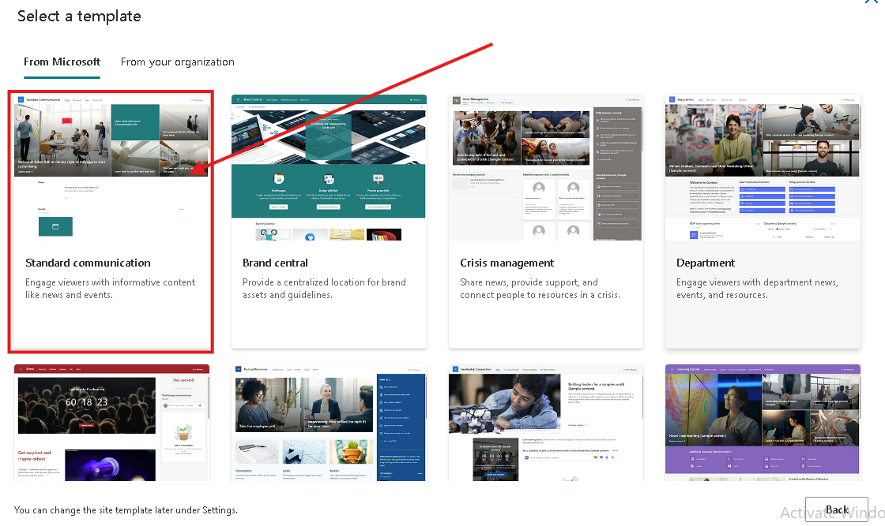
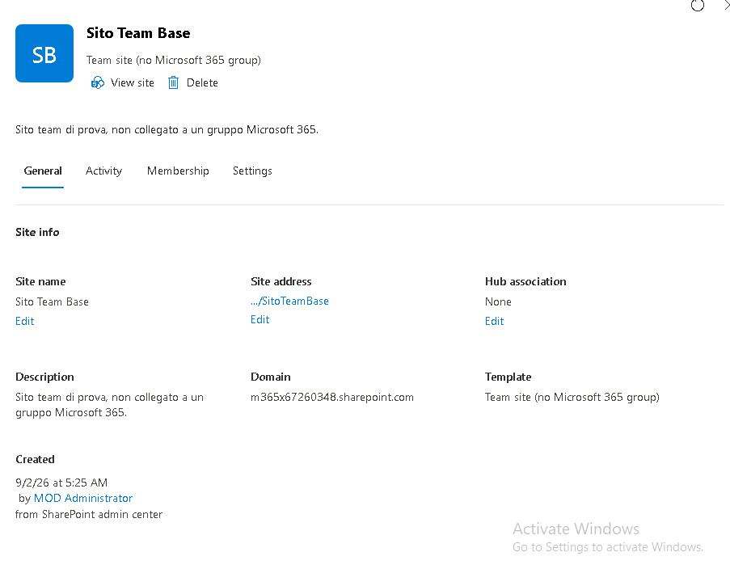

# Modulo 3 – Esercizio 1: Creazione dei siti

[← Indice modulo](README.md) · [Esercizio 2 →](Esercizio-02.md)

## Passo 1 – Accesso all'Admin Center e a SharePoint

**Accedere alla VM SEA-DEV1 come User01 con credenziali admin**

1. Aprire il browser e accedere come **amministratore del tenant Microsoft 365** a `https://admin.microsoft.com`.
2. Nel menu laterale, aprire **Show all** (Mostra tutto) e selezionare **Admin centers > SharePoint**, per accedere all'**Admin Center di SharePoint**.

## Passo 2 – Creazione del sito Team Site "Marketing Department"

Percorso: **SharePoint Admin Center > Sites > Active sites > Create**

1. Selezionare **Create**, poi scegliere il tipo **Team site** (sito collegato a un gruppo Microsoft 365).

2. Selezionare il template **Standard Team**.

### Sezione 1 – Informazioni di base

3. Compilare i campi:
    - **Site Name**: `Marketing Department`
    - **Site Description**: `Sito dedicato al reparto Marketing per la collaborazione su campagne, materiali e progetti condivisi.`
    - **Group email address**: lasciare il valore proposto di default.
    - **Site address**: lasciare il valore proposto di default.
    - **Group owner**: aggiungere **User02**.

### Sezione 2 – Impostazioni aggiuntive

4. Selezionare **Next** e compilare:
    - **Privacy settings**: `Private`
    - **Select language**: `English`
    - **Time zone**: `UTC+1`
    - **Add member**: aggiungere **User03**

4. Selezionare **Create site** per completare la creazione.

> [!NOTE]
> Un **Team site** collegato a un **Microsoft 365 Group** crea automaticamente, insieme al sito, anche una cassetta postale condivisa, un calendario di gruppo e ,come vedremo nell'Esercizio 8 , può diventare la base per un Team di Microsoft Teams.

> [!TIP]
> Per default **qualsiasi utente** può creare gruppi Microsoft 365 (e quindi Team site). In molte organizzazioni la creazione viene limitata a un gruppo di sicurezza specifico.
>
> 📖 [Gestire chi può creare gruppi Microsoft 365](https://learn.microsoft.com/microsoft-365/solutions/manage-creation-of-groups)

## Passo 3 – Creazione guidata di un Site Communication e di un Team Site senza gruppo M365

> Questi due siti servono solo a mostrare le differenze di tipologia disponibili in fase di creazione: non verranno utilizzati negli esercizi successivi. Usare valori uniformi e prestabiliti, senza personalizzazioni aggiuntive.

### 3.1 – Communication Site

1. Tornare su **SharePoint Admin Center > Sites > Active sites > Create**.
2. Selezionare il tipo **Communication site**.
3. Scegliere il template **Standard Communication**.
4. Compilare i campi con valori uniformi e prestabiliti:
    - **Site name**: `Comunicazioni Aziendali`
    - **Site description**: `Sito di comunicazione per annunci e notizie aziendali.`
    - **Site address**: lasciare il valore proposto di default.
    - **Owner**: User02
    - **Select language**: `English`
    - **Time zone**: `UTC+1`

5. Selezionare **Crea** per completare la creazione.

### 3.2 – Team Site senza Microsoft 365 Group

1. Ripetere la procedura da **Create**, selezionando questa volta **Browse more site**.
2. Nella scelta del tipo di collaborazione, selezionare l'opzione **Team site**.
3. Compilare i campi con valori uniformi e prestabiliti:
    - **Site name**: `Sito Team Base`
    - **Site description**: `Sito team di prova, non collegato a un gruppo Microsoft 365.`
    - **Site address**: lasciare il valore proposto di default.
    - **Primary Administrator**: User02
    - **Select language**: `English`
    - **Time zone**: `UTC+1`
4. Selezionare **Create Site** per completare la creazione.

> [!NOTE]
> A differenza del Team Site collegato a un gruppo (creato al Passo 2), un **Team site senza Microsoft 365 Group** non genera automaticamente una cassetta postale condivisa né un calendario di gruppo, e non può diventare la base per un Team di Microsoft Teams tramite l'opzione "crea da gruppo esistente" (Esercizio 8).

> [!NOTE]
> Riepilogo: **Team site** (con gruppo M365) per la collaborazione di un team; **Communication site** per pubblicare contenuti a un pubblico ampio; **Team site senza gruppo** quando serve un sito di collaborazione gestito solo con i permessi SharePoint.
>
> 📖 [Pianificare i siti SharePoint](https://learn.microsoft.com/sharepoint/planning-hub-sites)

---

[← Indice modulo](README.md) · [Esercizio 2 →](Esercizio-02.md)
