# Modulo 3 – Esercizio 2: Navigazione e aspetto del sito

[← Esercizio 1](Esercizio-01.md) · [Indice modulo](README.md) · [Esercizio 3 →](Esercizio-03.md)

## Passo 1 – Accesso al sito con User02

**Accedere alla VM SEA-DEV2 con le credenziali di User02**

1. Aprire **Microsoft Edge** e accedere all'indirizzo del sito creato nell'Esercizio 1: `https://tenant_name.sharepoint.com/sites/MarketingDepartment`  (dove `tenant_name` è il nome del proprio tenant)

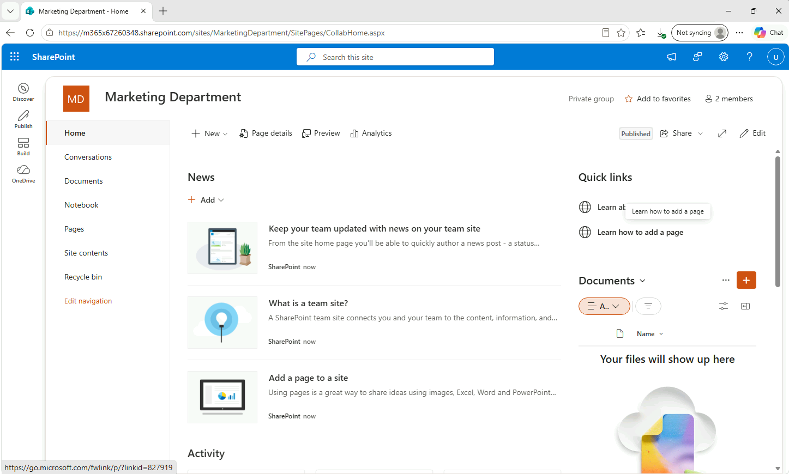

2. Inserire le credenziali di **User02** solo se richiesto: essendo User02 già autenticato su Windows/Microsoft 365, l'accesso dovrebbe avvenire in automatico tramite SSO, senza richiedere nuovamente le credenziali.

## Passo 2 – Gestione del menu di navigazione (Edit Navigation)

1. Nel menu laterale sinistro del sito, in fondo, selezionare **Edit Navigation** (Modifica) per aprire la gestione della navigazione.

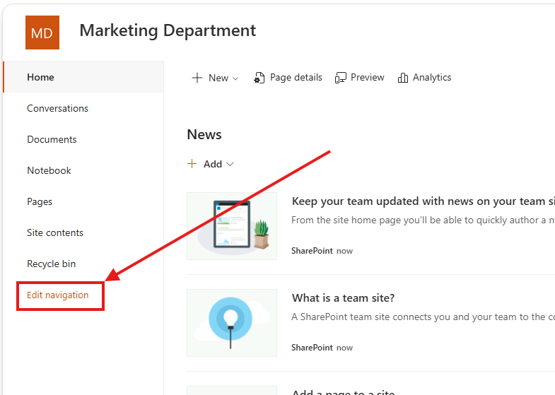

2. **Modificare l'ordine delle voci**: trascinare la voce **Pages** sopra la voce **Documents**, in modo da anteporre l'accesso alle pagine rispetto ai documenti.
3. **Rinominare** la voce **Documents** in **`File Condivisi01`**: selezionare la voce, scegliere **Edit** e sostituire il testo visualizzato.

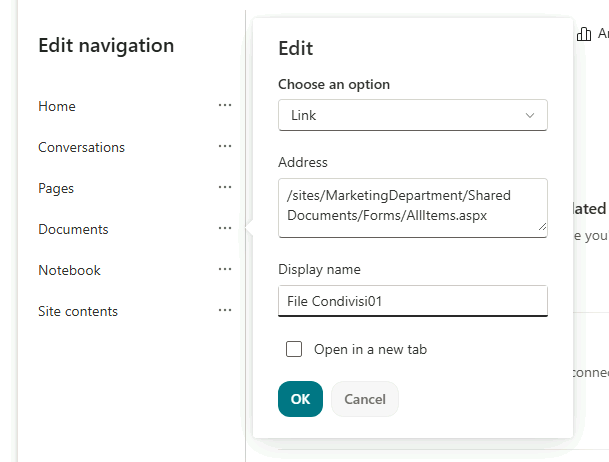

4. **Rimuovere** la voce **Notebook**: selezionare la voce, scegliere i tre puntini (**...**) e selezionare **Remove** (Rimuovi).
5. **Aggiungere una nuova voce di menu**: selezionare **+ Add**, scegliere **Link**, inserire l'indirizzo `https://computergross.it` come URL e un nome a scelta (es. `Computer Gross`); abilitare l'opzione **Open in new tab** (Apri in nuova scheda), se disponibile in questa versione del pannello, oppure specificarlo tramite l'opzione **Open link in new tab**.

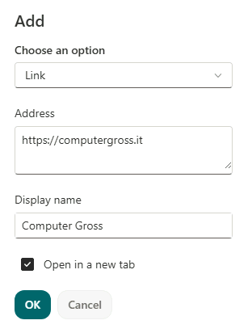

6. Selezionare **Save** (Salva) per applicare tutte le modifiche alla navigazione.

> [!NOTE]
> Le modifiche alla navigazione sono visibili immediatamente a tutti gli utenti che accedono al sito, in base ai permessi di visualizzazione di ciascuna voce.
## Passo 3 – Change the Look del sito

Premere sulla **rotella delle impostazioni (in alto a destra) > Change the look**

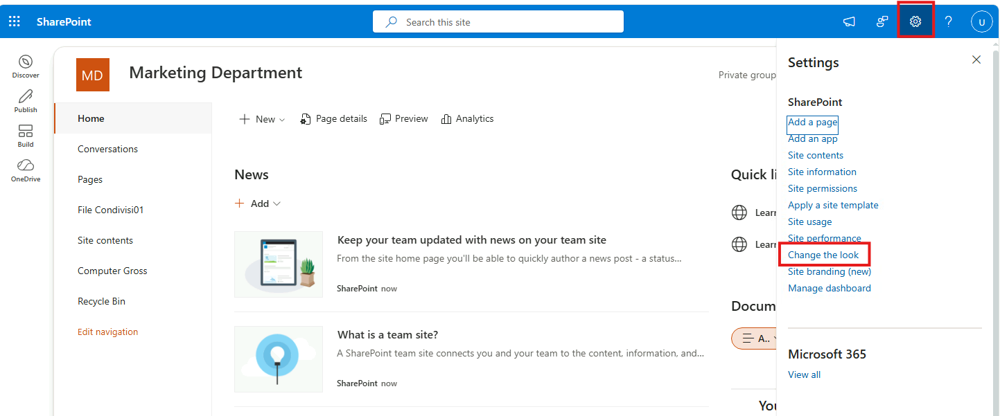
### Tema

1. Nella sezione **Theme**, selezionare il tema **Blue** (tema aziendale coerente con il reparto Marketing).

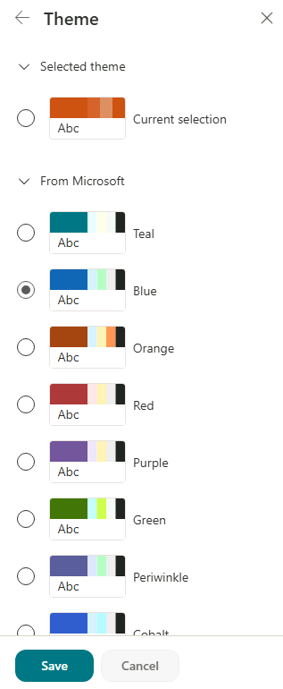

### Header  Layout

2. Nella sezione **Header**, impostare il **Layout** su **Extended** (esteso), per un'intestazione più ampia e visivamente d'impatto.

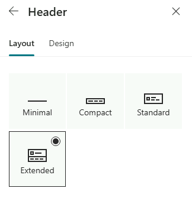
### Header  Design

3. Configurare le seguenti opzioni nella sezione **Header > Design**:
- **Theme**: selezionare `#1267B5 background, white accent`.

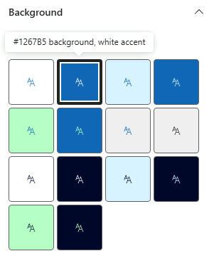

- **Image (opzionale)**: selezionare un'immagine da **Stock Images** (a tema ufficio/collaborazione).

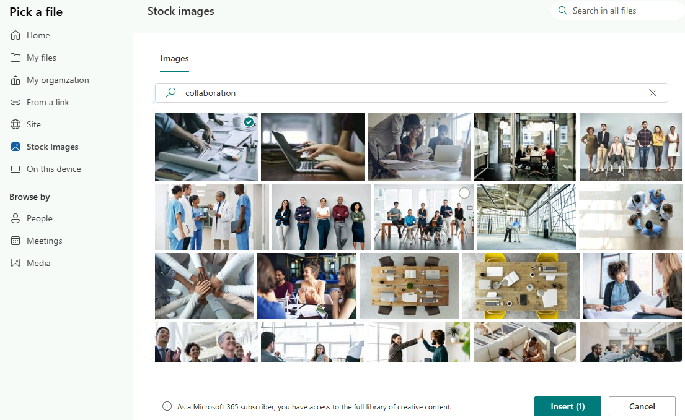

- **Overlay color**: selezionare l'ultima opzione della tavolozza colori proposta (la tonalità più scura/intensa).
- **Gradient direction**: impostare su **Bottom to top** (dal basso verso l'alto).

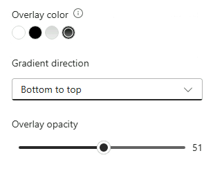
### Logo

4. Configurare i loghi del sito:
    - **Site logo thumbnail**: caricare il file `icon1.png` dal percorso materiale `/Modulo3/Data/icon1.png`.
    - **Site logo**: caricare il file `icon2.png` dal percorso materiale `/Modulo3/Data/icon2.png`.
    - **Logo alignment**: impostare su **Right** (tutto allineato a destra).

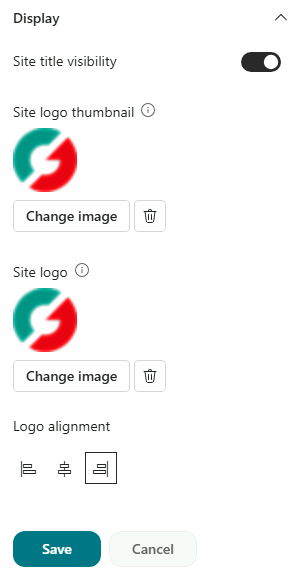

5. Selezionare **Save** per applicare il nuovo aspetto al sito.

> [!TIP]
> Gli amministratori possono aggiungere **temi personalizzati** con i colori aziendali (`Add-SPOTheme`) e nascondere i temi predefiniti, così che i site owner scelgano solo tra quelli approvati.
>
> 📖 [Temi dei siti SharePoint](https://learn.microsoft.com/sharepoint/dev/declarative-customization/site-theming/sharepoint-site-theming-overview)

---

[← Esercizio 1](Esercizio-01.md) · [Indice modulo](README.md) · [Esercizio 3 →](Esercizio-03.md)
