# Modulo 3 – Esercizio 3: Librerie, metadati e viste

[← Esercizio 2](Esercizio-02.md) · [Indice modulo](README.md) · [Esercizio 4 →](Esercizio-04.md)

## Passo 1 – Accesso al sito con User02

**Accesso alla VM SEA-DEV2 con le credenziali di User02**

1. Aprire **Microsoft Edge** e accedere all'indirizzo del sito:

   ```text
   https://tenant_name.sharepoint.com/sites/MarketingDepartment
   ```

2. Inserire le credenziali di **User02** solo se richiesto (l'accesso dovrebbe avvenire in automatico via SSO).
## Passo 2 – Creazione della libreria "File Condivisi02"

1. Nella home del sito, selezionare **+ New > Document library > Blank library**.

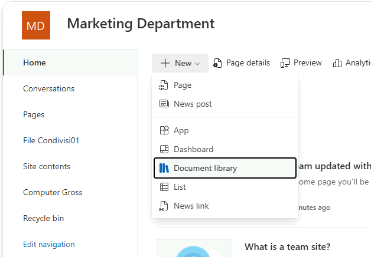

2. Assegnare come nome della libreria:

   ```text
   File Condivisi02
   ```

3. Selezionare **Create** per completare la creazione.
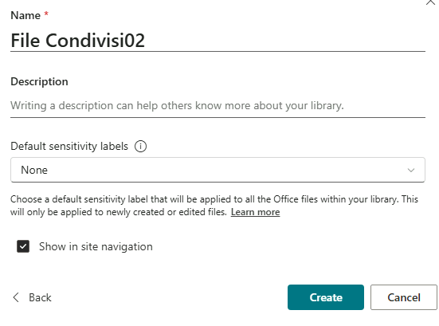
> [!NOTE]
> Il sito dispone ora di due librerie documentali: **File Condivisi01** (la libreria "Documents" rinominata nell'Esercizio 2) e **File Condivisi02** (appena creata).

## Passo 3 – Copia dei file del materiale nelle librerie

1. Aprire la cartella del materiale del corso **Materiale Studenti/Modulo3/Data/**.
2. Copiare Folder1  nella libreria **File Condivisi01**.
3. Copiare Folder2 nella libreria **File Condivisi02**.

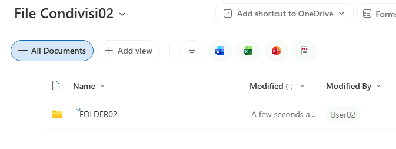

## Passo 4 – Esempi di metadati e colonne personalizzate

1. Aprire la libreria **File Condivisi01**.
2. Selezionare **+ Add column** e creare le seguenti colonne di esempio:
- **Reparto** (tipo _Choice_, con valori: `Marketing`, `Vendite`, `Comunicazione` e spuntare il **Require that this column contains information**)

  ```text
  Marketing
  ```

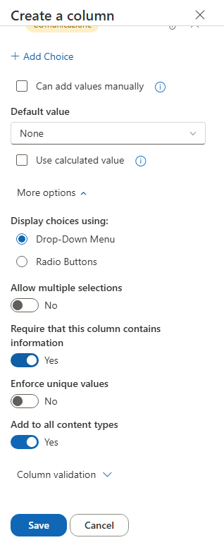

- **Data Revisione** (tipo _Date and time_)

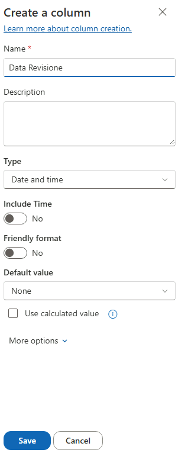

- **Confidenziale** (tipo _Yes/No_)

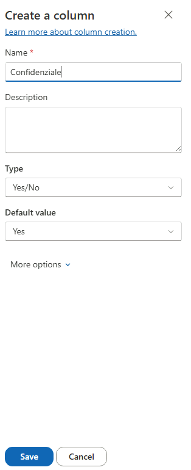

- **Responsabile** (tipo _Person_)

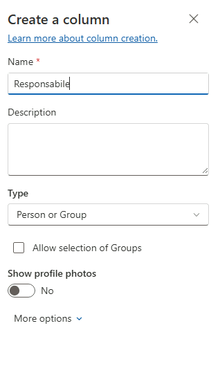

3. Compilare i metadati , usando **Edit in Grid View**, per alcuni file caricati, assegnando valori diversi alle colonne appena create (ad esempio un file con Reparto = Marketing e Confidenziale = Yes, un altro con Reparto = Vendite e Confidenziale = No).

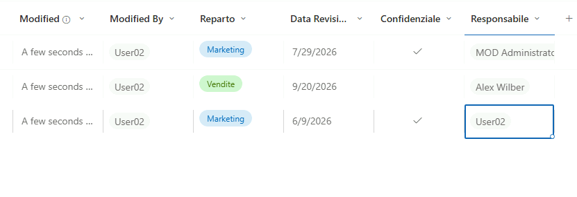

> [!TIP]
> Le colonne create nella libreria valgono solo lì. Per riutilizzare gli stessi metadati in più librerie o siti usare **colonne del sito** e **tipi di contenuto**, o meglio il **Content type gallery** a livello di tenant.
>
> 📖 [Creare e gestire i tipi di contenuto](https://learn.microsoft.com/sharepoint/create-content-type)
## Passo 5 – Esempi di viste (condivise o personali)

1. Nella libreria **File Condivisi01**, selezionare **Add view** (accanto al nome della vista corrente, es. "All Documents").
2. Creare una nuova vista con nome **`Vista Confidenziali`**:
- Lasciare come di default le opzioni e fare create.
- Premere Filters e spuntare Confidenziale Yes.

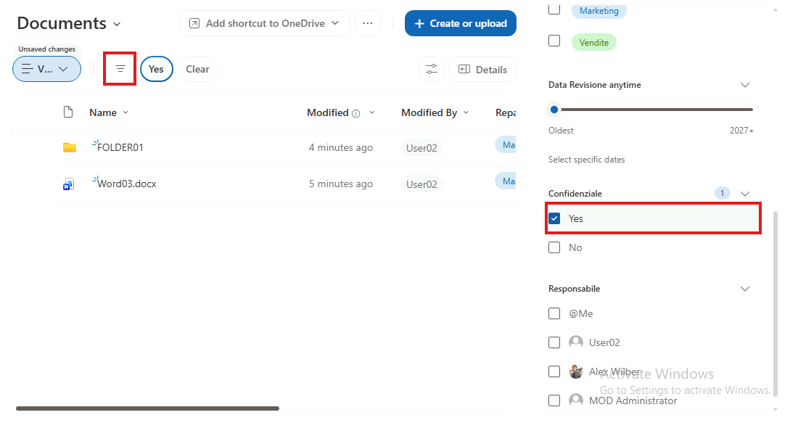
- Premere Save View.

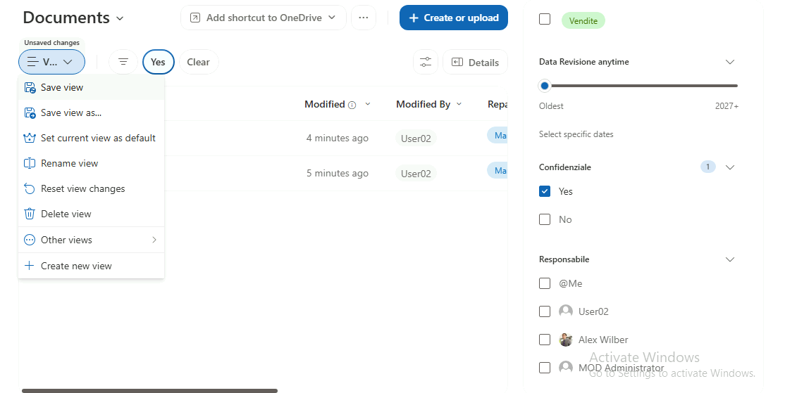

3. Creare una seconda vista con nome **`Vista Personale per Reparto`**:
- Togliere la spunta a **Make this a public view**.
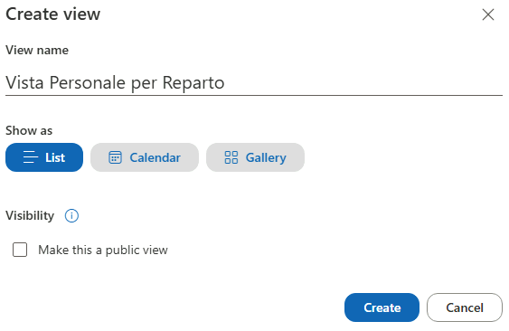
- Andare su Filters e spuntare il reparto Vendite, poi salvare la View.

> [!WARNING]
> Le viste filtrate **non sono un meccanismo di sicurezza**: nascondono gli elementi dalla vista, ma gli utenti con accesso alla libreria possono comunque trovarli (ricerca, altre viste). Per limitare l'accesso usare i **permessi**.
>
> Le viste aiutano anche con le librerie molto grandi (oltre la soglia di **5.000 elementi** per vista): usare filtri su colonne **indicizzate**.
>
> 📖 [Gestire elenchi e raccolte di grandi dimensioni](https://support.microsoft.com/office/b8588dae-9387-48c2-9248-c24122f07c59)
## Passo 6 – Verifica lato User03 (membro) su SEA-DEV3

1. Accedere alla **VM SEA-DEV3 con le credenziali di User03**.
2. Aprire **Microsoft Edge** e accedere allo stesso indirizzo del sito:

   ```text
   https://tenant_name.sharepoint.com/sites/MarketingDepartment
   ```

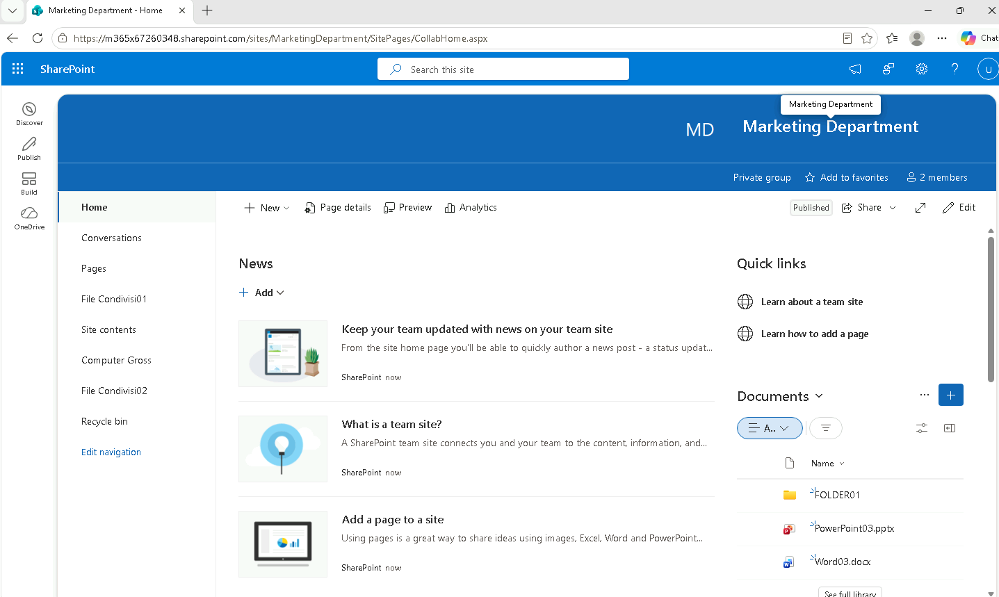

3. Verificare che User03, in qualità di **Member** del sito, possa:
    - Visualizzare entrambe le librerie **File Condivisi01** e **File Condivisi02** con tutti i file caricati.
    - Visualizzare la **Vista Confidenziali** (vista condivisa, creata da User02).
    - **Non** visualizzare la **Vista Personale per Reparto** (vista personale, visibile solo a User02).

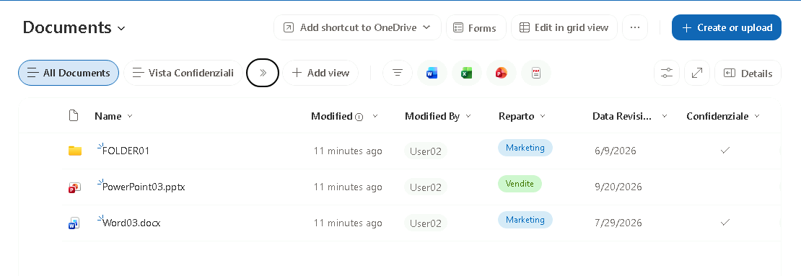

---

[← Esercizio 2](Esercizio-02.md) · [Indice modulo](README.md) · [Esercizio 4 →](Esercizio-04.md)
