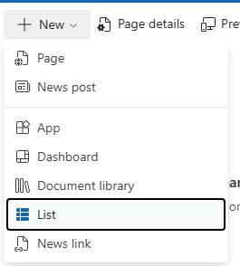
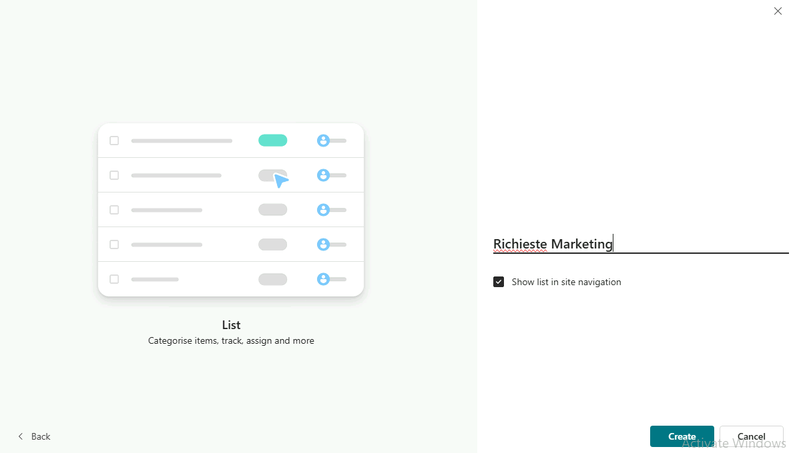
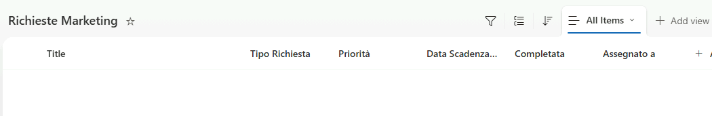
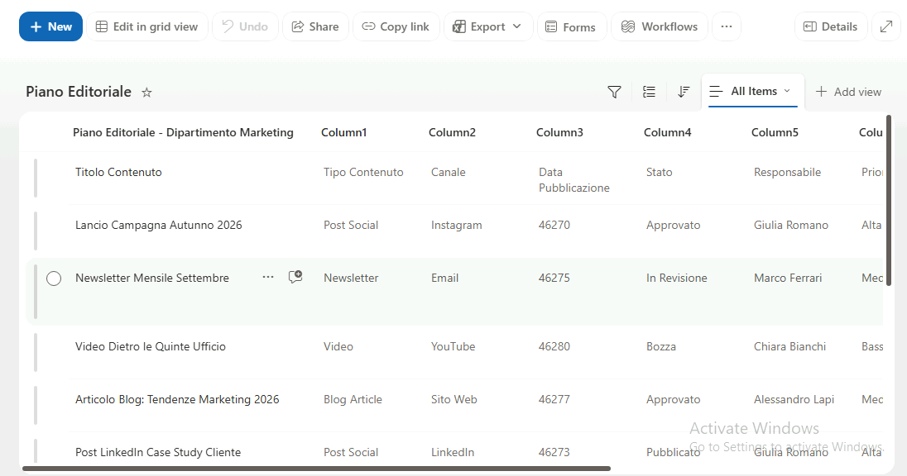
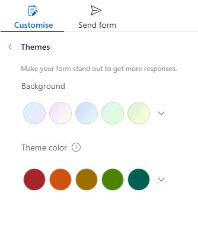
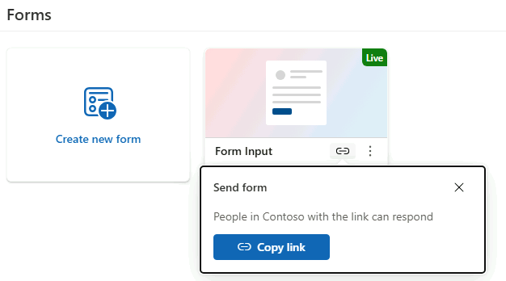
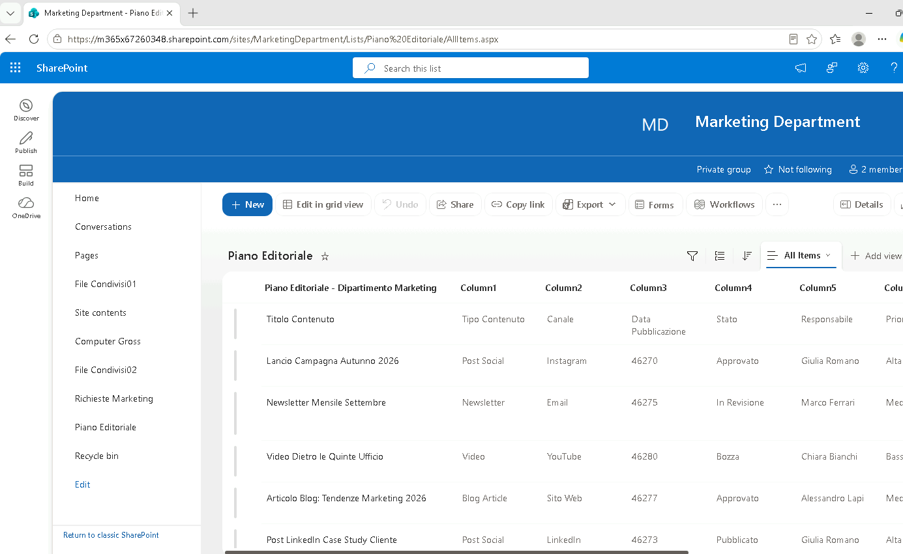

# Modulo 3 – Esercizio 4: Liste e moduli

[← Esercizio 3](Esercizio-03.md) · [Indice modulo](README.md) · [Esercizio 5 →](Esercizio-05.md)

## Passo 1 – Accesso al sito con User02

**Accesso alla VM `SEA-DEV2` con le credenziali di User02**

1. Aprire **Microsoft Edge** e accedere all'indirizzo del sito:

   ```text
   https://tenant_name.sharepoint.com/sites/MarketingDepartment
   ```

2. Inserire le credenziali di **User02** solo se richiesto (l'accesso dovrebbe avvenire in automatico via SSO).

## Passo 2 – Creazione di una nuova lista da zero

1. Nella home del sito, selezionare **+ New > List**.



2. Scegliere l'opzione **List** (sotto Create from blank).
3. Assegnare come nome **`Richieste Marketing`** e selezionare **Create**.



4. Aggiungere le seguenti colonne, tramite **+ Add column**:
    - **Tipo Richiesta**: colonna a **scelta multipla** (_Choice_), con opzioni: `Grafica`, `Contenuti Social`, `Evento`, `Materiale Stampa`.

      ```text
      Grafica
      ```

    - **Priorità**: colonna _Choice_ a scelta singola, con opzioni: `Bassa`, `Media`, `Alta`.

      ```text
      Bassa
      ```

    - **Data Scadenza**: colonna di tipo _Date and time_.
    - **Completata**: colonna di tipo _Yes/No_.
    - **Assegnato a**: colonna di tipo _Person_.



5. Aggiungere alcuni elementi di esempio alla lista, compilando i valori per ciascuna colonna.

| Title                             | Tipo Richiesta    | Priorità | Data Scadenza | Completata | Assegnato a    |
| --------------------------------- | ----------------- | -------- | ------------- | ---------- | -------------- |
| **Campagna Social Black Friday**  | Social Media      | Alta     | 15/11/2026    | No         | Mario Rossi    |
| **Revisione Brochure Prodotto X** | Materiale Grafico | Media    | 30/09/2026    | No         | Giulia Bianchi |
| **Newsletter Mensile Settembre**  | Email Marketing   | Bassa    | 10/09/2026    | Sì         | Luca Verdi     |

## Passo 3 – Importazione di una lista da un foglio Excel

1. Tornare alla home del sito e selezionare **+ New > List**.
2. Scegliere l'opzione **From Excel**.
3. Caricare un file Excel di esempio dal materiale del corso (**MATERIALE_STUDENTI/Modulo3/Data/Piano_Editoriale_Marketing.xlsx**), contenente un elenco tabellare con intestazioni di colonna.
4. Selezionare la tabella giusta e premere Next.
5. Assegnare un nome alla lista, ad esempio **`Piano Editoriale`**, e selezionare **Create**.



> [!NOTE]
> Per l'importazione da Excel i dati devono essere formattati come **tabella** (Inserisci > Tabella): SharePoint propone il tipo di ogni colonna in base al contenuto, modificabile prima della creazione.

## Passo 4 – Personalizzazione del modulo (Form) della lista

1. Aprire la lista **Richieste Marketing** creata al Passo 2.
2. Selezionare **Forms**.
3. Premere **Create new form**
4. Personalizzare il modulo, ad esempio:
    - **Title**:

      ```text
      Form Input
      ```

    - **Logo**:

      ```text
      Icon.png
      ```

    - Riordinare i campi (spostare "Priorità" subito sotto "Titolo").
    - Modificare il colore di sfondo dell'intestazione del modulo tramite **Themes > Create your own Style**.



5. Notare come è possibile Copiare il link del form e condividerlo.



## Passo 5 – Verifica lato User03 (membro) su `SEA-DEV3`

1. Accedere alla **VM `SEA-DEV3` con le credenziali di User03**.
2. Aprire **Microsoft Edge** e accedere allo stesso indirizzo del sito.
3. Verificare che User03, in qualità di **Member**, possa visualizzare entrambe le liste (**Richieste Marketing** e **Piano Editoriale**), aggiungere nuovi elementi tramite il modulo personalizzato e modificare gli elementi esistenti.



---

[← Esercizio 3](Esercizio-03.md) · [Indice modulo](README.md) · [Esercizio 5 →](Esercizio-05.md)
