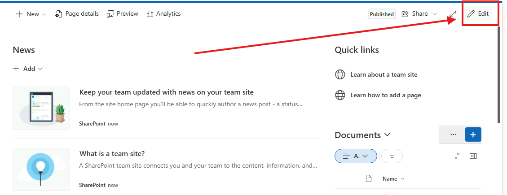
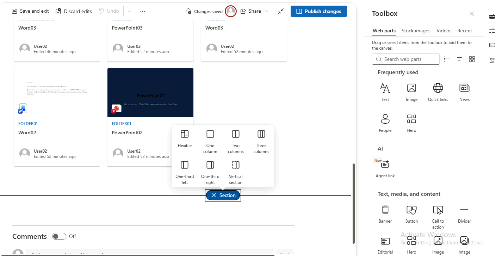
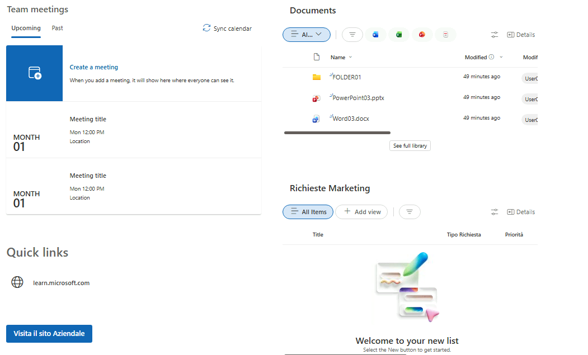
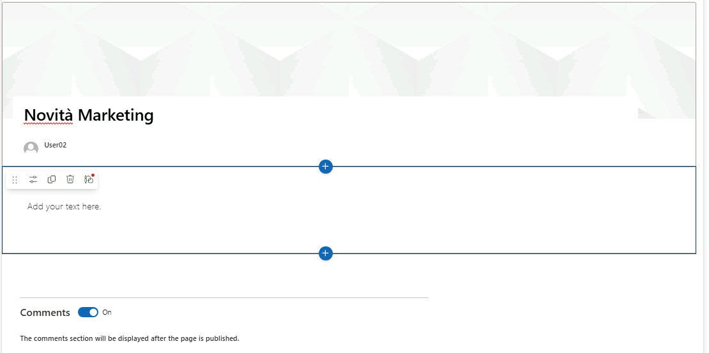
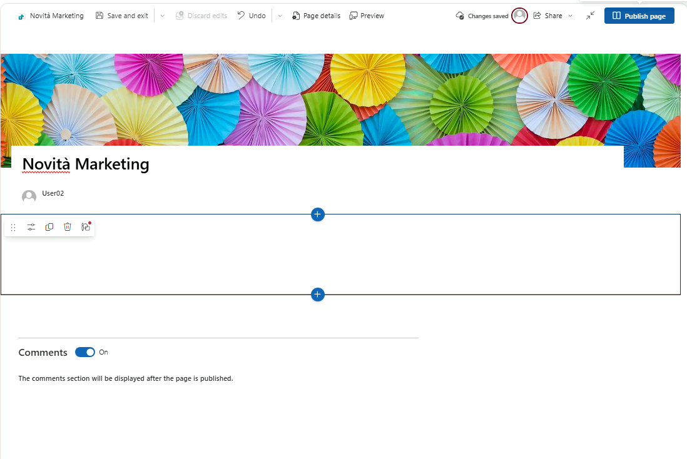
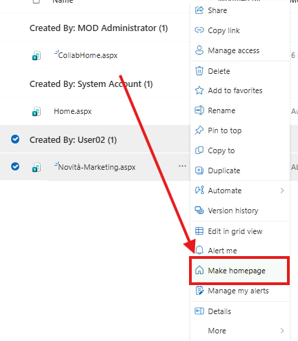
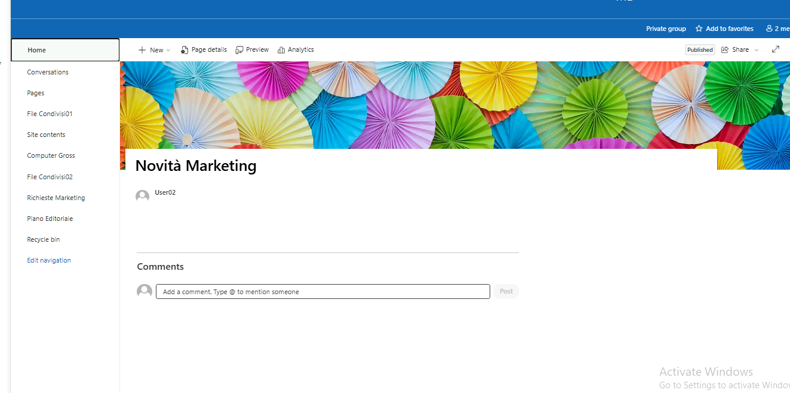
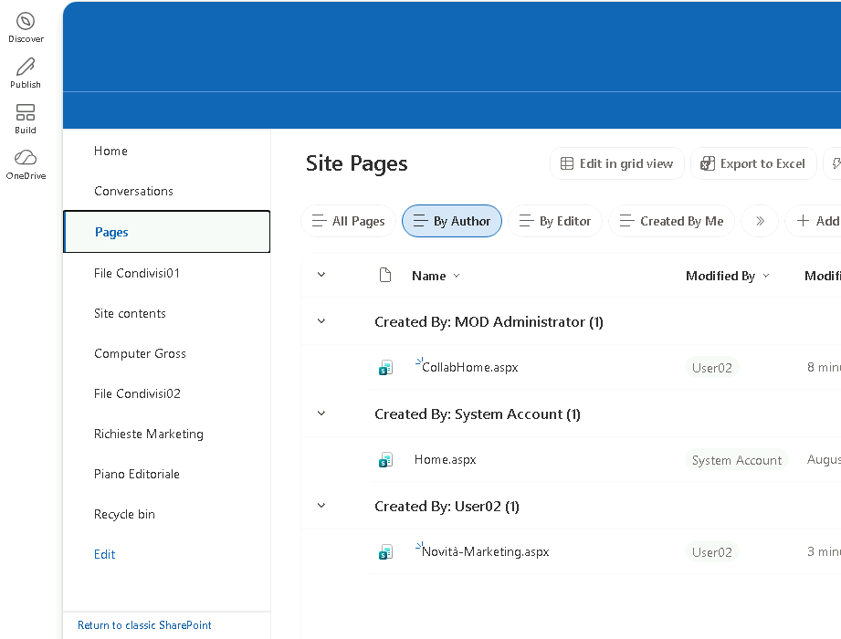

# Modulo 3 – Esercizio 5: Pagine e web part

[← Esercizio 4](Esercizio-04.md) · [Indice modulo](README.md) · [Esercizio 6 →](Esercizio-06.md)

## Passo 1 – Accesso al sito con User02

**Accesso alla VM SEA-DEV2 con le credenziali di User02**

1. Aprire **Microsoft Edge** e accedere all'indirizzo del sito:

   ```text
   https://tenant_name.sharepoint.com/sites/MarketingDepartment
   ```

2. Inserire le credenziali di **User02** solo se richiesto (l'accesso dovrebbe avvenire in automatico via SSO).
## Passo 2 – Modifica della Home Page

1. Nella home del sito, selezionare **Edit** (in alto a destra della pagina).



2. Alla fine del contenuto esistente, selezionare **+** per aggiungere una **nuova sezione**: scegliere un layout a due colonne, per ospitare più web part affiancate.



3. All'interno della nuova sezione, aggiungere le seguenti web part (tramite il pulsante **+** all'interno di ogni colonna):

- **Calendario condiviso**: Group Calendar.
- **Document library**: web part **Document Library**, puntata sulla libreria **Documents**.
- **List**: web part **List**, puntata sulla lista **Richieste Marketing** (quella con il modulo personalizzato dell'Esercizio 4).
- **Quick Links**: web part **Quick Links**, con un link di esempio verso:

  ```text
  https://learn.microsoft.com
  ```

- **Button**: web part **Button**, con testo `Visita il sito aziendale`, puntata su:

  ```text
  https://computergross.it
  ```


4. Aggiungere una sesta web part **Video** o **Embed**, incorporando il video `https://www.youtube.com/watch?v=nEwl1ZPRyMc` come contenuto multimediale di esempio (ad es. una clip di presentazione o formazione per il team).

   ```text
   https://www.youtube.com/watch?v=nEwl1ZPRyMc
   ```

5. Selezionare **Republish** (o **Publish**) per pubblicare le modifiche alla Home Page.

> [!NOTE]
> Le web part **Events**, **Document Library** e **List** si aggiornano automaticamente quando cambia il contenuto sottostante (calendario, libreria o lista): non serve modificare la pagina per riflettere nuovi elementi.

> [!TIP]
> La web part **Embed** accetta solo domini consentiti dalle impostazioni **HTML Field Security** del sito; YouTube è consentito per default.
>
> [Usare le web part nelle pagine SharePoint](https://support.microsoft.com/office/336e8e92-3e2d-4298-ae01-d404bbe751e0)
## Passo 3 – Creazione di una nuova pagina

1. Nel menu laterale, selezionare **Home > + New > Page**.
2. Scegliere Create Blank e assegnare come titolo **`Novità Marketing`**.



3. Personalizzare la pagina:
- Impostare un **'immagine di sfondo per l'intestazione** (Header), tramite l'opzione **Change** sull'immagine di intestazione.


4. Selezionare **Publish** per pubblicare la nuova pagina.

## Passo 4 – Promuovere la pagina a Home Page

1. Tornare su **Pages**, individuare la pagina **Novità Marketing** appena creata.
2. Selezionare i tre puntini (**...**) accanto alla pagina e scegliere **Promote > Make homepage** (Imposta come pagina iniziale).


3. Verificare che, accedendo alla home del sito, venga ora mostrata la pagina **Novità Marketing** al posto della Home originale.



5. Ripetere la stessa procedura sulla pagina originale (**Home**) per **ripristinarla come Home Page**: da **Pages**, selezionare i tre puntini sulla pagina **Home** e scegliere nuovamente **Promote > Make homepage**.
## Passo 5 – Verifica lato User03 (membro) su SEA-DEV3

1. Accedere alla **VM SEA-DEV3 con le credenziali di User03**.
2. Aprire **Microsoft Edge** e accedere allo stesso indirizzo del sito.
3. Verificare che User03 veda:
- La Home Page originale, con tutte le web part aggiunte al Passo 2 (calendario, libreria, lista, quick link, pulsante, video).
- La pagina **Novità Marketing** tra le pagine del sito, raggiungibile dal menu **Pages**.



---

[← Esercizio 4](Esercizio-04.md) · [Indice modulo](README.md) · [Esercizio 6 →](Esercizio-06.md)
