# Modulo 3 – Esercizio 6: Permessi del sito e delle librerie

[← Esercizio 5](Esercizio-05.md) · [Indice modulo](README.md) · [Esercizio 7 →](Esercizio-07.md)

## Passo 1 – Verifica iniziale dei permessi di User03 (Member)

**Accedere alla VM `SEA-DEV3` con le credenziali di User03**

1. Aprire **Microsoft Edge** e accedere all'indirizzo del sito:

   ```text
   https://tenant_name.sharepoint.com/sites/MarketingDepartment
   ```

2. Inserire le credenziali di **User03** solo se richiesto (l'accesso dovrebbe avvenire in automatico via SSO).
3. Verificare che User03, in qualità di **Member**, possa attualmente:
- Accedere e caricare file in **File Condivisi01** e **File Condivisi02**.
- Modificare le pagine del sito (Home Page e pagina "Novità Marketing").
- Creare nuovi contenuti: nuove pagine, nuove liste, nuove librerie.

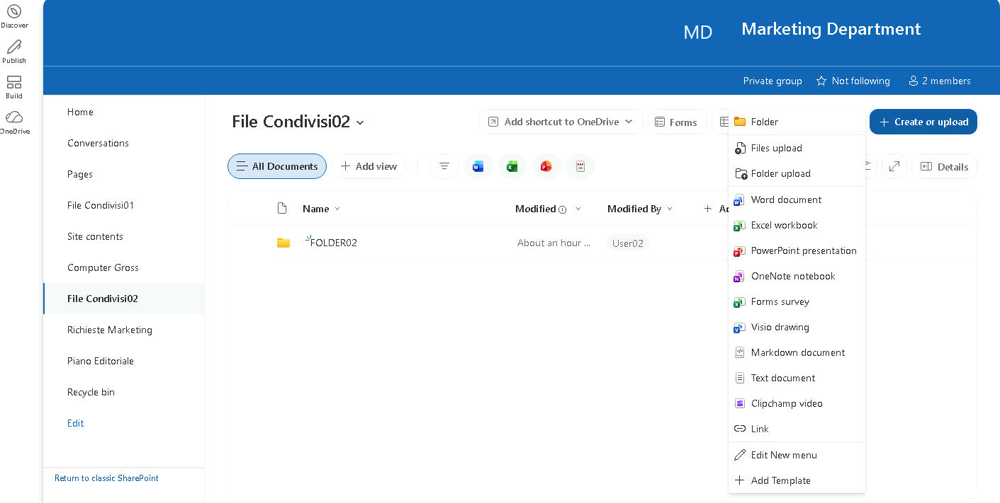

## Passo 2 – Restrizione dei permessi a livello di sito (da Owner)

**Accedere alla VM `SEA-DEV2` con le credenziali di User02**
1. Aprire **Microsoft Edge** e accedere allo stesso indirizzo del sito.
2. Selezionare la rotella delle impostazioni (in alto a destra) e scegliere **Site permissions**.

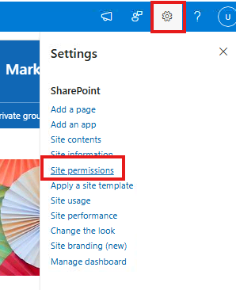

3. Individuare il gruppo **Marketing Department Members** e selezionare **Edit permission level** (o, tramite **Advanced permissions settings**, modificare il livello associato al gruppo).
4. Notare che nei Teams Site con gruppo 365 non è possibile editare direttamente i permessi del gruppo.

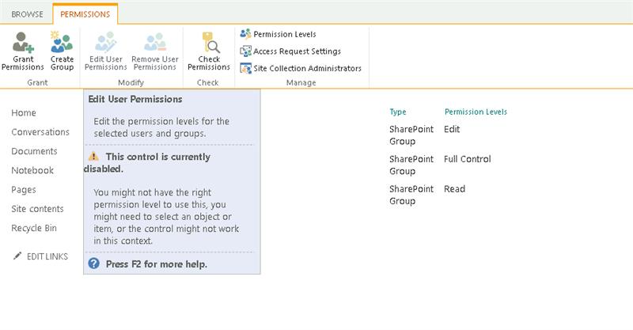

5. Per effettuare l'operazione e aggirare le limitazioni è necessario usare SharePoint Online Management Shell.
6. Aggiungere ai Site Collection Administrator MOD Administrator.

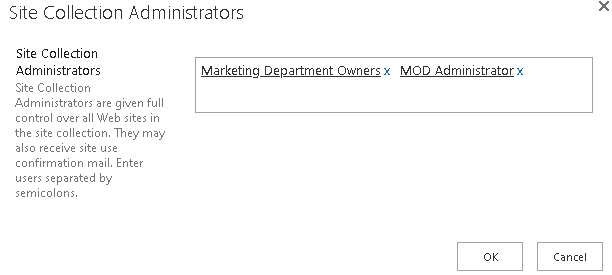

7. Andare su `SEA-DEV1` con MOD Administrator aprire Visual Studio Code con il seguente script: `Modulo3\Script\SPO.ps1`.Seguire i seguenti comandi (dove `TENANT` è un segnaposto per il nome del proprio tenant) per cambiare i permessi al gruppo members.

   ```text
   Modulo3\Script\SPO.ps1
   ```

8. Installare il modulo SharePoint Online Management Shell (se non già presente).

```powershell
Install-Module -Name Microsoft.Online.SharePoint.PowerShell
```

9. Aggiornarlo per evitare problemi con gli Script.

```powershell
Update-Module -Name Microsoft.Online.SharePoint.PowerShell
```

10. Effettuare la connessione come amministratore.

```powershell
Connect-SPOService -Url https://TENANT-admin.sharepoint.com -Credential admin@TENANT.onmicrosoft.com
```

11. Modificare i permessi del gruppo Members con il seguente comando:

```powershell
Set-SPOSiteGroup `
-Site "https://TENANT.sharepoint.com/sites/MarketingDepartment" `
-Identity "Marketing Department Members" `
-PermissionLevelsToRemove "Edit" `
-PermissionLevelsToAdd "Contribute"
```

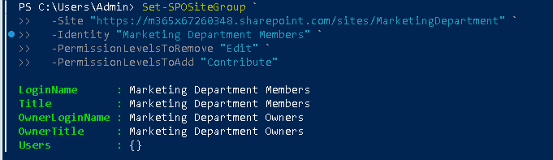

12. Per controllare che sia andato a buon fine eseguire il seguente script:

```powershell
Get-SPOSiteGroup `
-Site "https://TENANT.sharepoint.com/sites/MarketingDepartment" `
-Group "Marketing Department Members" | Select Title, Roles
```

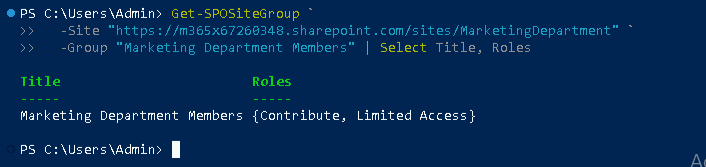

13. Per ulteriore conferma andare su site permission del sito SharePoint e controllare che i members abbiano assegnato Contributor.

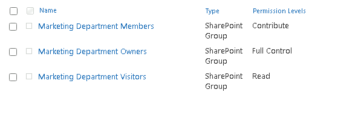

> [!NOTE]
> Livelli di autorizzazione predefiniti: **Full Control** (Owners), **Edit** (Members: possono anche creare/eliminare liste e librerie), **Contribute** (aggiungere/modificare/eliminare elementi ma **non** gestire liste), **Read** (Visitors).
>
> [Informazioni sui livelli di autorizzazione](https://learn.microsoft.com/sharepoint/understanding-permission-levels)

> [!CAUTION]
> Aggiungersi come **Site Collection Administrator** concede accesso completo a tutti i contenuti del sito. In produzione registrarlo come intervento amministrativo e rimuovere il ruolo al termine.
>
> [Gestire gli amministratori dei siti](https://learn.microsoft.com/sharepoint/manage-site-collection-administrators)

## Passo 3 – Permessi univoci sulla libreria "File Condivisi02"

1. Aprire la libreria **File Condivisi02**.
2. Selezionare la rotella delle impostazioni e scegliere **Library settings** (Impostazioni raccolta).
3. Selezionare **Permissions for this document library** (Permessi per questa raccolta documenti).

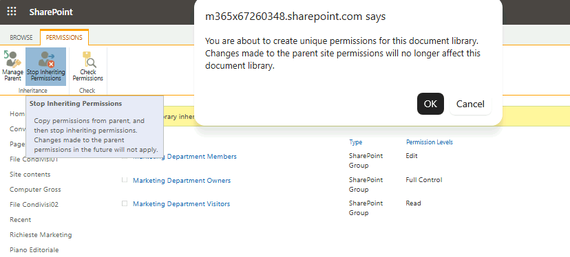

4. Selezionare **Stop Inheriting Permissions** (Interrompi ereditarietà) e confermare l'operazione.

5. Una volta interrotta l'ereditarietà, modificare il permesso assegnato al gruppo **Marketing Department Members**, impostandolo su **Read**, rimuovendo l'eventuale permesso di modifica precedentemente ereditato dal sito.

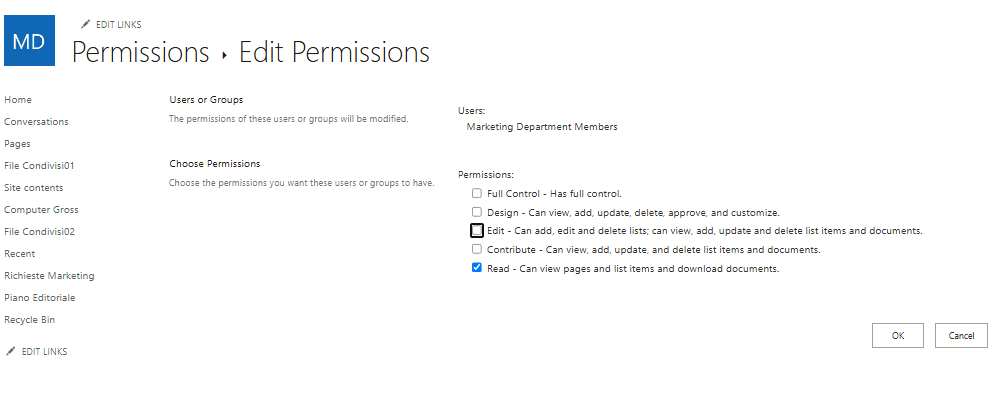

6. Salvare le modifiche.

> [!NOTE]
> Interrompere l'ereditarietà dei permessi (**Stop Inheriting Permissions**) rende una libreria (o lista, cartella, file) indipendente dalle impostazioni di permesso del sito principale: da questo momento, eventuali modifiche ai permessi del sito non si propagheranno più automaticamente a questa libreria.

> [!TIP]
> Rompere l'ereditarietà a livello di libreria è accettabile; evitare invece permessi univoci su **molti singoli file o cartelle**: rendono la gestione e l'audit difficili e possono degradare le prestazioni.

## Passo 4 – Verifica lato User03 dopo le modifiche ai permessi

**Accedere alla VM `SEA-DEV3` con le credenziali di User03**

1. Aprire **Microsoft Edge** e accedere allo stesso indirizzo del sito.
2. Verificare che User03 ora:
- **Non** possa più creare nuove liste, librerie o pagine dal sito (l'opzione **+ New** risulta limitata o assente per queste azioni).
- Possa ancora aggiungere, modificare ed eliminare file all'interno di **File Condivisi01** (permesso Contribute, ereditato dal sito).
- Possa **solo visualizzare e scaricare** i file in **File Condivisi02**, senza poter caricare, modificare o eliminare nulla (permesso Read Only, impostato con permessi univoci).

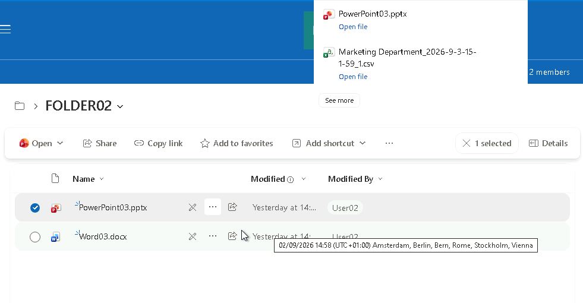

## Passo 5 – Collegamento del sito a OneDrive lato User03

1. Sempre da **`SEA-DEV3` con User03**, aprire il browser e accedere a `https://portal.office.com` oppure direttamente a `https://tenant_name-my.sharepoint.com` per aprire **OneDrive sul Web**.

   ```text
   https://portal.office.com
   ```

   ```text
   https://tenant_name-my.sharepoint.com
   ```

2. Nel menu laterale di OneDrive, verificare la presenza del sito **Marketing Department** tra i siti SharePoint a cui si ha accesso.

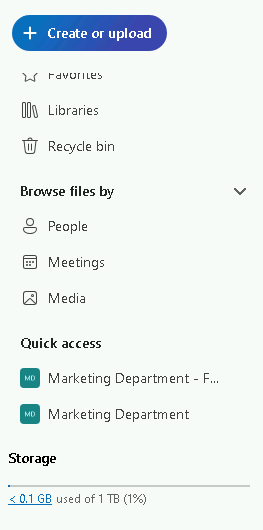

3. Tornare sul sito **Marketing Department** e aprire la libreria **File Condivisi01**.
4. Selezionare la libreria (o una cartella al suo interno) e scegliere i tre puntini (**...**) > **Add shortcut to OneDrive** -> **My files**.

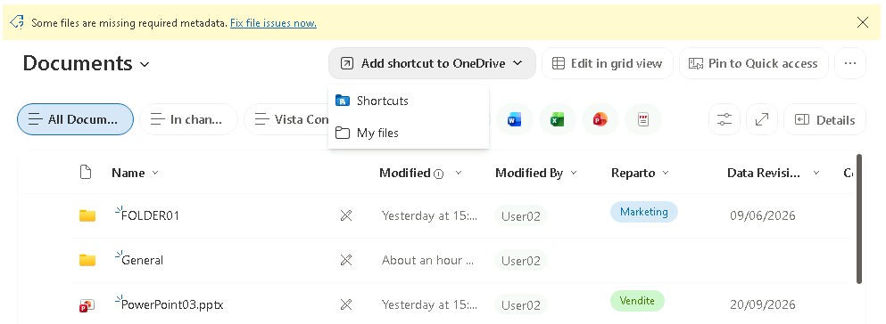

5. Confermare l'operazione: la libreria comparirà ora come collegamento (shortcut) nella sezione **My files** di OneDrive Web, contrassegnata da una piccola icona a forma di freccia.

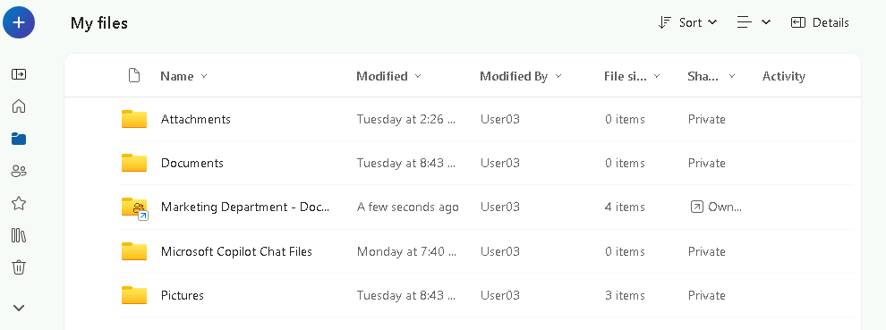

6. Verificare che, aprendo **Esplora file** sulla VM (con il client OneDrive desktop già configurato), la libreria compaia sotto **OneDrive** come una cartella con icona cloud (online-only), senza necessità di eseguire una sincronizzazione completa della libreria.

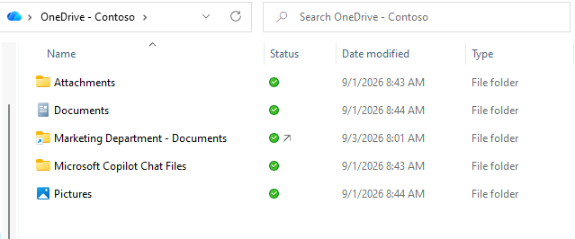

---

[← Esercizio 5](Esercizio-05.md) · [Indice modulo](README.md) · [Esercizio 7 →](Esercizio-07.md)
