# Modulo 3 – Esercizio 7: Impostazioni del sito

[← Esercizio 6](Esercizio-06.md) · [Indice modulo](README.md) · [Esercizio 8 →](Esercizio-08.md)

## Passo 1 · Accesso al sito con User02

**Accedere alla VM `SEA-DEV2` con le credenziali di User02**
1. Aprire **Microsoft Edge** e accedere all'indirizzo del sito:

   ```text
   https://tenant_name.sharepoint.com/sites/MarketingDepartment
   ```

2. Inserire le credenziali di **User02** solo se richiesto (l'accesso dovrebbe avvenire in automatico via SSO).

## Passo 2 · Site Information

1. Selezionare la rotella delle impostazioni (in alto a destra) e scegliere **Site information**.

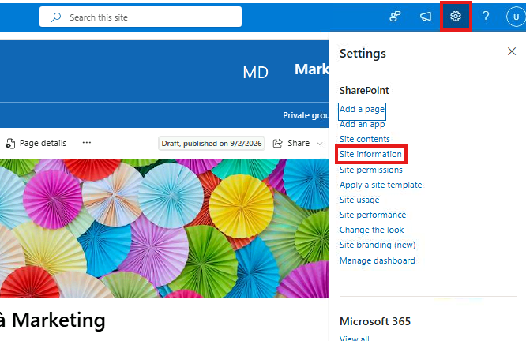

2. Visualizzare senza modificare le opzioni disponibili in questo pannello:
    - **Site name** e **Site description**: possono essere modificati direttamente da qui.
    - **Site logo**: possibilità di cambiarlo rapidamente.
    - **Privacy Settings**: possibilità di passare il sito da **Private** a **Public** (o viceversa) — visibile in fondo al pannello.

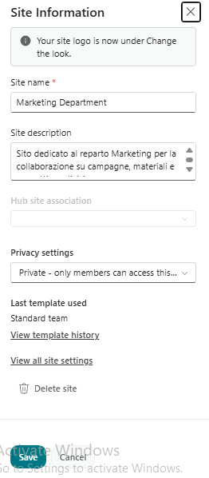

## Passo 3 · Add an App

1. Dalla rotella delle impostazioni, selezionare **Add an app**.

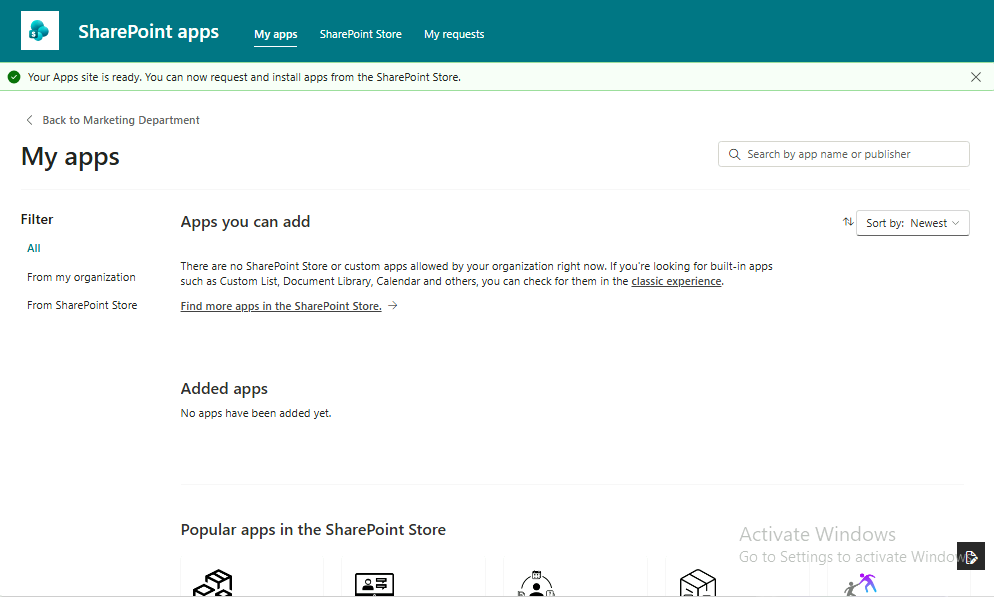

2. Visualizzare lo store premendo su Find more apps in the Sharepoint Store.

   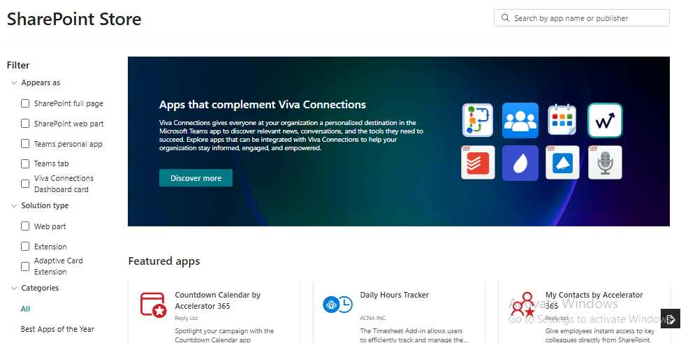

3. Cercare Approval System e premere su Request aggiungere un commento a piacere e inviare la richiesta..

   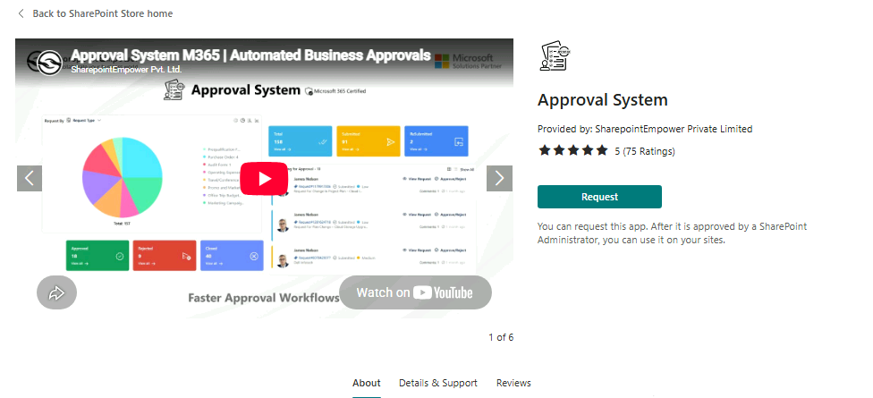

> [!WARNING]
>E' possibile che l'invio della richiesta per l'app dallo store non parta e dia questo errore:
>`Can't send request. Refresh your page and try again. If the issue persists, contact a SharePoint Administrator`
>
>Nel caso refreshare la pagina e aspettare un minuto.

4. Tornare su `SEA-DEV1` sullo sharepoint admin center -> more features -> apps e visualizzare i menù di controllo sulle apps per sharepoint.

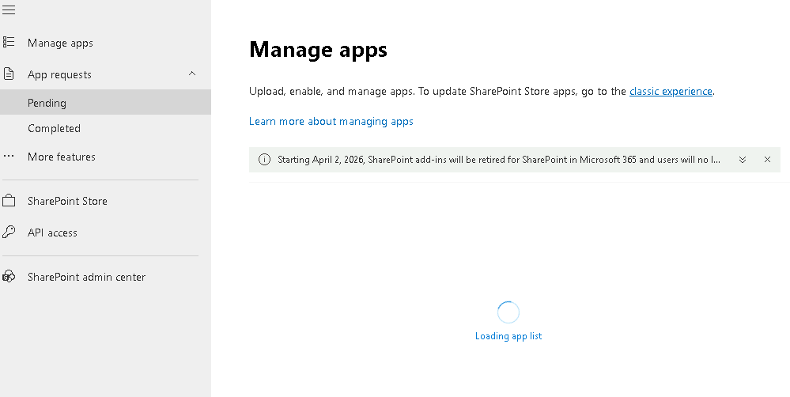

> [!NOTE]
> Le richieste di app dallo Store arrivano agli amministratori in **SharePoint admin center > More features > Apps > App requests**. Gli amministratori possono anche impedire agli utenti di accedere allo Store.
>
> [Gestire le app con il sito App Catalog](https://learn.microsoft.com/sharepoint/use-app-catalog)

## Passo 4 · Site Usage

1. Tornare su `SEA-DEV2` con User02 e aprire Marketing Department.
2. Dalla rotella delle impostazioni, selezionare **Site usage**.

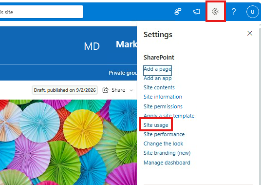

3. Visualizzare le statistiche disponibili: numero di visite, file più visualizzati/modificati di recente, utenti più attivi.

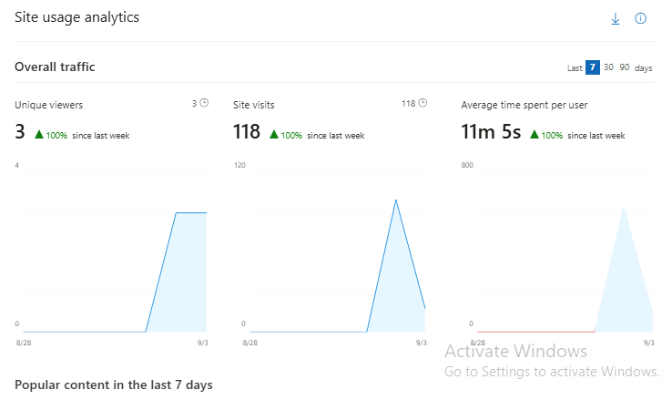

## Passo 5 · View all site settings (solo visualizzazione)

1. Dalla rotella delle impostazioni, selezionare **Site information**, poi in fondo al pannello selezionare **View all site settings**.

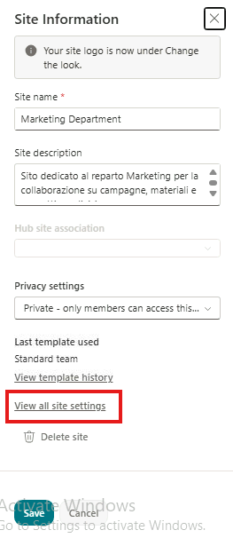

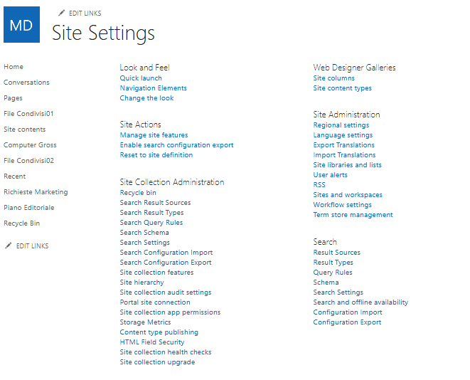

2. Aprire (solo per visualizzare, **senza modificare**) le seguenti sezioni, evidenziandone lo scopo:

- **Regional Settings**: permette di cambiare il **formato di data e ora**, il fuso orario predefinito e il calendario utilizzato dal sito. Cambiare Locale e mettere Italian e mettere ok.

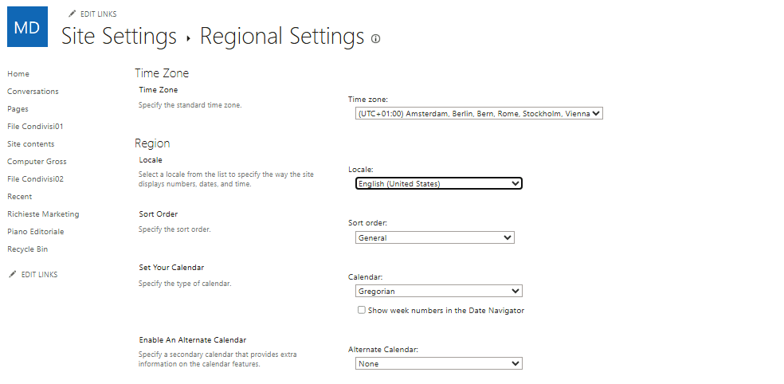

- **Site language settings** (Language settings): permette di **aggiungere lingue** aggiuntive all'interfaccia del sito, così che ogni utente possa visualizzare menu ed etichette nella propria lingua preferita. Aggiungere Italian, French e Spanish e premere save.

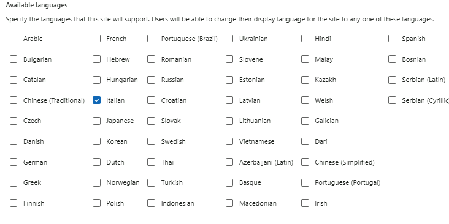

- **Term store management** (se disponibile a livello di sito/hub): permette di gestire i **termini di metadati gestiti** (managed metadata) usati nelle colonne di tipo Managed Metadata, utile da mostrare come collegamento fra i metadati visti nell'Esercizio 3 e una gestione centralizzata dei termini.

> [!TIP]
> Il **Term store** a livello di tenant si gestisce da **SharePoint admin center > Content services > Term store**.
>
> [Introduzione ai metadati gestiti](https://learn.microsoft.com/sharepoint/managed-metadata)

---

[← Esercizio 6](Esercizio-06.md) · [Indice modulo](README.md) · [Esercizio 8 →](Esercizio-08.md)
