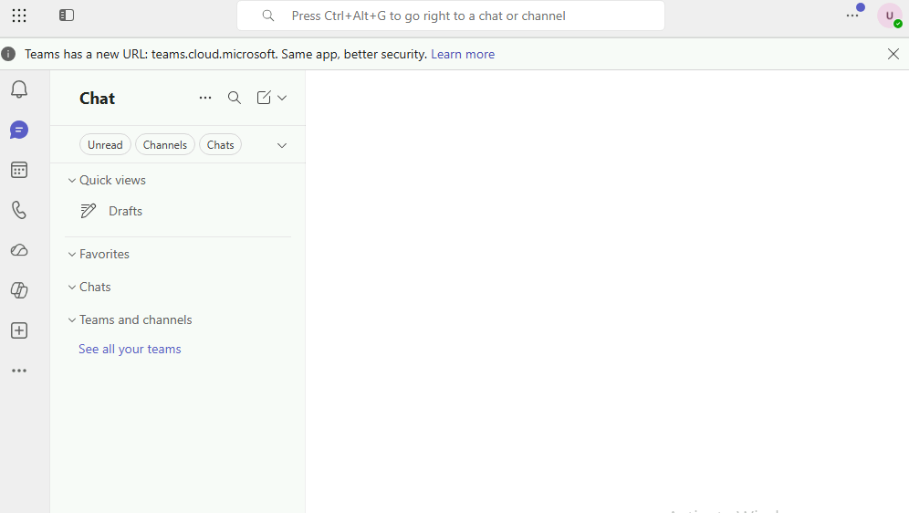
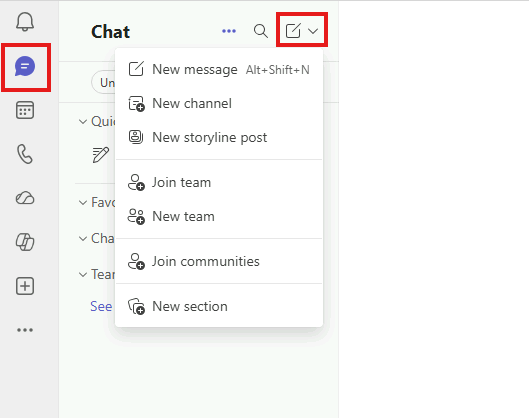
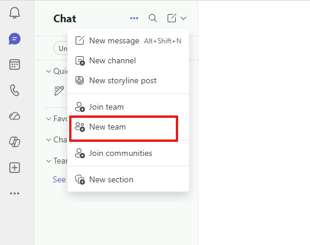
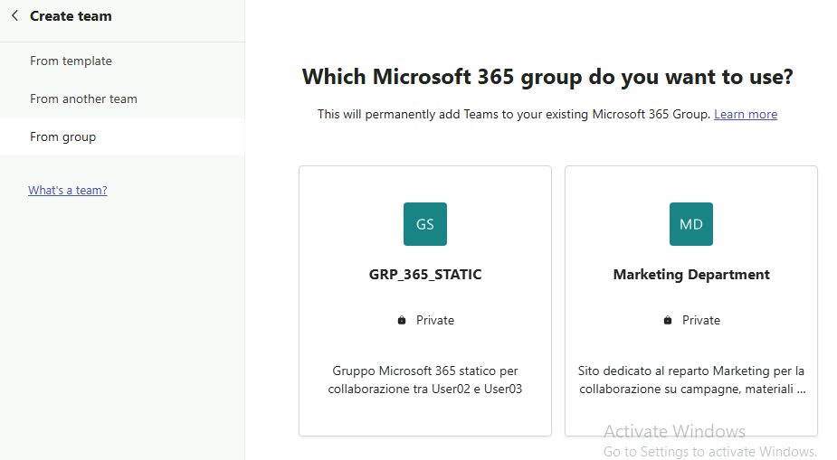
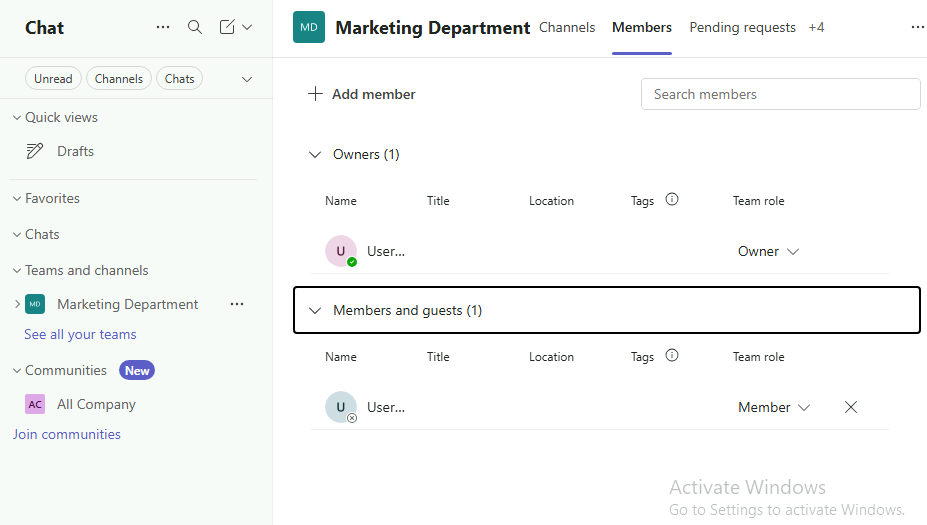
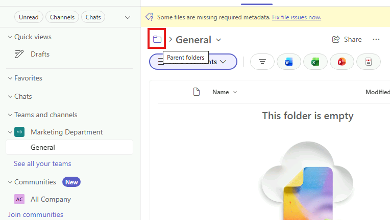
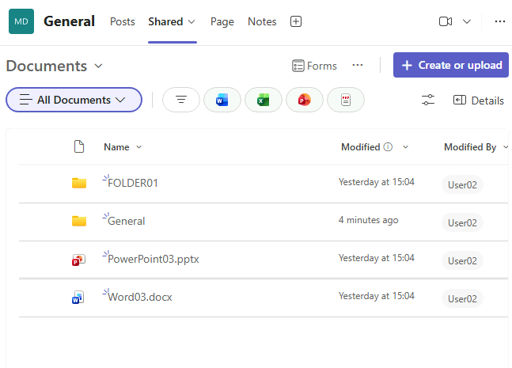

# Modulo 3 · Esercizio 8: Team di Microsoft Teams da un gruppo esistente

[← Esercizio 7](Esercizio-07.md) · [Indice modulo →](README.md)

## Passo 1 · Accesso a Microsoft Teams con User02

**Accesso alla VM `SEA-DEV2` con le credenziali di User02**

1. Aprire **Microsoft Edge** e accedere a:

   ```text
   https://teams.microsoft.com
   ```

2. Inserire le credenziali di **User02** solo se richiesto (l'accesso dovrebbe avvenire in automatico via SSO).



## Passo 2 · Creazione del Team a partire dal gruppo Microsoft 365 esistente

1. Nel menu laterale di Teams, selezionare **Chat**.
2. In alto a sinistra (o in alto a destra, a seconda della versione del client), selezionare **New Items**.



3. Scegliere **New team**.



4. Selezionare l'opzione **More create team option** e **From a group**.



5. Nella schermata successiva, selezionare la scheda **Microsoft 365** e individuare il gruppo **Marketing Department** lo stesso gruppo Microsoft 365 creato insieme al sito SharePoint nell'Esercizio 1.
6. Selezionare il gruppo e confermare con **Create** (o **Choose team**).
7. Attendere il completamento dell'operazione: Teams crea il nuovo Team riutilizzando automaticamente:
- il **Microsoft 365 Group** già esistente (nessun nuovo gruppo viene creato);
- il **sito SharePoint** collegato (**Marketing Department**), che diventa la libreria file del canale principale del Team;
- l'**appartenenza esistente** al gruppo (User02 come owner, User03 come member vengono riportati automaticamente come owner/member del Team);



8. Aprire il canale **General** del nuovo Team e selezionare la scheda **Shared**, premere su parent folder e poi Documents.



9. Notare che la pagina di condivisione del team non è altro che una cartella nella document library del sito SharePoint Marketing Department.



> [!NOTE]
> Ogni Team crea (o riusa) un **gruppo Microsoft 365** e un **sito SharePoint**: ogni canale standard corrisponde a una **cartella** nella libreria *Documents* del sito. I canali **privati** e **condivisi** hanno invece un proprio sito SharePoint dedicato.
>
> [Come SharePoint e OneDrive interagiscono con Microsoft Teams](https://learn.microsoft.com/microsoftteams/sharepoint-onedrive-interact)

---

[← Esercizio 7](Esercizio-07.md) · [Indice modulo →](README.md)
