# Modulo 4 · Esercizio 1: Gestione del OneDrive di un utente

[← Indice modulo](README.md) · [Esercizio 2 →](Esercizio-02.md)

## Passo 1 · Accesso all'Admin Center

1. Accedere alla VM `SEA-DEV1` come administrator, con credenziali admin del tenant.

2. Aprire il browser e accedere come **amministratore del tenant Microsoft 365** a:

   ```text
   https://admin.microsoft.com
   ```

3. Nel menu laterale, selezionare **Users > Active users**.

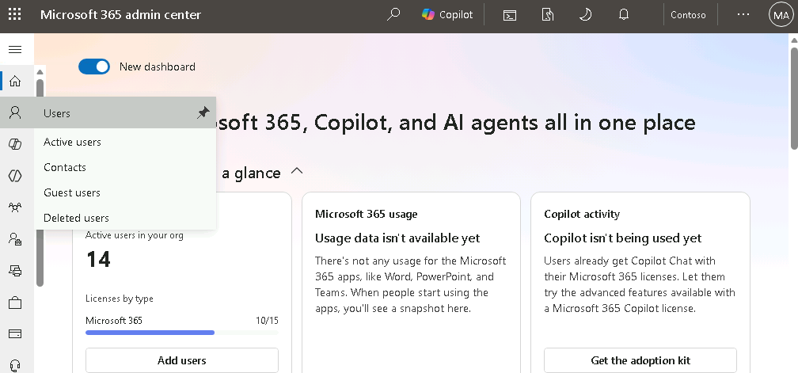

## Passo 2 · Gestione delle impostazioni OneDrive di User02

1. Nell'elenco degli utenti attivi, selezionare **User02**.
2. Nel pannello laterale che si apre, selezionare la scheda **OneDrive**.

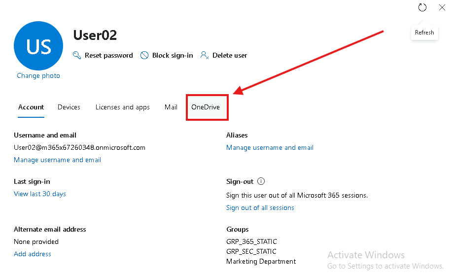

3. Selezionare **Create link to files**.
4. Aprire il link generato: si accede direttamente al **OneDrive di User02** con **accesso completo** come amministratore, senza dover impersonare l'utente o richiedere credenziali aggiuntive.

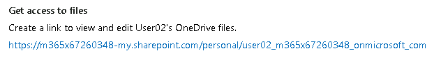

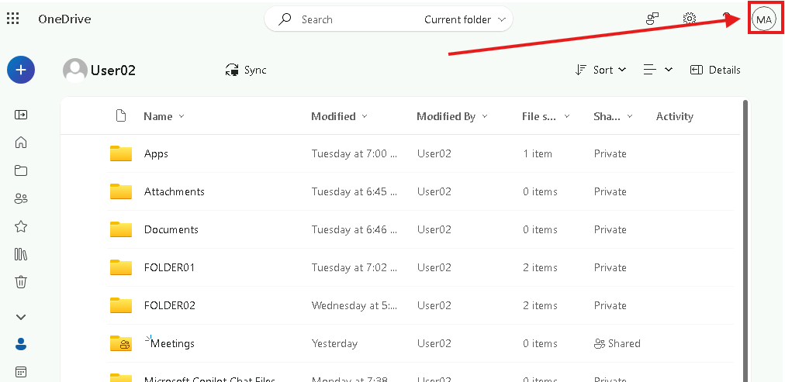

5. Tornare sull'admin center 365 e individuare la sezione **Storage Used** e selezionare **Edit**.
6. Impostare il valore su **512 GB** (rispetto ai 1024 GB predefiniti) premendo **Maximum storage for this user**.
7. **Salvare** la modifica.

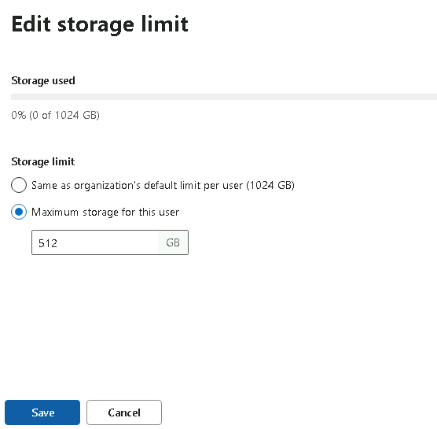

8. Individuare la sezione **Manage external sharing** (o **External sharing**, a seconda della UI).

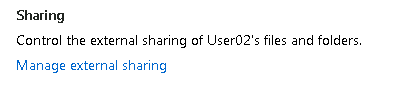

9. **Togliere la spunta** dall'opzione **Let people outside your organization access your OneDrive**.
10. **Salvare** la modifica.

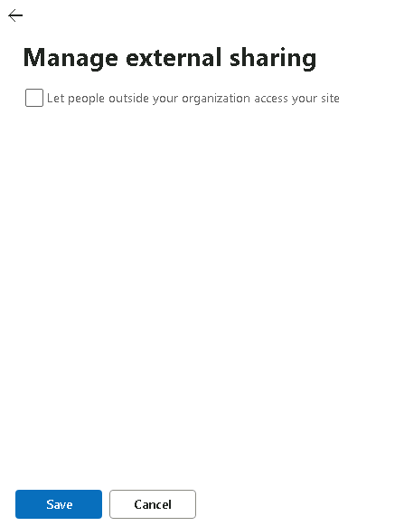

> [!NOTE]
> Il link **Create link to files** aggiunge l'amministratore come **Site Collection Administrator** del OneDrive dell'utente. È un accesso a dati personali: usarlo solo con motivazione documentata e rimuoverlo al termine.
>
> [Accedere ai file OneDrive di un altro utente](https://learn.microsoft.com/sharepoint/user-onedrive-access)

## Passo 3 · Verifica lato User02 su SEA-DEV2

1. Accedere alla VM `SEA-DEV2` con le credenziali di User02.

2. Aprire il browser e accedere a `https://portal.office.com`, quindi aprire **OneDrive**.

   ```text
   https://portal.office.com
   ```

3. Verificare che la **quota disponibile** mostrata risulti ora **512 GB** (invece di 1 TB).

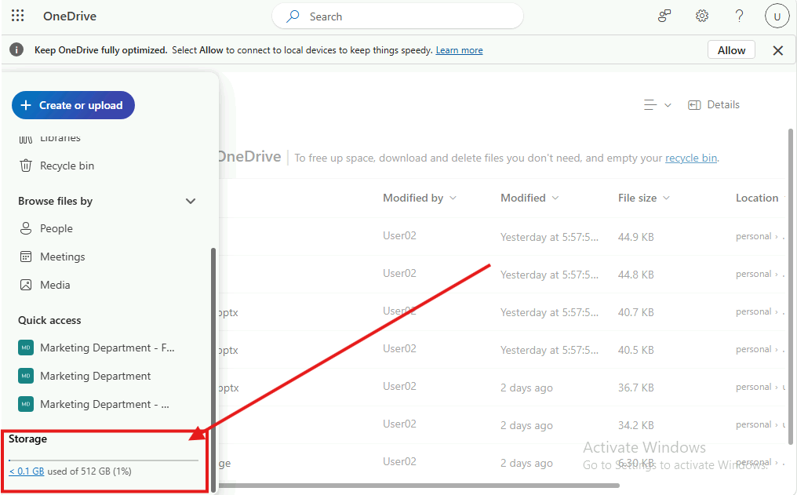

4. Provare a condividere un file:
- Tentare una condivisione **anonima** ("Anyone with the link"): l'opzione non dovrebbe più essere disponibile o dovrebbe risultare bloccata.

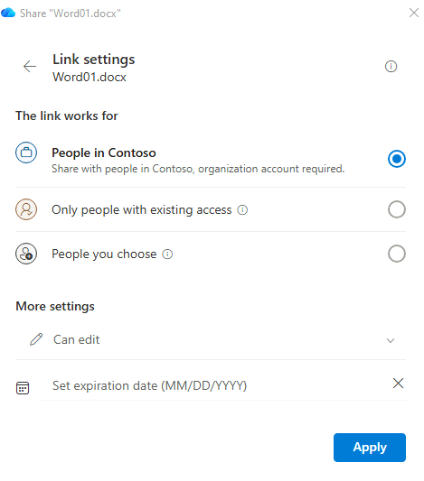

- Tentare una condivisione verso un **indirizzo email esterno/guest** (es. un indirizzo email personale): l'operazione dovrebbe risultare bloccata o non disponibile.

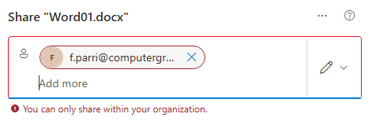

5. Verificare che resti possibile condividere solo con utenti **interni al tenant** (Member).

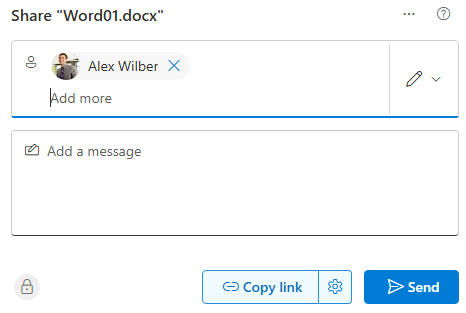

> [!TIP]
> Il setting per utente può essere solo **uguale o più restrittivo** di quello a livello di organizzazione: non è possibile concedere a un singolo OneDrive più condivisione esterna di quanta ne consenta il tenant.
>
> [Gestire le impostazioni di condivisione](https://learn.microsoft.com/sharepoint/turn-external-sharing-on-or-off)

---

[← Indice modulo](README.md) · [Esercizio 2 →](Esercizio-02.md)
