# Modulo 4 – Esercizio 2: Condivisione esterna e idle session sign-out

[← Esercizio 1](Esercizio-01.md) · [Indice modulo](README.md) · [Esercizio 3 →](Esercizio-03.md)

## Passo 1 – Accesso al SharePoint Admin Center

**Accedere alla VM SEA-DEV1 come administrator, con credenziali admin del tenant**

1. Aprire il browser e accedere come **amministratore del tenant Microsoft 365** a:

   ```text
   https://admin.microsoft.com
   ```

2. Aprire **Show all > Admin centers > SharePoint**.

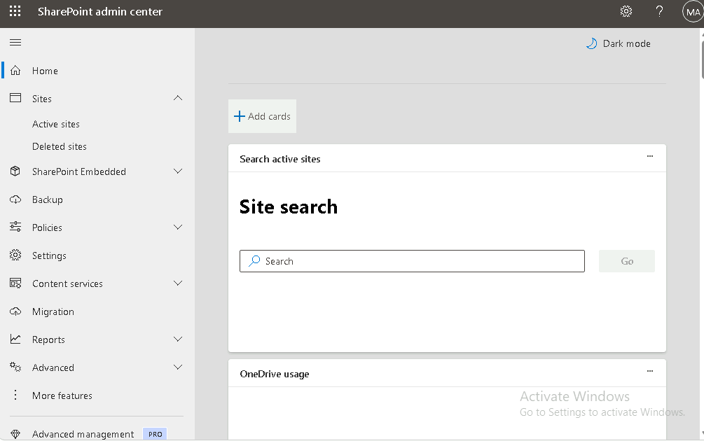

## Passo 2 – Policy di condivisione esterna (Policies > Sharing)

Andare su **Policies > Sharing**

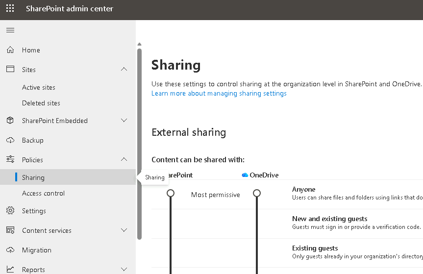

1. Impostare il livello di condivisione esterna, sia per **SharePoint** sia per **OneDrive**, su **New and existing guests** (Nuovi e utenti guest esistenti).

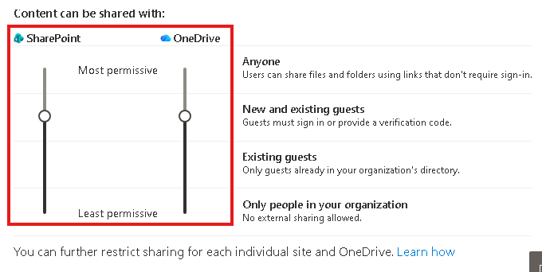

> [!NOTE]
> Impostando il livello su **New and existing guests**, non sarà più possibile per gli utenti creare condivisioni **anonime** (link "Anyone"): la condivisione esterna resta possibile solo verso utenti guest già noti o nuovi, che devono comunque autenticarsi.

2. Espandere **More external sharing settings** e configurare:
- **Allow guests to share items they don't own**: **togliere la spunta** (disabilitare).
- **Guest access to a site or OneDrive will expire automatically after this many days**: impostare **30**.
- **People who use a verification code must reauthenticate after this many days**: impostare **1**.

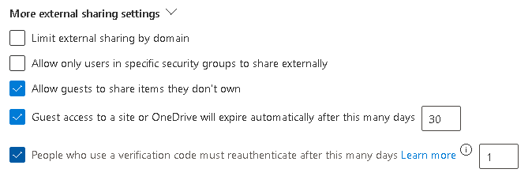

- **Choose the permission that's selected by default for sharing links**: cambiare da **Edit** a **View**.

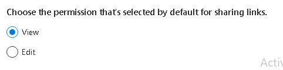

3. Selezionare **Save** per confermare tutte le modifiche.

> [!NOTE]
> Impostare il permesso predefinito dei link di condivisione su **View** significa che, quando un utente crea un nuovo link di condivisione senza specificare esplicitamente il permesso, il link concederà **solo visualizzazione** e non modifica: un criterio di sicurezza "secure by default".

> [!IMPORTANT]
> Il livello di **OneDrive** può essere uguale o più restrittivo di quello di **SharePoint**, mai più permissivo. Ogni sito ha a sua volta un proprio livello, che non può superare quello del tenant. Se si restringe la condivisione esterna, i guest perdono l'accesso in genere **entro un'ora**.
>
> 📖 [Gestire le impostazioni di condivisione per SharePoint e OneDrive](https://learn.microsoft.com/sharepoint/turn-external-sharing-on-or-off)
## Passo 3 – Access Control: Idle session sign-out

Raggiungere **Access control > Idle session sign-out**

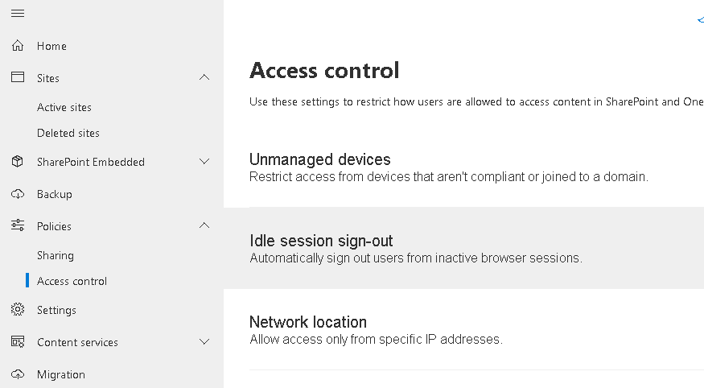

1. Selezionare **Idle session sign-out**.
2. Attivare **Sign out inactive users automatically** (On).
3. Impostare **Sign out users after**: **15 minuti**.
4. Impostare **Give users this much notice before signing them out**: **5 minuti**.
5. Selezionare **Save**.

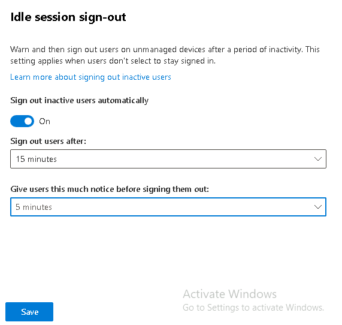

> [!WARNING]
> **Idle session sign-out** richiede una licenza **Microsoft Entra ID P1 o P2** per funzionare, poiché si appoggia alle **Conditional Access Policies** di Microsoft Entra. Si applica all'intera organizzazione e non può essere configurato per singoli utenti o siti.

> [!NOTE]
> L'idle session sign-out **non disconnette** gli utenti che: accedono con SSO da un dispositivo joined, hanno scelto **Stay signed in**, o usano un dispositivo gestito/conforme. Per questo la verifica al Passo 4 va fatta da una finestra InPrivate su un PC non gestito.
>
> 📖 [Idle session timeout per Microsoft 365](https://learn.microsoft.com/microsoft-365/admin/manage/idle-session-timeout-web-apps)
## Passo 4 – Verifica lato User03 su SEA-DEV3

**Accedere alla VM SEA-DEV3 con le credenziali di User03**

1. Accedere via **Web** con **Microsoft Edge** a `https://portal.office.com`, quindi aprire **OneDrive**.

   ```text
   https://portal.office.com
   ```

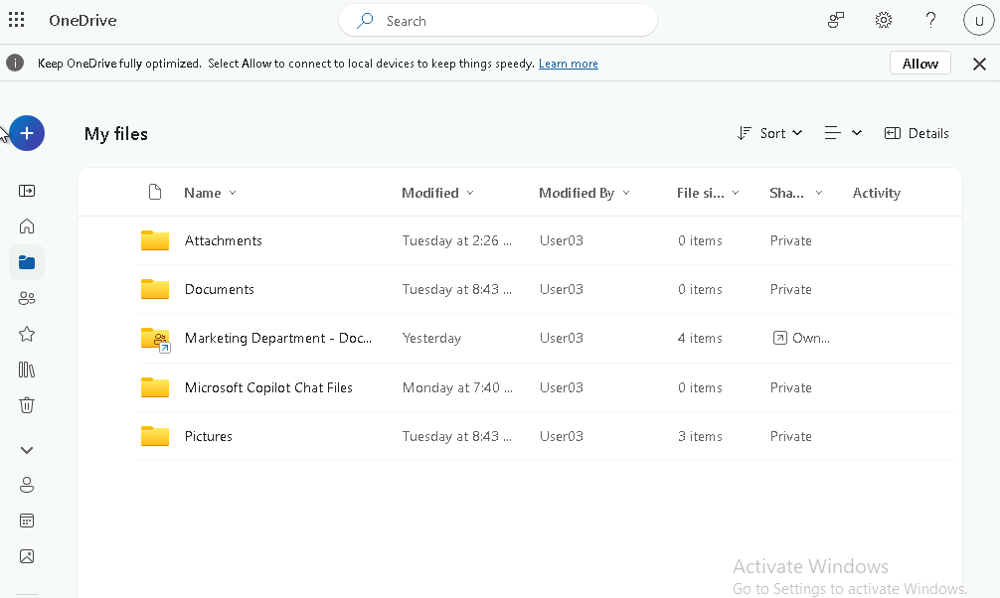

2. **Verificare l'assenza di condivisione anonima**: provare a condividere un file e controllare che l'opzione **"Anyone with the link"** non sia più disponibile o risulti bloccata.

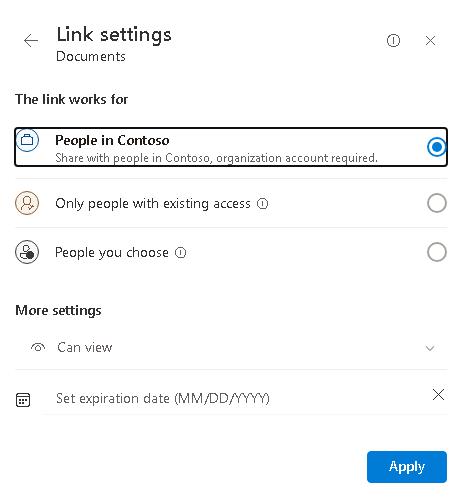

3. **Verificare il permesso predefinito dei link**: creare un nuovo link di condivisione e controllare che il permesso proposto di default sia **View** (e non più **Edit**).

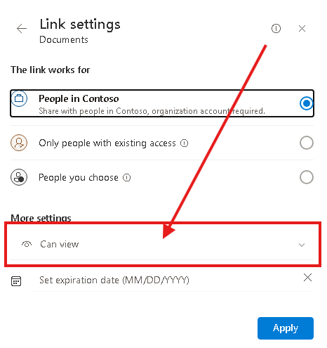

4. **Verificare l'idle session sign-out**: aprire **sul proprio pc** una finestra inPrivate, loggare sul Onedrive di User03 e restare inattivi sulla sessione Web per circa **10 minuti** e osservare se compare una **notifica di avviso** (a 5 minuti dalla disconnessione, quindi attorno al decimo minuto di inattività su un timeout di 15), seguita dalla disconnessione automatica al raggiungimento dei 15 minuti totali di inattività.

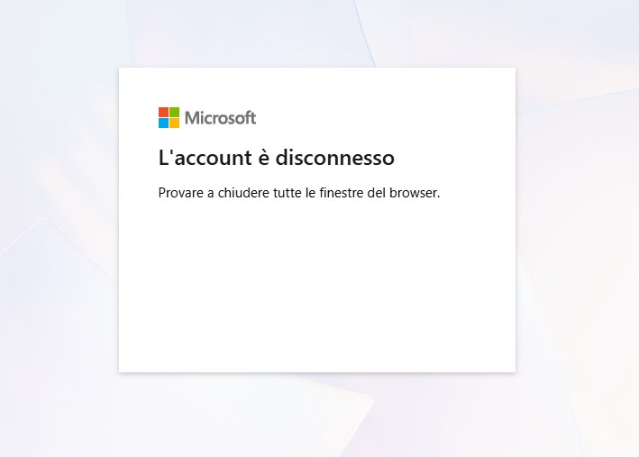

---

[← Esercizio 1](Esercizio-01.md) · [Indice modulo](README.md) · [Esercizio 3 →](Esercizio-03.md)
