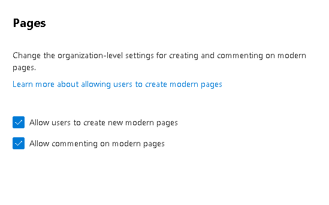
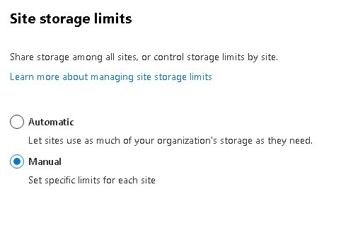
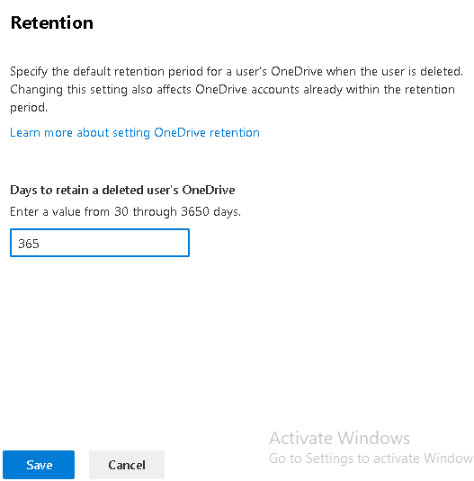
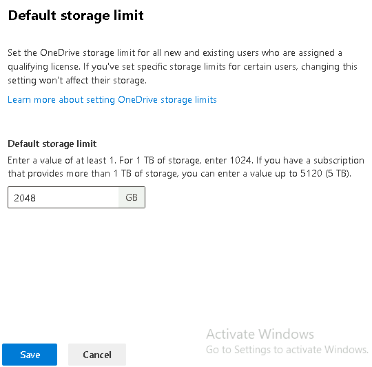
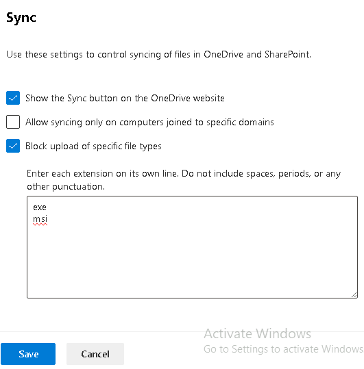
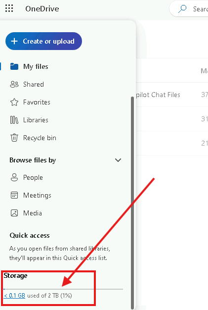
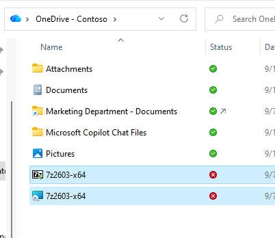

# Modulo 4 – Esercizio 3: Impostazioni di SharePoint e OneDrive

[← Esercizio 2](Esercizio-02.md) · [Indice modulo](README.md) · [Esercizio 4 →](Esercizio-04.md)

## Passo 1 – Accesso al SharePoint Admin Center

**Accedere alla VM `SEA-DEV1` come administrator, con credenziali admin del tenant**

1. Aprire il browser e accedere come **amministratore del tenant Microsoft 365** a:

   ```text
   https://admin.microsoft.com
   ```

## Passo 2 – SharePoint: Pages

1. Aprire **Show all > Admin centers > SharePoint**.
2. Nel menu laterale, selezionare **Settings**.
3. Nella pagina **Settings**, individuare la sezione **SharePoint** e selezionare **Pages**.
4. **Togliere la spunta** da **Allow users to create new modern pages** (disabilitare).
5. **Togliere la spunta** da **Allow commenting on modern pages** (disabilitare).



6. Selezionare **Save**.

> [!NOTE]
> **Cosa può fare ancora ogni ruolo dopo questa modifica:**
>
> **Owner e Member del gruppo Microsoft 365** (associato al sito):
>
> - **Non può** creare nuove pagine né commentare le pagine esistenti.
> - **Può** comunque modificare le pagine esistenti (pubblicarle, nasconderle), gestire i membri, creare liste e librerie.
>
> **Member del gruppo Microsoft 365** (permessi standard, senza ruoli aggiuntivi di gestione):
>
> - **Non può** creare nuove pagine né commentare.
> - **Può** modificare documenti e contenuti del sito, utilizzare liste e librerie esistenti.

> [!WARNING]
> **Errore comune:** molti amministratori pensano che questa impostazione serva a impedire ai **Member** di modificare le pagine esistenti. **Non è così**: questa policy blocca solo la **creazione di nuove pagine** e i **commenti**, non la modifica di pagine già presenti. Per limitare davvero la possibilità di un Member di modificare le pagine, è necessario intervenire sui **permessi** del sito, come mostrato nel **Modulo 3 - Esercizio 6 (Passo 2)**.

## Passo 3 – SharePoint: Site Storage Limit

1. Nella pagina **Settings**, individuare la sezione **SharePoint** e selezionare **Site storage limit**.
2. Cambiare l'impostazione da **Automatic** a **Manual**.



3. Selezionare **Save**.

> [!NOTE]
> Passando a **Manual**, diventa possibile impostare manualmente, dalle **proprietà di ciascun sito**, lo spazio massimo di archiviazione consentito per quel singolo sito SharePoint (anziché lasciare che il sistema lo distribuisca automaticamente tra tutti i siti in base allo spazio totale disponibile nel tenant).
>
> Questa impostazione riguarda esclusivamente **SharePoint Online** e **non OneDrive for Business** (per il quale esiste un'impostazione separata, vedi Passo 5). Inoltre, **non si applica automaticamente** alle librerie SharePoint già esistenti: la nuova gestione manuale vale per le quote assegnate da questo momento in poi.

## Passo 4 – OneDrive: Retention

1. Nella pagina **Settings**, individuare la sezione **OneDrive** e selezionare **Retention**.
2. Modificare il valore da **30** giorni a **365** giorni.



3. Selezionare **Save**.

> [!NOTE]
> Questa impostazione specifica per quanto tempo viene conservato il **OneDrive di un utente** dopo che il suo account è stato **eliminato** dal tenant, prima che i dati vengano rimossi definitivamente. La modifica di questo valore ha effetto **anche sugli account OneDrive già presenti** all'interno del periodo di conservazione (non solo sulle eliminazioni future).

> [!NOTE]
> Il valore ammesso va da **30 a 3650 giorni**. Il periodo inizia quando l'account viene **eliminato** da Microsoft Entra ID (non quando viene bloccato o perde la licenza). Al termine il OneDrive passa nel cestino della raccolta siti per altri **93 giorni**.
>
> [Impostare la retention di OneDrive per gli utenti eliminati](https://learn.microsoft.com/sharepoint/set-retention) · [OneDrive retention and deletion](https://learn.microsoft.com/sharepoint/retention-and-deletion)

## Passo 5 – OneDrive: Storage Limit

1. Nella pagina **Settings**, sezione **OneDrive**, selezionare **Storage limit**.
2. Modificare il valore da **1024 GB** a **2048 GB**.
3. Selezionare **Save**.



> [!NOTE]
> Questa impostazione definisce il limite di spazio di archiviazione OneDrive per **tutti gli utenti** (nuovi) che dispongono di una licenza idonea. **Non si applica retroattivamente** agli utenti per i quali sia già stato impostato un limite specifico e diverso (come, ad esempio, User02 al Passo 2 dell'Esercizio 1, dove la quota è stata limitata manualmente a 512 GB): quella impostazione individuale resta prioritaria.

## Passo 6 – OneDrive: Sync (blocco estensioni file)

1. Nella pagina **Settings**, sezione **OneDrive**, selezionare **Sync**.
2. Selezionare la casella **Block upload of specific file types**.
3. Nel campo di testo, inserire le estensioni da bloccare, **una per riga**, senza punti, spazi o altra punteggiatura:

```
exe
msi
```

4. Selezionare **Save**.



> [!NOTE]
> Questa opzione **non blocca in assoluto** il caricamento di questi tipi di file su SharePoint/OneDrive (ad esempio tramite upload da browser web restano possibili), ma **blocca specificamente il caricamento tramite il client di sincronizzazione OneDrive** per le estensioni indicate. Il client OneDrive impiega circa **8 ore** per rilevare la modifica e applicarla.

> [!TIP]
> Per escludere file senza mostrare errori agli utenti (o con wildcard come `*.pst`) si può usare la policy di gruppo **Exclude specific kinds of files from being uploaded** (`EnableODIgnoreListFromGPO`).
>
> [Bloccare la sincronizzazione di tipi di file specifici](https://learn.microsoft.com/sharepoint/block-file-types)

## Passo 7 – Verifica con User04 e User03

**Accedere alla VM `SEA-DEV1` con le credenziali di Admin**

1. Da Admin Center 365 creare un nuovo utente User04 con le seguenti specifiche:

| Campo                 | Valore            |
| --------------------- | ----------------- |
| **Nome visualizzato** | `User04`          |
| **Nome utente**       | `User04@XXXXXX`   |
| **Password**          | `TempPassword04!` |
| **Usage Location**    | Italy             |

2. Assegnare le seguenti licenze andando su **Billing > Licenses**:
   - Office 365 E5 (no Teams)
   - Microsoft Teams Enterprise

3. Aspettare qualche minuto, e poi aprire una finestra in Privato.
4. Accedere via **Web** a `https://portal.office.com` con le credenziali di User04, quindi aprire **OneDrive**, e verificare che lo **spazio disponibile** mostrato risulti **2048 GB** (2TB).

   ```text
   https://portal.office.com
   ```



5. Andare sulla VM `SEA-DEV3` con le credenziali di User03 e scaricare i seguenti materiali:

   ```text
   Modulo4\Data\File .msi e .exe demo
   ```

6. Sul client OneDrive desktop di `SEA-DEV3`, provare a sincronizzare (copiare nella cartella OneDrive locale) due file di prova:

- **`7z2603.exe`**
- **`7z2603.msi`**

7. Verificare che questi file **non vengano sincronizzati** verso il cloud (icona di errore/attenzione, o file mostrato come "escluso dalla sincronizzazione").



---

[← Esercizio 2](Esercizio-02.md) · [Indice modulo](README.md) · [Esercizio 4 →](Esercizio-04.md)
