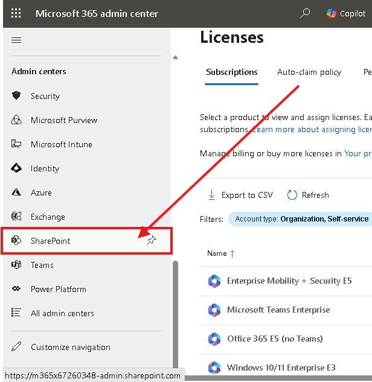
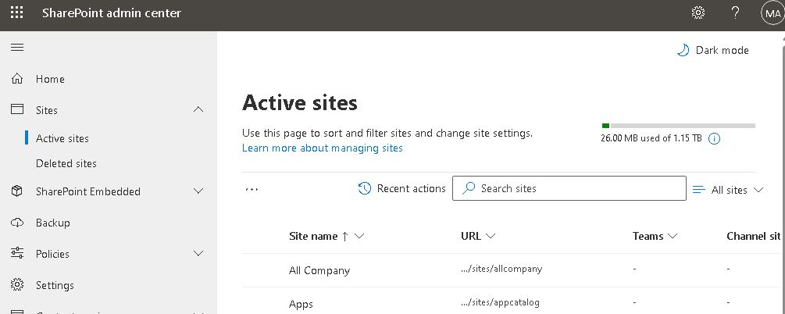
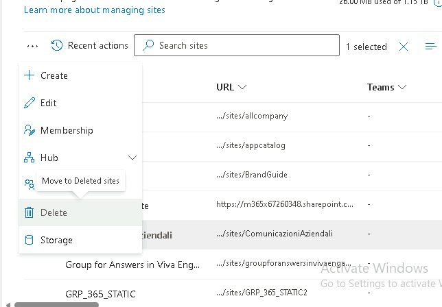
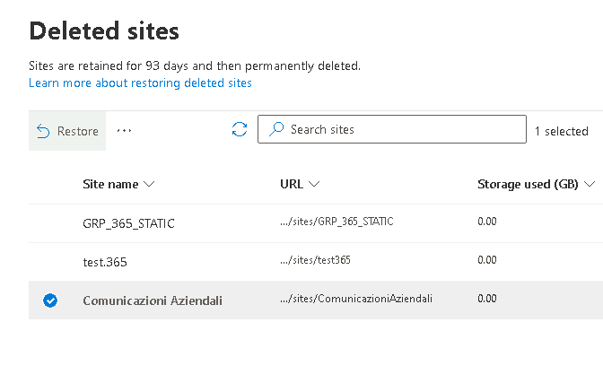
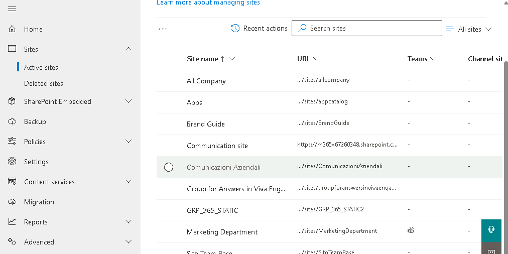

# Modulo 4 · Esercizio 4: Eliminazione e ripristino di un sito

[← Esercizio 3](Esercizio-03.md) · [Indice modulo](README.md) · [Esercizio 5 →](Esercizio-05.md)

## Passo 1 · Accesso al SharePoint Admin Center

1. Accedere alla VM `SEA-DEV1` come administrator, con credenziali admin del tenant.

2. Aprire il browser e accedere come **amministratore del tenant Microsoft 365** a:

   ```text
   https://admin.microsoft.com
   ```

3. Aprire **Show all > Admin centers > SharePoint**.



## Passo 2 · Eliminazione del sito Communication

1. Aprire **Sites > Active sites**



2. Individuare il sito **Comunicazioni Aziendali** (il Communication Site creato nel **Modulo 3 - Esercizio 1, Passo 3.1**).
3. Selezionare il sito (spunta accanto al nome) e scegliere **Delete**.
4. Confermare l'eliminazione con **Delete** nella finestra di conferma.



> [!NOTE]
> Quando un sito viene eliminato dall'Admin Center, non scompare definitivamente: viene spostato nel **cestino dei siti** (site collection Recycle Bin a livello di tenant), da cui può essere ripristinato entro un periodo limitato.

## Passo 3 · Ripristino del sito eliminato

1. Andare su **Sites > Deleted Sites**
2. Individuare il sito **Comunicazioni Aziendali**, ora presente nell'elenco dei siti eliminati.



3. Selezionare il sito e scegliere **Restore**.
4. Tornare su **Sites > Active sites** e verificare che il sito **Comunicazioni Aziendali** sia nuovamente presente e accessibile tra i siti attivi.



> [!WARNING]
> Un sito eliminato resta disponibile nel cestino **per un massimo di 93 giorni**. Trascorso questo periodo, il sito e tutto il suo contenuto vengono **eliminati definitivamente** e non possono più essere recuperati tramite l'Admin Center.

> [!NOTE]
> Ripristinando un sito collegato a un **gruppo Microsoft 365** viene ripristinato anche il gruppo con tutte le sue risorse; queste però sono conservate solo **30 giorni**, mentre il sito resta disponibile per **93**. Dopo l'eliminazione definitiva, Microsoft conserva backup per ulteriori **14 giorni**, recuperabili solo tramite supporto.
>
> [Ripristinare i siti eliminati](https://learn.microsoft.com/sharepoint/restore-deleted-site-collection)

> [!CAUTION]
> `Remove-SPODeletedSite` elimina il sito **definitivamente** dal cestino: l'operazione non è reversibile.
>
> [Eliminare un sito](https://learn.microsoft.com/sharepoint/delete-site-collection)

---

[← Esercizio 3](Esercizio-03.md) · [Indice modulo](README.md) · [Esercizio 5 →](Esercizio-05.md)
