# Modulo 4 – Esercizio 5: Report di utilizzo e Data access governance

[← Esercizio 4](Esercizio-04.md) · [Indice modulo](README.md) · [Esercizio 6 →](Esercizio-06.md)

## Passo 1 – Accesso al SharePoint Admin Center

**Accedere alla VM `SEA-DEV1` come administrator, con credenziali admin del tenant**

1. Aprire il browser e accedere come **amministratore del tenant Microsoft 365** a:

   ```text
   https://admin.microsoft.com
   ```

2. Aprire **Show all > Admin centers > SharePoint**.
3. Nel menu laterale, selezionare **Reports**.

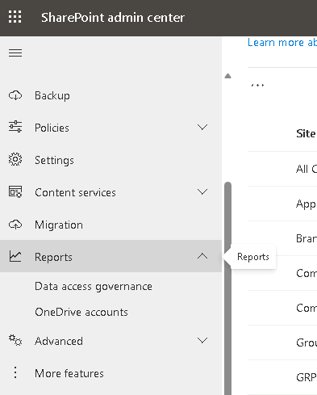

## Passo 2 – Report Data Access Governance: Sharing Links

Aprire **Reports > Data access governance**

1. Selezionare **Data access governance**, quindi **Sharing links**.

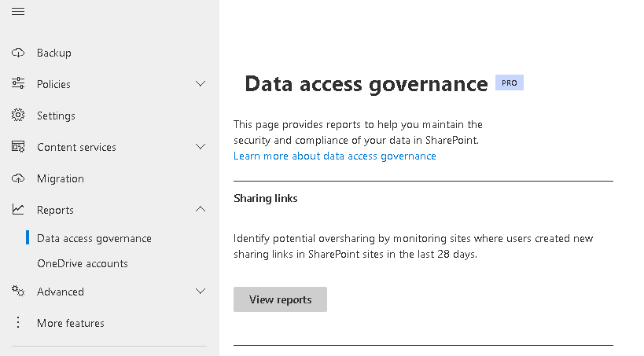

2. Eseguire i seguenti tre report, uno alla volta (selezionare il tipo di report e **Run report**):

**"Anyone" links**
- Mostra i siti nei quali è stato creato il **maggior numero di collegamenti che non richiedono l'accesso** (link anonimi, senza necessità di sign-in).

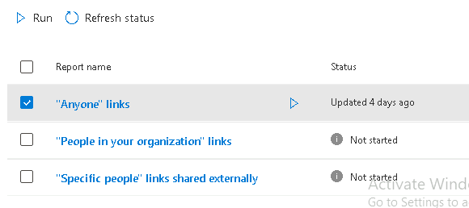

**"People in your organization" links**
- Mostra i siti nei quali è stato creato il **maggior numero di collegamenti utilizzabili e inoltrabili** dagli utenti **interni** all'organizzazione.

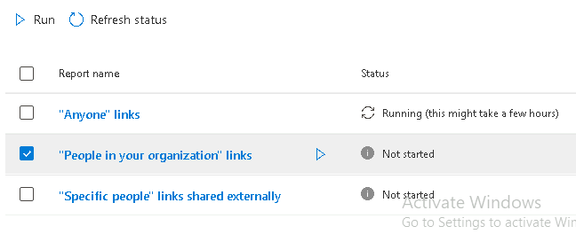

**"Specific people" links shared externally**
- Mostra i siti nei quali è stato creato il **maggior numero di collegamenti destinati a utenti esterni** (ospiti) individuati specificamente per nome/indirizzo.

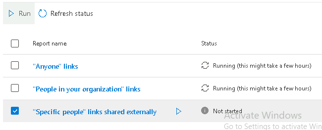

> [!WARNING]
> Dopo aver richiesto la generazione di questi report, può essere necessario attendere fino a **24 ore** prima che i dati risultino disponibili e consultabili nell'Admin Center.

> [!IMPORTANT]
> I report di **Data access governance** richiedono **SharePoint Advanced Management** (incluso in Microsoft 365 Copilot o come add-on).
>
> [Report di Data access governance](https://learn.microsoft.com/sharepoint/data-access-governance-reports)

## Passo 3 – Reports da Admin Center 365

Prerequisito:
1. Vai su **admin.microsoft.com**
2. **Settings** (Impostazioni) → **Org settings** (Impostazioni organizzazione)
3. Scheda **Services** (Servizi) → seleziona **Reports** (Report)
4. **Deseleziona** la casella **"Display concealed user, group, and site names in all reports"** (Mostra nomi di utenti, gruppi e siti nascosti in tutti i report)

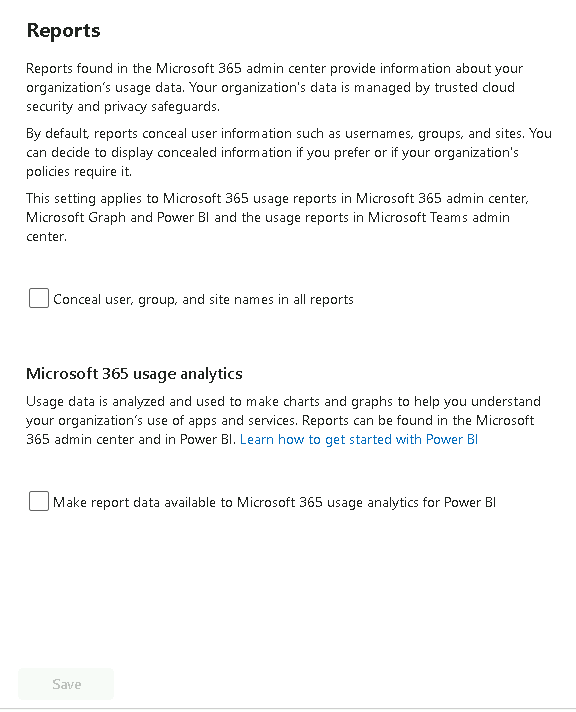

5. **Save** (Salva)

Terminato il prerequisito:

1. Andare su `SEA-DEV1` come **Administrator**.
2. Aprire l'**Admin Center 365**.
3. Premere nel menù laterale **Show All**.

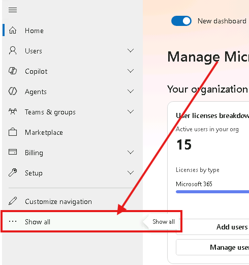

4. Andare su **Reports -> Usage**.

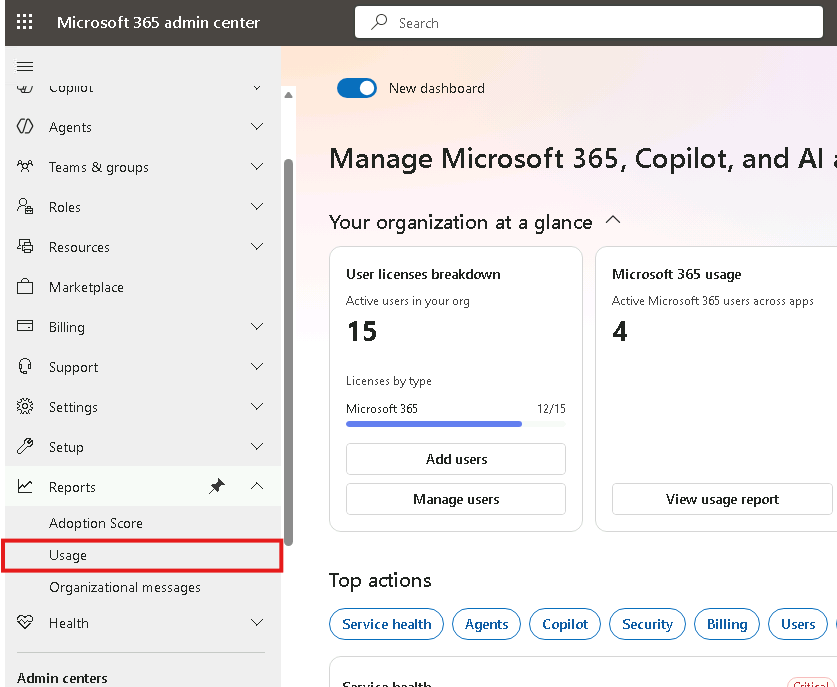

5. Selezionare **SharePoint** e visualizzare la schermata di **Activity**.

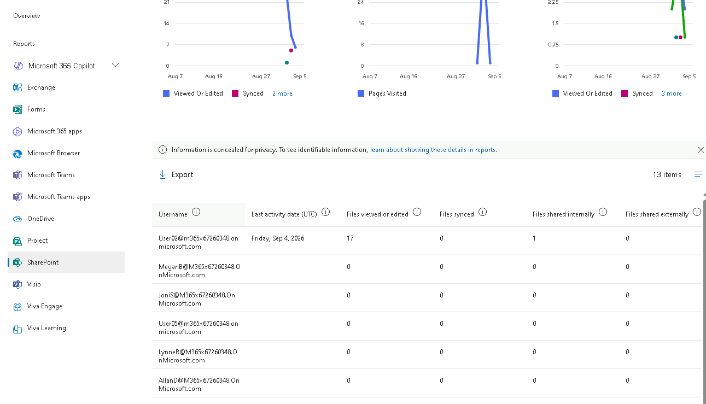

6. Passare alla finestra di **Site Usage** e visualizzare il report.

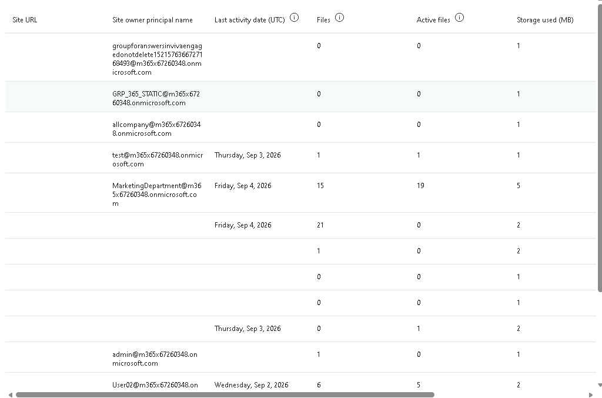

7. Infine passare alla sezione **Storage** e controllare il Report.

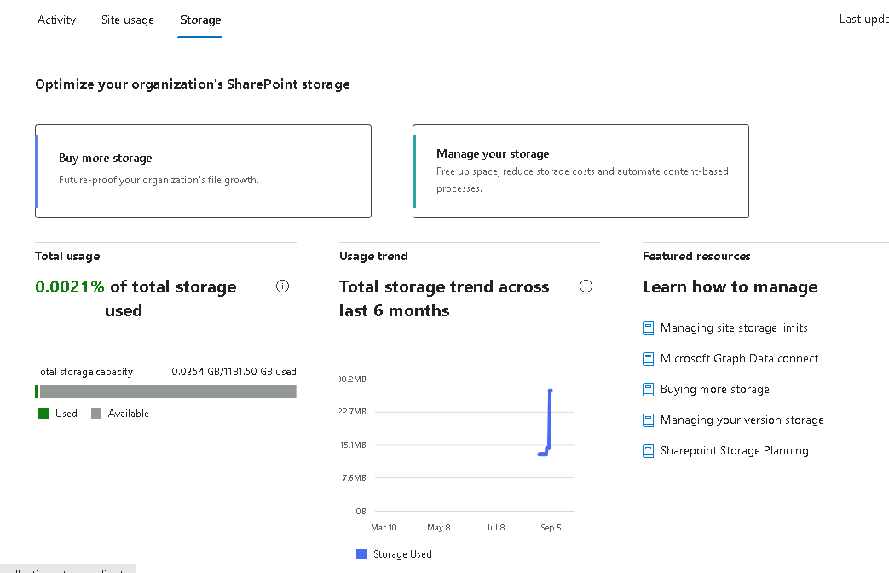

E' possibile visualizzare anche l'Activity e lo Usage di OneDrive.

1. Andare su **Reports -> Usage ->OneDrive**
2. Visualizzare i report sia della sezione **Activity** che **Usage**.

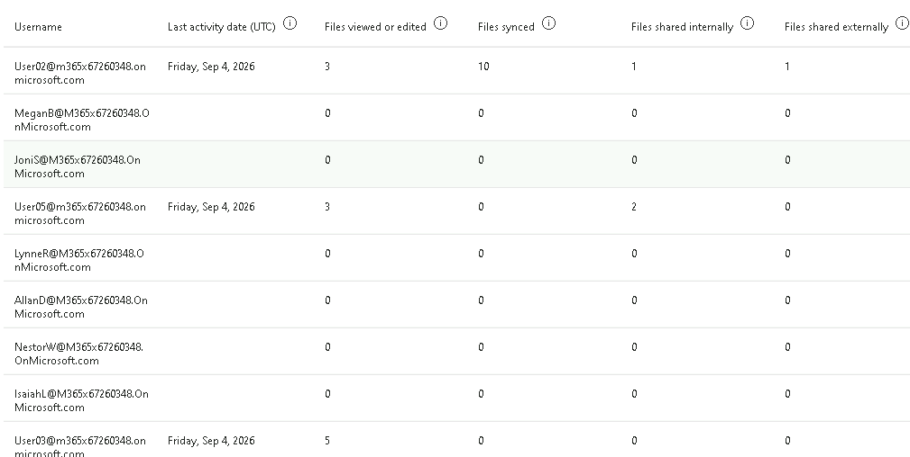

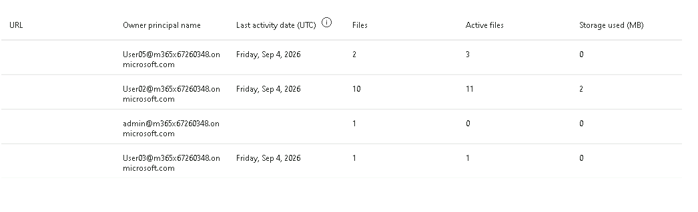

> [!NOTE]
> Per default i report di utilizzo mostrano nomi **pseudonimizzati**. La modifica dell'impostazione di privacy richiede un amministratore con ruolo adeguato (es. Global Administrator) e può richiedere alcuni minuti prima di riflettersi nei report.
>
> [Report di attività nell'interfaccia di amministrazione di Microsoft 365](https://learn.microsoft.com/microsoft-365/admin/activity-reports/activity-reports)

---

[← Esercizio 4](Esercizio-04.md) · [Indice modulo](README.md) · [Esercizio 6 →](Esercizio-06.md)
