# Modulo 4 – Esercizio 6: Report e audit con PowerShell

[← Esercizio 5](Esercizio-05.md) · [Indice modulo →](README.md)

## Passo 1 – Preparazione dell'ambiente PowerShell

**Accesso alla VM SEA-DEV1 come administrator, con credenziali admin del tenant**

1. Aprire **Visual Studio Code** con la modalità **PowerShell ISE** già abilitata (vedi Modulo 1 - Esercizio 4).

2. Verificare che i moduli **PnP.PowerShell** e **Microsoft.Graph** siano già installati (Modulo 1 - Esercizio 4). In caso contrario:
```powershell
Install-Module PnP.PowerShell -Scope CurrentUser -Force
Install-Module Microsoft.Graph -Scope CurrentUser -Force
```

1. Tutti gli script di questo esercizio si autenticano in modalità **app-only**, riutilizzando la stessa **Enterprise Application** e lo stesso **certificato** creati nel **Modulo 1 - Esercizio 5** (registrazione app + `New-PnPAzureCertificate` + import del certificato sul certificate store della VM). Impostare le variabili comuni una sola volta a inizio sessione:

```powershell
$AppId          = "<APP_ID_dell'Enterprise_Application>"

> [!WARNING]
> `Connect-SPOService` in app-only richiede un'app con permesso **SharePoint > Sites.FullControl.All** (application) e consenso amministrativo, già configurata nel [Modulo 1 – Esercizio 5](../Modulo-01-Identita-Entra-ID/Esercizio-05.md). Il file `.pfx` contiene la chiave privata: proteggerlo con una password e non condividerlo.
# da Modulo 1 - Esercizio 5
$TenantId       = "<TENANT_ID>"
$Thumbprint     = "<THUMBPRINT_del_certificato>"
# annotato al Modulo 1 - Esercizio 5, Passo 4
$AdminSiteUrl   = "https://tenant_name-admin.sharepoint.com"
# dove tenant_name è il nome del proprio tenant
```

2. Connettersi con **Microsoft Graph** usando il certificato (come già fatto nel Modulo 1 - Esercizio 5):

```powershell
Connect-MgGraph -ClientId $AppId -TenantId $TenantId -CertificateThumbprint $Thumbprint
Get-MgContext   # verificare che AuthType risulti "AppOnly"
```

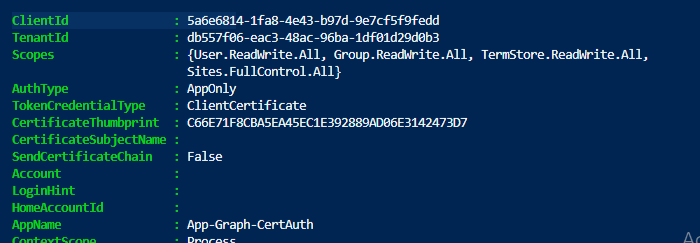

3. Connettersi con **PnP PowerShell**, in app-only con lo stesso certificato:

```powershell
Connect-PnPOnline -Url $AdminSiteUrl -ClientId $AppId -Tenant $TenantId -Thumbprint $Thumbprint
```

4. Connettersi con **SharePoint Online Management Shell** (Connect-SPOService), che supporta anch'esso l'autenticazione app-only con certificato:

```powershell
Connect-SPOService -Url $AdminSiteUrl -ClientId $AppId -TenantId $TenantId -CertificatePath "C:\Cert\cert.pfx"
```

## Script 1 – Cestino di 1° e 2° livello di tutti i OneDrive (PnP + SPO)

1. Prerequisito: su **SEA-DEV3** con **User03** cancellare un documento per metterlo nel cestino di OneDrive.
2. Su **SEA-DEV1** come Administrator creare la cartella **Temp** in:

   ```text
   C:\Temp
   ```

3. Scaricare lo **Script1.ps1** presente in:

   ```text
   Modulo4\Scripts
   ```

4. Aprire il file su **Visual Studio Code**.
5. Eseguire lo script su **Power Shell**.

```powershell

> [!TIP]
> Su tenant con molti OneDrive lo script può impiegare parecchio tempo e incorrere in **throttling** (HTTP 429). Per report su larga scala valutare **Microsoft Graph Data Connect** o i report di utilizzo.
>
> [Evitare il throttling in SharePoint Online](https://learn.microsoft.com/sharepoint/dev/general-development/how-to-avoid-getting-throttled-or-blocked-in-sharepoint-online)
# Report OneDrive: storage in MB, cestini in KB
# Requisiti: Microsoft.Online.SharePoint.PowerShell + PnP.PowerShell
# Connessione app-only gia' eseguita. Riusa $AppId, $TenantId, $Thumbprint.

$OutputCsv = "C:\Temp\Report_Cestini_OneDrive.csv"

$oneDriveSites = Get-SPOSite -IncludePersonalSite $true -Limit All -Filter "Url -like '-my.sharepoint.com/personal/'"

$report = foreach ($site in $oneDriveSites) {

    $s = Get-SPOSite -Identity $site.Url

    Connect-PnPOnline -Url $s.Url -ClientId $AppId -Tenant $TenantId -Thumbprint $Thumbprint

    $l1 = Get-PnPRecycleBinItem -FirstStage -RowLimit 500000 -ErrorAction SilentlyContinue
    $l2 = Get-PnPRecycleBinItem -SecondStage -RowLimit 500000 -ErrorAction SilentlyContinue

    # Size in BYTE: cast a [long] prima di sommare
    $l1Bytes = ($l1 | ForEach-Object { [long]$_.Size } | Measure-Object -Sum).Sum
    $l2Bytes = ($l2 | ForEach-Object { [long]$_.Size } | Measure-Object -Sum).Sum
    if (-not $l1Bytes) { $l1Bytes = 0 }
    if (-not $l2Bytes) { $l2Bytes = 0 }

    [PSCustomObject]@{
        OneDriveUrl        = $s.Url
        StorageTotaleMB    = "{0:N2}" -f $s.StorageQuota
        StorageUsatoMB     = "{0:N2}" -f $s.StorageUsageCurrent
        CestinoLivello1KB  = "{0:N2}" -f ($l1Bytes / 1KB)
        CestinoLivello2KB  = "{0:N2}" -f ($l2Bytes / 1KB)
    }
}

$report | Format-Table -AutoSize
$report | Export-Csv -Path $OutputCsv -NoTypeInformation -Encoding UTF8
```

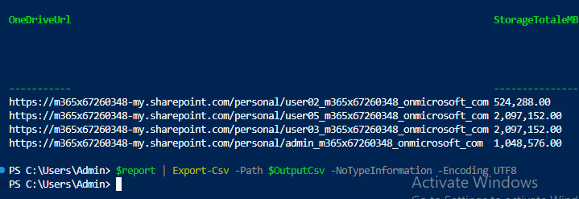

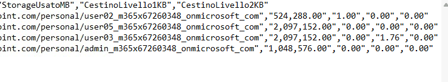

## Script 2 – Report permessi dei siti (con sottositi), adattato da PnP Script Samples

1. Scaricare **Script2.ps1** presente in:

   ```text
   Modulo4\Scripts
   ```

2. Aprire lo Script su **Visual Studio Code**.
3. Sostituire il **tenant_name** con il proprio tenant del lab.
4. Eseguire lo Script sul **Power Shell**.

```powershell

> [!NOTE]
> Lo script è adattato dai [PnP Script Samples](https://pnp.github.io/script-samples/): i campioni della community non hanno supporto ufficiale Microsoft, verificarli sempre in un tenant di test.
# Richiede il modulo: PnP.PowerShell
# Login con app registration Full Control (Sites.FullControl.All)
# Riutilizza $AppId, $TenantId, $Thumbprint

$TenantAdminUrl = "https://tenant_name-admin.sharepoint.com"
$OutputCsv      = "C:\Temp\Report_Permessi_Tenant.csv"

$permessi = @()

function Get-PermessiWeb($web) {
    Get-PnPProperty -ClientObject $web -Property HasUniqueRoleAssignments, RoleAssignments, Url, Title | Out-Null
    $permessiUnivoci = $web.HasUniqueRoleAssignments

    foreach ($assegnazione in $web.RoleAssignments) {
        Get-PnPProperty -ClientObject $assegnazione -Property RoleDefinitionBindings, Member | Out-Null

        $livelli = $assegnazione.RoleDefinitionBindings | Where-Object { $_.Name -ne "Limited Access" } | Select-Object -ExpandProperty Name
        if (-not $livelli -or $livelli.Count -eq 0) { continue }

        $tipoPrincipal = $assegnazione.Member.PrincipalType

        if ($tipoPrincipal -eq "SharePointGroup") {
            try {
                $membriGruppo = Get-PnPGroupMember -Identity $assegnazione.Member.LoginName -ErrorAction Stop
            } catch { $membriGruppo = @() }

            foreach ($utente in $membriGruppo) {
                $script:permessi += [PSCustomObject]@{ SitoUrl = $web.Url; SitoTitolo = $web.Title; Utente = $utente.Title; TipoPrincipal = $tipoPrincipal; LivelloPermesso = ($livelli -join ","); Gruppo = $assegnazione.Member.Title; PermessiUnivoci = $permessiUnivoci }
            }
        } else {
            $script:permessi += [PSCustomObject]@{ SitoUrl = $web.Url; SitoTitolo = $web.Title; Utente = $assegnazione.Member.Title; TipoPrincipal = $tipoPrincipal; LivelloPermesso = ($livelli -join ","); Gruppo = "Permesso diretto"; PermessiUnivoci = $permessiUnivoci }
        }
    }
}

# 1) Connessione admin ed enumerazione di TUTTI i siti
Connect-PnPOnline -Url $TenantAdminUrl -ClientId $AppId -Tenant $TenantId -Thumbprint $Thumbprint
$siti = Get-PnPTenantSite | Where-Object { $_.Template -notin @("SRCHCEN#0","SPSMSITEHOST#0") }
Write-Host "Trovati $($siti.Count) siti da analizzare." -ForegroundColor Cyan

# 2) Ciclo su ogni sito + sottositi
foreach ($sito in $siti) {
    Write-Host "Analizzo: $($sito.Url)" -ForegroundColor Yellow
    try {
        Connect-PnPOnline -Url $sito.Url -ClientId $AppId -Tenant $TenantId -Thumbprint $Thumbprint -ErrorAction Stop

        $webPrincipale = Get-PnPWeb -Includes RoleAssignments
        Get-PermessiWeb $webPrincipale

        $sottositi = Get-PnPSubWeb -Recurse -ErrorAction SilentlyContinue
        foreach ($sottosito in $sottositi) {
            Connect-PnPOnline -Url $sottosito.Url -ClientId $AppId -Tenant $TenantId -Thumbprint $Thumbprint
            Get-PermessiWeb $sottosito
        }
    }
    catch {
        Write-Warning "Impossibile analizzare $($sito.Url): $($_.Exception.Message)"
    }
}

# 3) Export finale
$permessi | Export-Csv -Path $OutputCsv -NoTypeInformation -Encoding UTF8
```

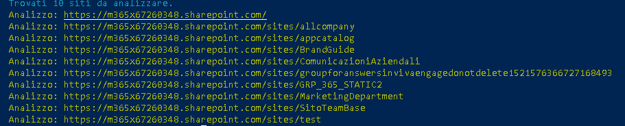

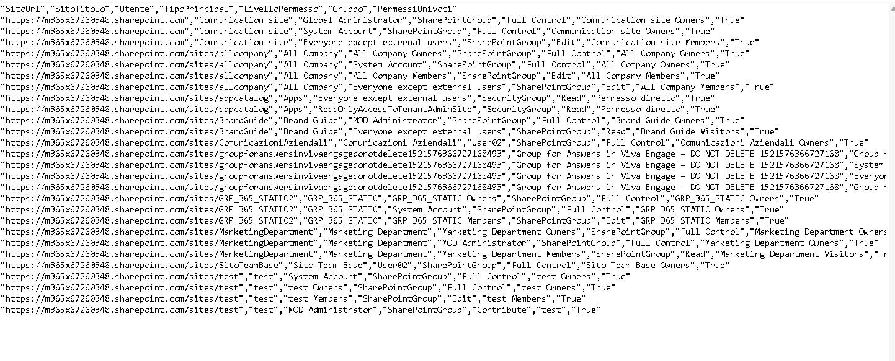

## Script 3 – Elenco utenti guest in tutti i siti del tenant

Per questo script è necessario avere almeno un **Guest** in un sito SharePoint.

1. Aprire su **SEA-DEV2** il sito SharePoint **Marketing Department**.
2. Premere su **Settings** in alto a destra.

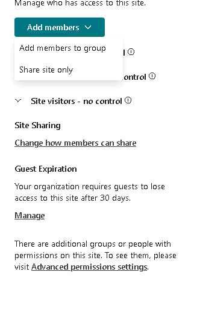

3. **Site Permissions -> Add members -> Add members to group** e invitare un account personale.

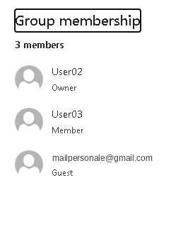

4. Tornare su **SEA-DEV1** come **Administrator**.
5. Scaricare **Script3.ps1** presente in:

   ```text
   Modulo4\Scripts
   ```

6. Aprire il file su **Visual Studio Code.**
7. Eseguire lo Script sul **Power Shell.**

```powershell
# Richiede il modulo: PnP.PowerShell
# Login con app registration Full Control + Graph (GroupMember.Read.All / Directory.Read.All)
# Riutilizza $AppId, $TenantId, $Thumbprint, $AdminSiteUrl

Connect-PnPOnline -Url $AdminSiteUrl -ClientId $AppId -Tenant $TenantId -Thumbprint $Thumbprint

$guestReport = @()

# FONTE 1 - Guest membri dei gruppi Microsoft 365 (siti Teams-connected)
$gruppi = Get-PnPMicrosoft365Group
Write-Host "Gruppi M365 da analizzare: $($gruppi.Count)" -ForegroundColor Cyan

foreach ($g in $gruppi) {
    $membri = Get-PnPMicrosoft365GroupMember -Identity $g.Id -ErrorAction SilentlyContinue
    foreach ($m in $membri) {
        if ($m.UserType -eq "Guest" -or $m.UserPrincipalName -like "*#EXT#*") {
            $guestReport += [PSCustomObject]@{
                SitoUrl    = $g.SiteUrl
                SitoTitolo = $g.DisplayName
                NomeGuest  = $m.DisplayName
                EmailGuest = $m.Email
                Origine    = "Gruppo M365"
                LoginName  = $m.UserPrincipalName
            }
        }
    }
}

# FONTE 2 - Guest con permessi diretti / gruppi SP su OGNI sito del tenant
# (copre communication site, siti classici, permessi rotti, ecc.)

$siti = Get-PnPTenantSite | Where-Object { $_.Template -notlike "SPSPERS*" }
Write-Host "Siti da analizzare: $($siti.Count)" -ForegroundColor Cyan

foreach ($sito in $siti) {
    Write-Host "Analizzo: $($sito.Url)" -ForegroundColor Yellow
    try {
        Connect-PnPOnline -Url $sito.Url -ClientId $AppId -Tenant $TenantId -Thumbprint $Thumbprint -ErrorAction Stop

        $guestSito = Get-PnPUser | Where-Object { $_.LoginName -like "*#ext#*" -or $_.LoginName -like "*urn:spo:guest*" }
        foreach ($u in $guestSito) {
            $guestReport += [PSCustomObject]@{
                SitoUrl    = $sito.Url
                SitoTitolo = $sito.Title
                NomeGuest  = $u.Title
                EmailGuest = $u.Email
                Origine    = "Permesso sito"
                LoginName  = $u.LoginName
            }
        }
    }
    catch {
        Write-Warning "Errore su $($sito.Url): $($_.Exception.Message)"
    }
}

# Export finale (deduplica per sito + guest)
$guestReport |
    Sort-Object SitoUrl, EmailGuest -Unique |
    Export-Csv -Path "C:\Temp\Report_Guest_Sites.csv" -NoTypeInformation -Encoding UTF8

Write-Host "Trovati $($guestReport.Count) guest totali." -ForegroundColor Green
```

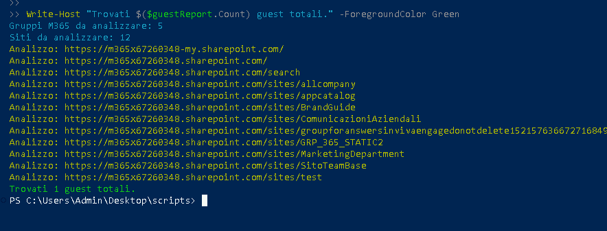

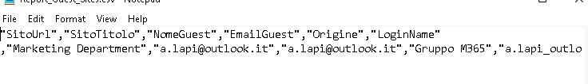

## Script 4 – Audit file nelle librerie documentali

1. Scaricare **Script4.ps1** presente in:

   ```text
   Modulo4\Scripts
   ```

2. Aprire lo Script su **Visual Studio Code**.
3. Sostituire il **tenant_name** con il proprio.
4. Eseguire lo Script sul **Power Shell**.

```powershell
# Richiede il modulo: PnP.PowerShell
# Riutilizza $AppId, $TenantId, $Thumbprint impostate al Passo 1
$SiteUrl = "https://tenant_name.sharepoint.com/sites/MarketingDepartment"

Connect-PnPOnline -Url $SiteUrl -ClientId $AppId -Tenant $TenantId -Thumbprint $Thumbprint

# Seleziona solo le librerie documentali reali (esclude liste di sistema)
$librerie = Get-PnPList -Includes IsSystemList, RootFolder | Where-Object {
    ($_.BaseType -eq "DocumentLibrary" -and $_.IsSystemList -eq $false)
}

$librerie | ForEach-Object {
    Get-PnPListItem -List $_.RootFolder.Name | Where-Object { $_.FieldValues.FSObjType -ne 1 } |
    Select-Object `
        @{n = "Libreria";      e = { $_.ParentList.Title } },
        @{n = "File";          e = { $_.FieldValues.FileRef } },
        @{n = "CreatoDa";      e = { ($_.FieldValues.Created_x0020_By).Split("|")[2] } },
        @{n = "DataCreazione"; e = { $_.FieldValues.Created } },
        @{n = "ModificatoDa";  e = { ($_.FieldValues.Modified_x0020_By).Split("|")[2] } },
        @{n = "DataModifica";  e = { $_.FieldValues.Modified } }
} | Export-Csv -Path "C:\Temp\Report_File_Librerie.csv" -NoTypeInformation -Append -Encoding UTF8

Import-Csv "C:\Temp\Report_File_Librerie.csv" | Format-Table -AutoSize
```

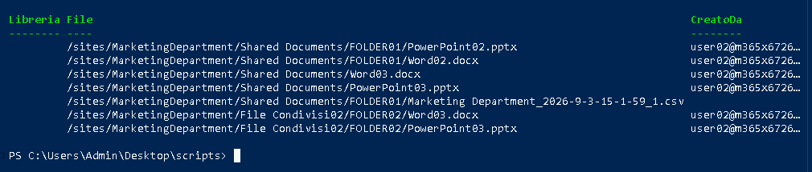

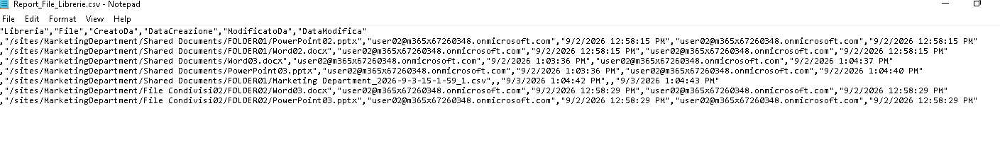

---

[← Esercizio 5](Esercizio-05.md) · [Indice modulo →](README.md)
