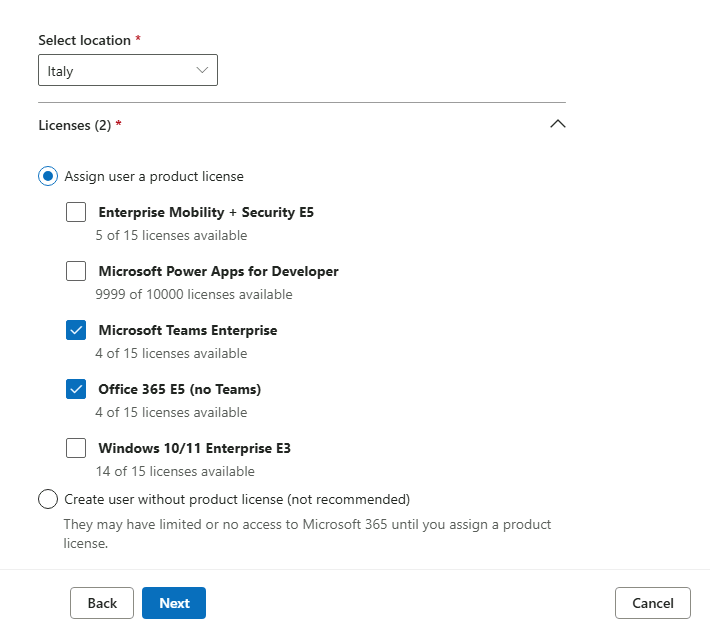
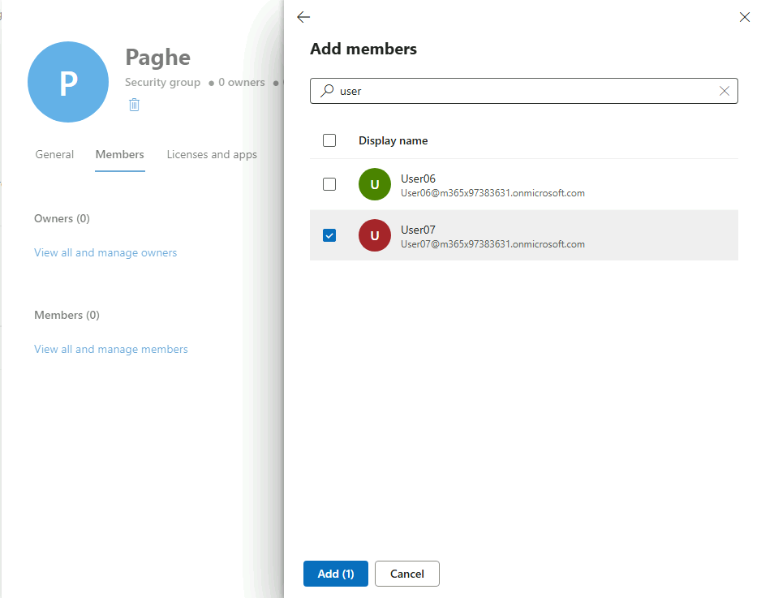
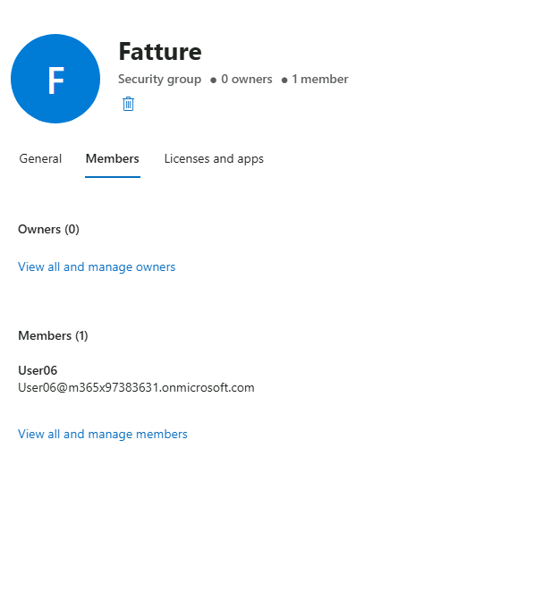
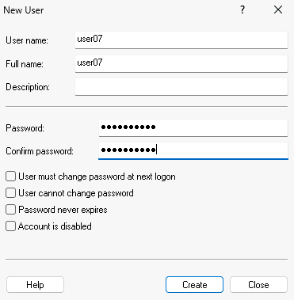
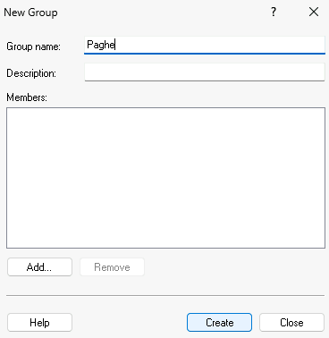
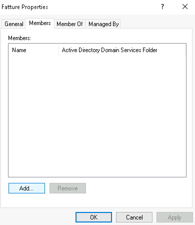
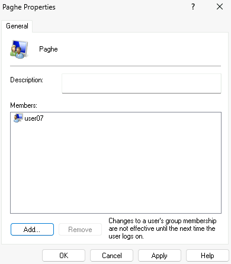

# Modulo 5 · Esercizio 1: Utenti e gruppi (cloud e locali)

[← Indice modulo](README.md) · [Esercizio 2 →](Esercizio-02.md)

> [!NOTE]
> In questo modulo si simula un file server on-premises usando **utenti e gruppi locali** della VM `SEA-DEV1`. Il collegamento con gli utenti cloud omonimi avverrà tramite un **file di mapping utenti** (Esercizio 4).

## Passo 1 · Creazione Utenti e Gruppi su Entra

1. Accedere alla VM `SEA-DEV1` come administrator, con credenziali admin di dominio.

2. Aprire **Microsoft Edge** e andare su https://admin.cloud.microsoft/.
3. Andare su **Users > Active users > Add a user**.
4. Procedere con la creazione di **User06** con le seguenti info e licenze:
   `First Name`: User
   `Last Name`: 06
   `Display name`: User06
   `Username`: User06
   `Select location`: Italy
   `Licenses`: Microsoft Teams Enterprise, Office 365 E5 (no Teams).
5. Togliere la spunta a `Automatically create a password` e a `Require this user to change their password when they first sign in` e impostare `Computergross@!` .

   ```text
   Automatically create a password
   ```

   ```text
   Require this user to change their password when they first sign in
   ```

   ```text
   Computergross@!
   ```

6. Terminare la creazione e annotare l'**UPN**.



7. Andare su **Users > Active users > Add a user**.
8. Procedere con la creazione di **User07** con le seguenti info e licenze:
   `First Name`: User
   `Last Name`: 07
   `Display name`: User07
   `Username`: User07
   `Select location`: Italy
   `Licenses`: Microsoft Teams Enterprise, Office 365 E5 (no Teams).
9. Togliere la spunta a `Automatically create a password` e a `Require this user to change their password when they first sign in` e impostare `Computergross@!` .

   ```text
   Automatically create a password
   ```

   ```text
   Require this user to change their password when they first sign in
   ```

   ```text
   Computergross@!
   ```

10. Terminare la creazione e annotare l'**UPN**.
11. Andare su **Teams & groups > Active teams & groups > Security groups**.
12. Premere **+ Add a security group** e inserire le seguenti informazioni:
   `Name`: Paghe
13. Aprire il gruppo, andare su **Members** e premere **+ Add members**.
14. Selezionare **User07**.



15. Andare su **Teams & groups > Active teams & groups > Security groups**.
16. Premere **+ Add a security group** e inserire le seguenti informazioni:
   `Name`: Fatture
17. Aprire il gruppo, andare su **Members** e premere **+ Add members**.
18. Selezionare **User06**.



## Passo 2 · Creazione degli utenti locali

1. Aprire **Computer Management** e andare su **System Tools > Local Users and Groups > Users**.
2. Premere tasto destro e selezionare **New User**.

### Utente user06

1. Compilare i campi:
    - **User name**:

      ```text
      user06
      ```

    - **Full name**:

      ```text
      user06
      ```

2. Impostare **Password**:

   ```text
   Password0!
   ```

3. **Togliere la spunta** da **User must change password at next logon**.
4. Selezionare **Create**.

### Utente user07

1. Ripetere la procedura: tasto destro su **Users** e selezionare **New User**.
    - **User name**:

      ```text
      user07
      ```

    - **Full name**:

      ```text
      user07
      ```

2. **Password**: `Password0!`, con la stessa spunta **User must change password at next logon** rimossa.

   ```text
   Password0!
   ```

3. Selezionare **Create**.



## Passo 3 · Creazione dei gruppi locali

1. Aprire **Computer Management** e andare su **System Tools > Local Users and Groups > Groups**.

### Gruppo Fatture

1. Premere tasto destro e selezionare **New Group**.
2. **Group name**:

   ```text
   Fatture
   ```

3. Selezionare **Create**.

### Gruppo Paghe

1. Ripetere la procedura: **New Group**, **Group name**: `Paghe`, impostazioni base predefinite.

   ```text
   Paghe
   ```

2. Selezionare **Create**.



## Passo 4 · Aggiunta degli utenti ai gruppi

1. Fare doppio clic sul gruppo **Fatture** per aprirne le proprietà.
2. Selezionare la scheda **Members**, poi **Add...**.



3. Digitare **`user06`**, selezionare **Check Names** e confermare con **OK**.
4. Selezionare **OK** per chiudere le proprietà del gruppo.


5. Fare doppio clic sul gruppo **Paghe** per aprirne le proprietà.
6. Selezionare la scheda **Members**, poi **Add...**.
7. Digitare **`user07`**, selezionare **Check Names** e confermare con **OK**.



8. Selezionare **OK** per chiudere le proprietà del gruppo.

---

[← Indice modulo](README.md) · [Esercizio 2 →](Esercizio-02.md)
