# Modulo 5 – Esercizio 2: Preparazione del file server

[← Esercizio 1](Esercizio-01.md) · [Indice modulo](README.md) · [Esercizio 3 →](Esercizio-03.md)

## Passo 1 · Creazione della struttura di cartelle

**Accedere alla VM `SEA-DEV1` come administrator, con credenziali admin**

1. Aprire **Esplora file** e accedere all'unità **C:\**.
2. Creare una nuova cartella chiamata:

   ```text
   Fileserver
   ```

3. All'interno di **`Fileserver`**, incollare le due sottocartelle:
- **`Amministrazione`**
- **`HomeUsers`**

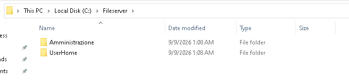

4. Aprire la cartella **Amministrazione** e assicurarsi che al suo interno siano presenti tre sottocartelle:
- **`Fatture`**
- **`Paghe`**
- **`Generale`**

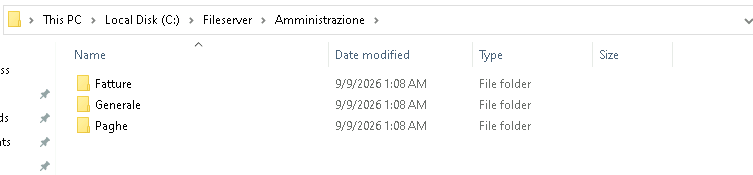

5. Aprire la cartella **HomeUsers** e verificare la presenza al suo interno della sottocartella:
- **`user06`**

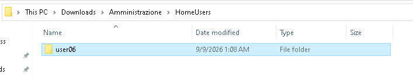

## Passo 2 · Condivisione e permessi della cartella user06

1. Selezionare la cartella **`user06`** (dentro `HomeUsers`), tasto destro **> Properties**.

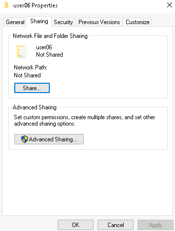

2. Selezionare la scheda **Sharing**, poi **Share**.

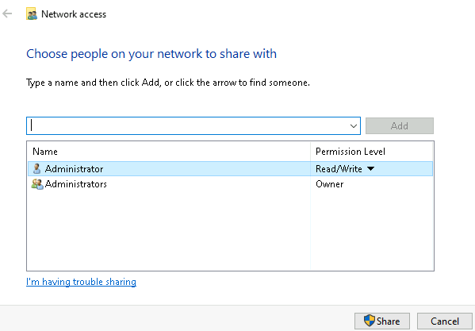

3. Aggiungere l'utente **`user06`** con permesso **Read/Write**.

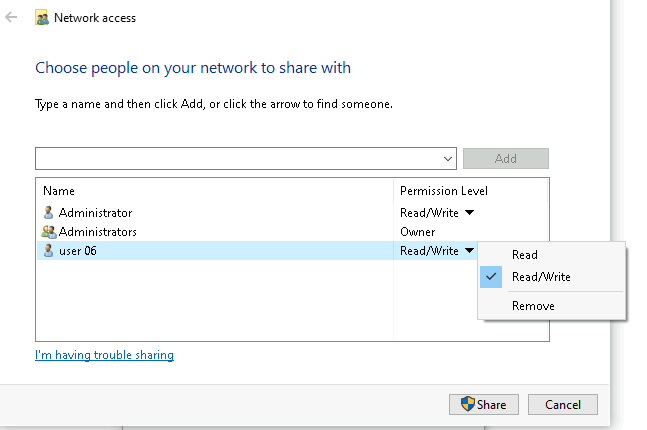

4. Selezionare **Share** per confermare la condivisione.
5. Tornare alle **Properties** della cartella, selezionare la scheda **Security**.
6. Selezionare **Advanced**.

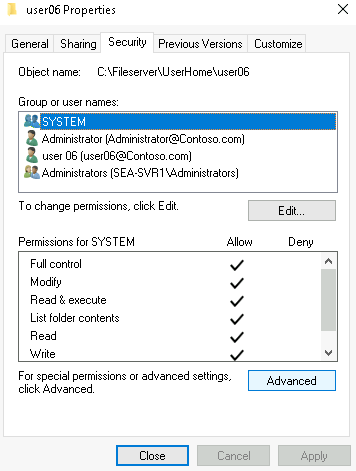

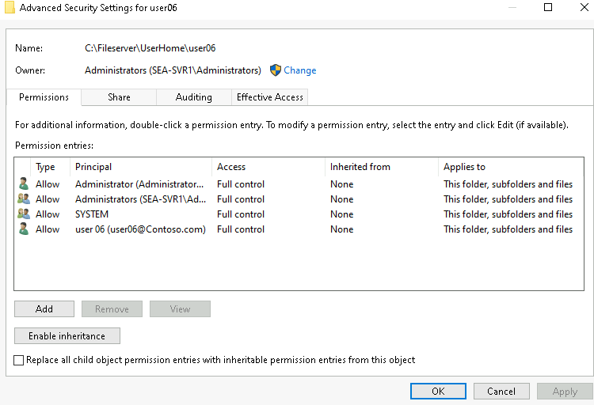

7. Selezionare **Add** per aggiungere un nuovo permesso.
8. Selezionare **Select a principal** (in alto), cercare e selezionare l'utente **`user06`**.

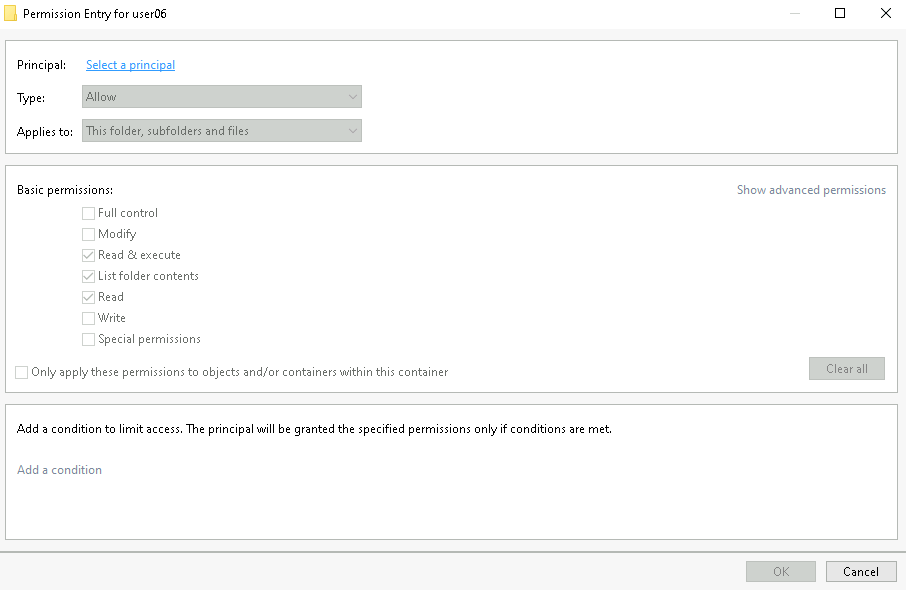

9. Impostare il permesso su **Full control**.

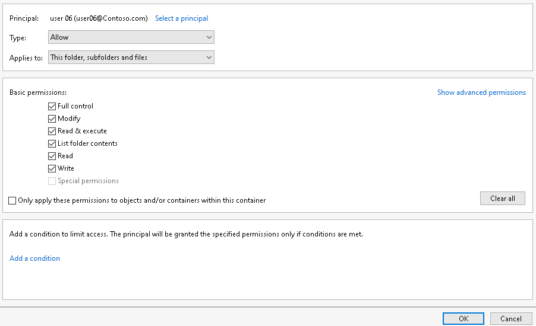

10. Selezionare **OK**, poi nuovamente **OK** per chiudere la finestra avanzata di sicurezza.

> [!NOTE]
> Migration Manager migra tre tipi di permesso del file system: **Read** → *Read*, **Write** → *Contribute*, **Full control** → *Full Control*. I permessi speciali (es. **Deny**) **non vengono migrati**.
>
> [Permessi di file e cartelle durante la migrazione](https://learn.microsoft.com/sharepointmigration/understanding-permissions-when-migrating)

## Passo 3 · Condivisione e permessi della cartella Fatture

1. Selezionare la cartella **`Fatture`** (dentro `Amministrazione`), tasto destro **> Properties**.
2. Selezionare la scheda **Sharing**, poi condividere la cartella.
3. Aggiungere il gruppo **`Fatture`** con permesso **Read/Write**.
4. Selezionare **Share** per confermare.

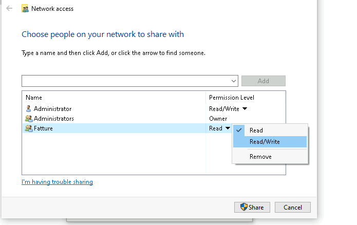

5. Tornare alle **Properties**, scheda **Security > Advanced**.
6. Selezionare **Add > Select a principal**, cercare e selezionare il gruppo **`Fatture`**.
7. Impostare il permesso su **Full control**.
8. Selezionare **OK**, poi nuovamente **OK**.

## Passo 4 · Condivisione e permessi della cartella Paghe

1. Selezionare la cartella **`Paghe`** (dentro `Amministrazione`), tasto destro **> Properties**.
2. Selezionare la scheda **Sharing**, poi condividere la cartella.
3. Aggiungere il gruppo **`Paghe`** con permesso **Read/Write**.

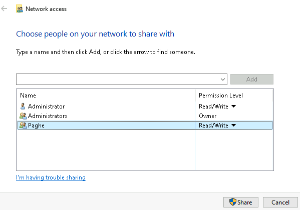

4. Selezionare **Share** per confermare.
5. Tornare alle **Properties**, scheda **Security > Advanced**.
6. Selezionare **Add > Select a principal**, cercare e selezionare il gruppo **`Paghe`**.
7. Impostare il permesso su **Full control**.

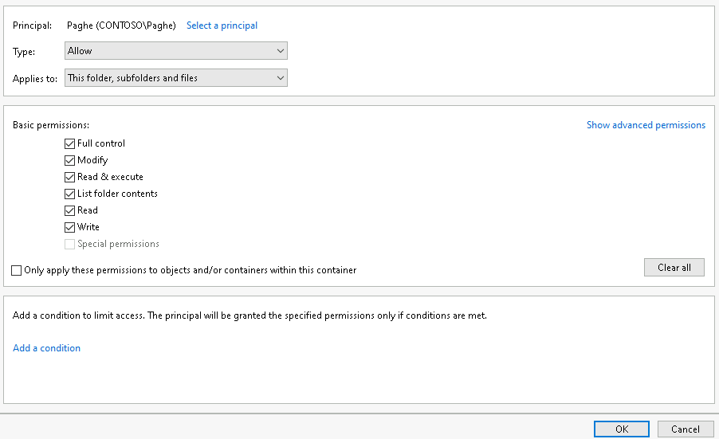

8. Selezionare **OK**, poi nuovamente **OK**.

## Passo 5 · Condivisione e permessi della cartella Generale

1. Selezionare la cartella **`Generale`** (dentro `Amministrazione`), tasto destro **> Properties**.

2. Selezionare la scheda **Sharing**, poi condividere la cartella.

3. Aggiungere il gruppo **`Fatture`** e **`Paghe`** con permesso **Read/Write**.

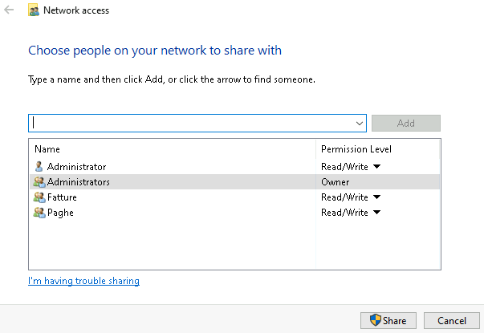

4. Selezionare **Share** per confermare.
5. Tornare alle **Properties**, scheda **Security > Advanced**.
6. Selezionare **Disable inheritance**, poi **Remove all inherited permissions from this object**.
7. Selezionare **Add > Select a principal**, cercare e selezionare il gruppo **`Fatture`**.
8. Impostare il permesso su **Full control**.

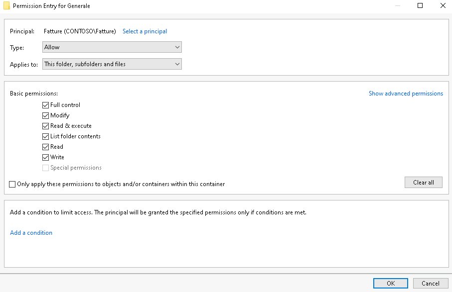

9. Selezionare **OK** per chiudere questa prima voce di permesso.
10. Selezionare nuovamente **Add > Select a principal**, cercare e selezionare il gruppo **`Paghe`**.
9. Impostare il permesso su **Full control**.

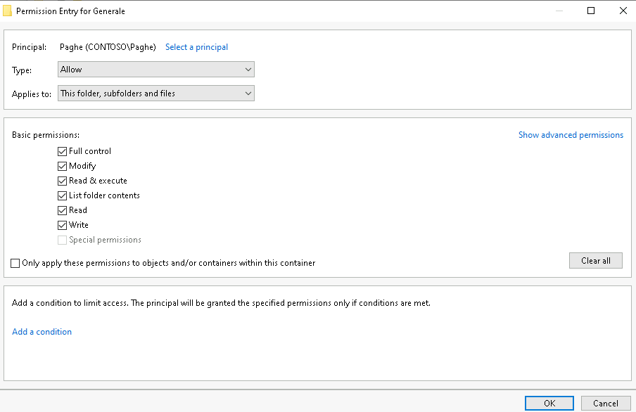

12. Selezionare **OK**, poi nuovamente **OK** per chiudere la finestra avanzata.

## Passo 6 · Copia dei file del materiale del corso

1. Aprire la cartella del materiale del corso **Modulo5/Data/**.
2. Copiare il contenuto secondo questa corrispondenza (se non già presente nelle cartelle):

| Origine (materiale del corso)           | Destinazione                            |
| --------------------------------------- | --------------------------------------- |
| `Modulo5/Data/Amministrazione/Fatture`  | `C:\Fileserver\Amministrazione\Fatture`  |
| `Modulo5/Data/Amministrazione/Paghe`    | `C:\Fileserver\Amministrazione\Paghe`    |
| `Modulo5/Data/Amministrazione/Generale` | `C:\Fileserver\Amministrazione\Generale` |
| `Modulo5/Data/HomeUsers/User06/`        | `C:\Fileserver\HomeUsers\user06`          |

---

[← Esercizio 1](Esercizio-01.md) · [Indice modulo](README.md) · [Esercizio 3 →](Esercizio-03.md)
