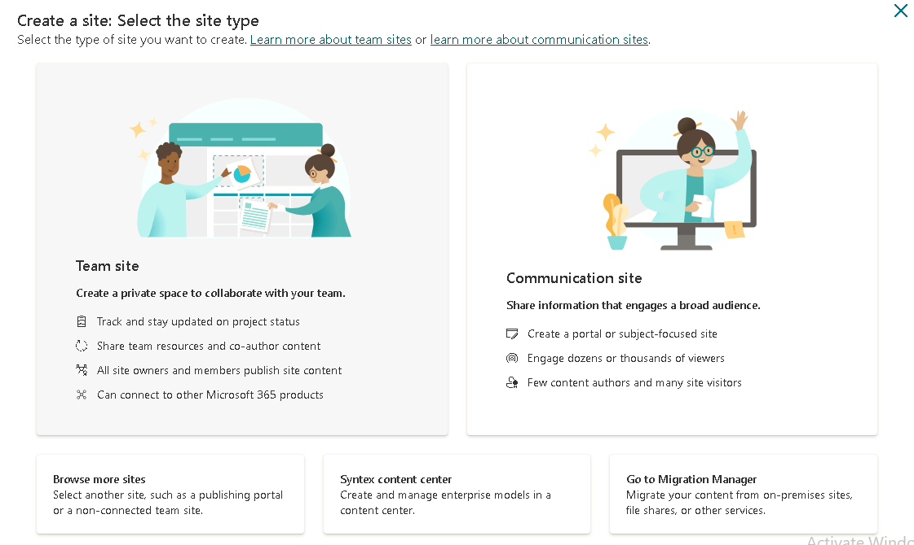
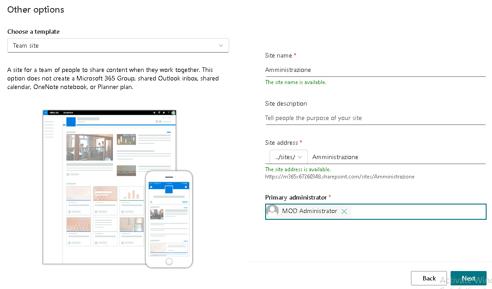
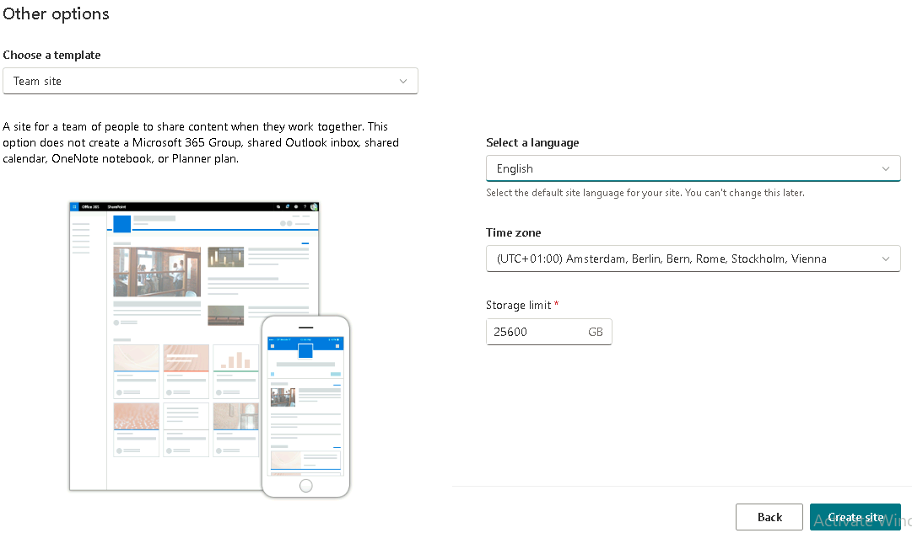
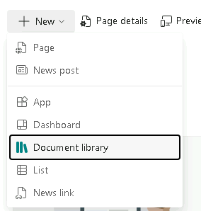
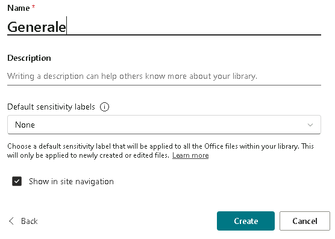
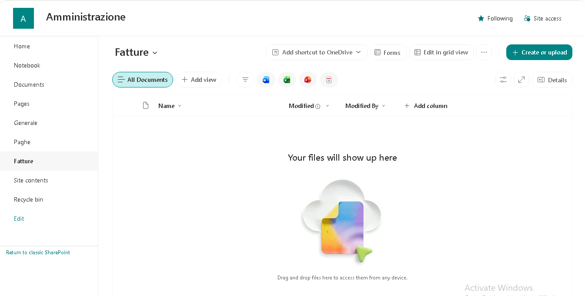
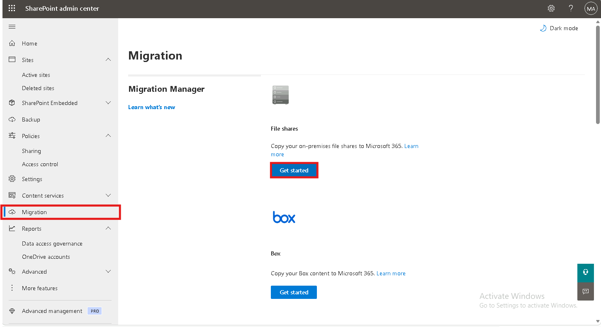
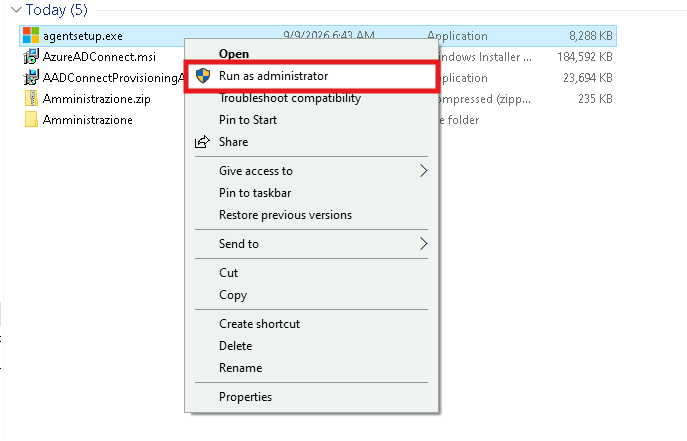
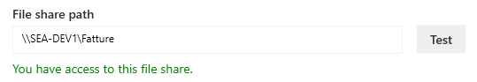
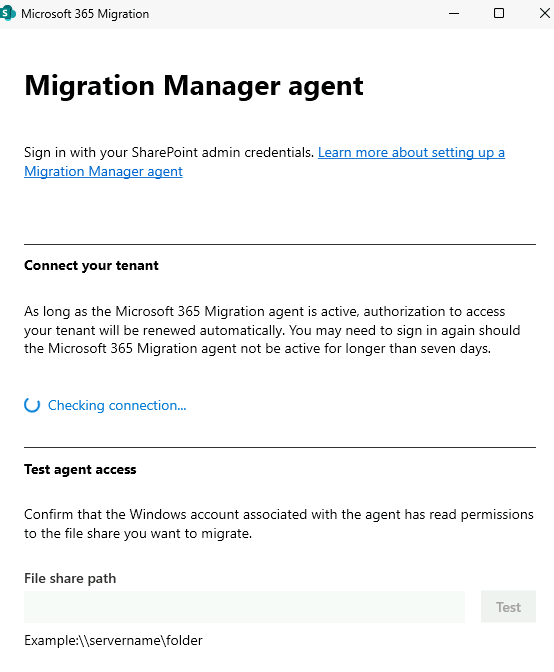

# Modulo 5 – Esercizio 3: Sito di destinazione e Migration Manager agent

[← Esercizio 2](Esercizio-02.md) · [Indice modulo](README.md) · [Esercizio 4 →](Esercizio-04.md)

## Passo 1 – Creazione del sito Amministrazione

**Accedere alla VM `SEA-DEV1` come administrator, con credenziali admin del tenant**

1. Aprire il browser e accedere come **amministratore del tenant Microsoft 365** a:

   ```text
   https://admin.microsoft.com
   ```

2. Aprire **Show all > Admin centers > SharePoint**.
3. Andare su **Sites > Active sites > Create**.



4. Selezionare **Browse more sites**, quindi scegliere l'opzione **Team site** (ovvero il Teams site senza gruppo 365)
5. Compilare i campi:
- **Site name**:

  ```text
  Amministrazione
  ```

- **Site address**: lasciare il valore proposto di default.
6. Durante la fase di **provisioning**, nel campo relativo all'amministratore del sito, impostare **admin** (l'account amministratore del tenant) come **Primary administrator**.



7. Come **Time Zone** impostare UTC+01:00.



8. Selezionare **Create Site** per completare la creazione.

## Passo 2 – Creazione delle document library

1. Accedere al sito **Amministrazione** appena creato.
2. Nella home del sito, selezionare **+ New > Document library > Blank library**.



3. Creare la libreria **`Generale`** e selezionare **Create**.

   ```text
   Generale
   ```



4. Ripetere la procedura per creare la libreria:

   ```text
   Paghe
   ```

5. Ripetere nuovamente la procedura per creare la libreria:

   ```text
   Fatture
   ```



## Passo 3 – Installazione del Migration Agent

1. Tornare su `SEA-DEV1` e aprire lo **SharePoint Admin Center**, andare su **Migration > File share**.
2. Selezionare **Get started**.



3. Seguire la procedura guidata per **scaricare l'agent di migrazione** (Migration Manager agent).
4. Sul server dove verrà eseguita la migrazione, eseguire il pacchetto scaricato con **Esegui come amministratore**.



5. Seguire gli step della procedura di installazione guidata:
   - Login con l'account amministratore del tenant (sostituire `TENANT` con il proprio):

     ```text
     admin@TENANT.onmicrosoft.com
     ```

   - Login con la password di Administrator.
   - Selezionare il path della file share per testare.



6. Completare l'installazione.



> [!IMPORTANT]
> Prerequisiti dell'agent: Windows Server 2016+/Windows 10+ a 64 bit, .NET Framework 4.6.2+, accesso agli **endpoint** Microsoft richiesti e account Windows con **lettura** sulle condivisioni sorgente. Il server sorgente deve supportare **SMB 2.0** o superiore. Per migrare serve essere **Global** o **SharePoint Administrator**.
>
> [Prerequisiti di Migration Manager](https://learn.microsoft.com/sharepointmigration/mm-prerequisites) · [Panoramica migrazione file share](https://learn.microsoft.com/sharepointmigration/mm-get-started)

---

[← Esercizio 2](Esercizio-02.md) · [Indice modulo](README.md) · [Esercizio 4 →](Esercizio-04.md)
