# Modulo 5 · Esercizio 4: Migrazione e verifica dei permessi

[← Esercizio 3](Esercizio-03.md) · [Indice modulo →](README.md)

## Passo 1 · Scansione dei percorsi sorgente

**Accesso alla VM `SEA-DEV1` come administrator, con credenziali admin del tenant**

1. Aprire il browser e accedere come **amministratore del tenant Microsoft 365** a:

   ```text
   https://admin.microsoft.com
   ```

2. Aprire **Show all > Admin centers > SharePoint**.
3. Andare su **Migration > File share > View task**.
4. Nella sezione **Scan**, selezionare **Add source path** come spiegato:

5. Selezionare **Specify a single source path**, inserire `\\SEA-DEV1\Fatture` , togliere il flag a **Add all folders as source paths** e lasciare il resto default e premere add

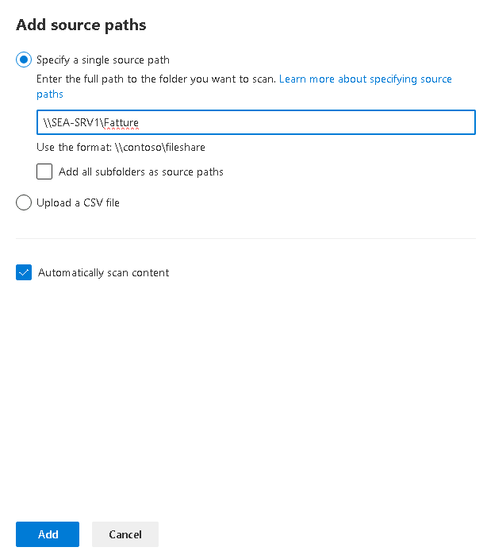

6. Ripetere per i seguenti path:
-:

  ```text
  \\SEA-DEV1\Generale
  ```

-:

  ```text
  \\SEA-DEV1\Paghe
  ```

-:

  ```text
  \\SEA-DEV1\user06
  ```

## Passo 2 · Migrazione della cartella Fatture verso SharePoint

1. Sempre su **Migration > File share > View task**, nella sezione **Scan** individuare l'elemento **`\\SEA-DEV1\Fatture`**.
2. Selezionare l'elemento e, dal menu, scegliere **Copy to migrations**.

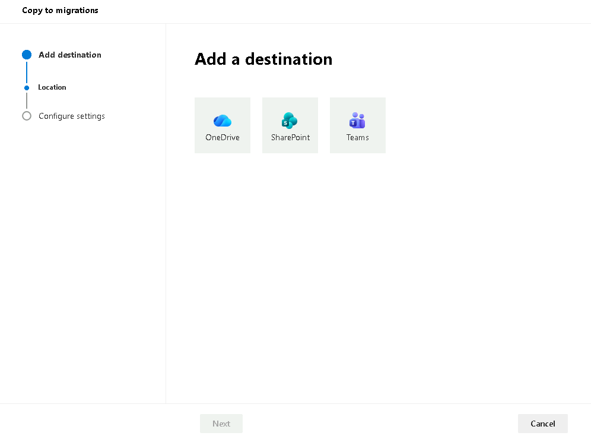

3. Selezionare **SharePoint** come destinazione.
4. Inserire lo **SharePoint site**: `https://tenant_name.sharepoint.com/sites/Amministrazione` (dove `tenant_name` è il nome del proprio tenant).

   ```text
   https://tenant_name.sharepoint.com/sites/Amministrazione
   ```

5. Nella sezione **Select the location you want to copy your content**, selezionare la libreria **`Fatture`**.
6. Selezionare **Next**.

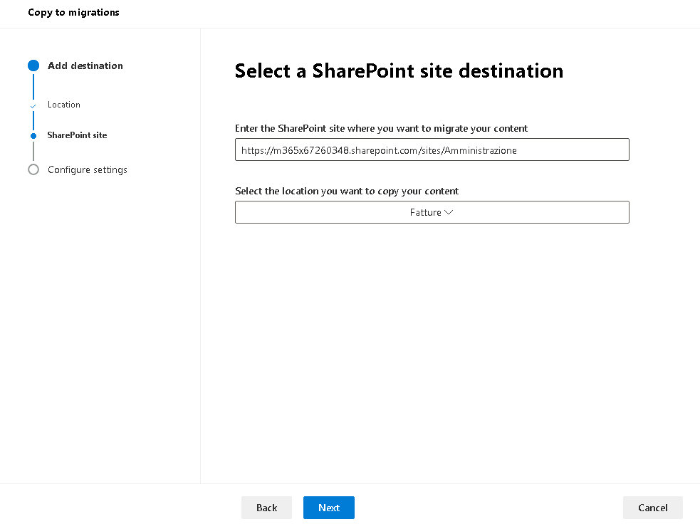

7. Compilare i campi del task:
- **Task name**:

  ```text
  Migrazione Fatture da FS on prem a Document Library [Fatture]
  ```

8. Selezionare **Preserve file share permission**.
9. Aprire **All settings** e, sotto **Users**, togliere la spunta a **Microsoft Entra ID lookup**.

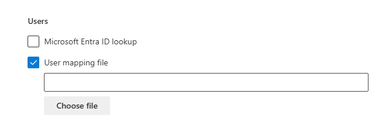

10. Mettere la spunta a **User mapping file** e caricare il CSV presente in:

  ```text
  Modulo5\Data\Migration.csv
  ```

11. Lasciare il resto delle opzioni sui valori predefiniti.
12. Selezionare **Run**.

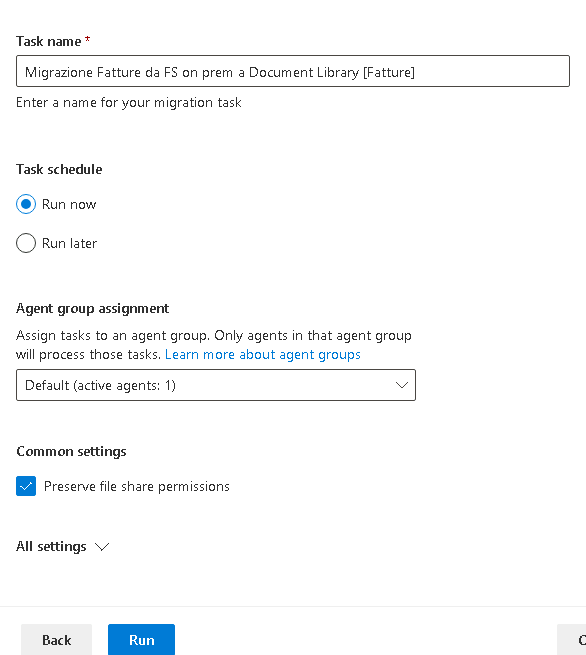

> [!IMPORTANT]
> Formato del file di mapping (CSV **senza riga di intestazione**): colonna A login sorgente (`DOMINIO\utente`), colonna B UPN di destinazione, colonna C `TRUE` se la destinazione è un gruppo AD/Entra, altrimenti `FALSE`. Per preservare i permessi con un mapping personalizzato disattivare **Microsoft Entra ID lookup**.
>
> [Creare un file di mapping utenti](https://learn.microsoft.com/sharepointmigration/mm-user-mapping-file) · [Impostazioni di Migration Manager](https://learn.microsoft.com/sharepointmigration/mm-settings)

## Passo 3 · Migrazione della cartella Paghe verso SharePoint

1. Tornare su **Migration > File share > View task**, sezione **Scan**, individuare l'elemento **`\\SEA-DEV1\Paghe`**.
2. Selezionare l'elemento e scegliere **Copy to migrations**.
3. Selezionare **SharePoint** come destinazione.
4. Inserire lo **SharePoint site**:

   ```text
   https://tenant_name.sharepoint.com/sites/Amministrazione
   ```

5. Nella sezione **Select the location you want to copy your content**, selezionare la libreria **`Paghe`**
6. Selezionare **Next**.

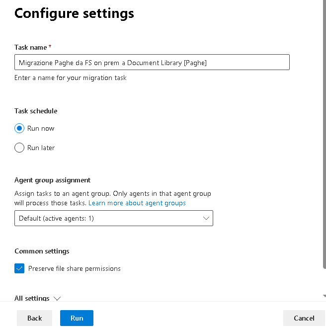

7. Compilare i campi del task:
- **Task name**:

  ```text
  Migrazione Paghe da FS on prem a Document Library [Paghe]
  ```

8. Selezionare **Preserve file share permission**.
9. Aprire **All settings** e, sotto **Users**, togliere la spunta a **Microsoft Entra ID lookup**.


10. Mettere la spunta a **User mapping file** e caricare il CSV presente in:

  ```text
  Modulo5\Data\Migration.csv
  ```

11. Lasciare il resto delle opzioni sui valori predefiniti.
12. Selezionare **Run**.

## Passo 4 · Migrazione della cartella Generale verso SharePoint

1. Tornare su **Migration > File share > View task**, sezione **Scan**, individuare l'elemento **`\\SEA-DEV1\Generale`**.
2. Selezionare l'elemento e scegliere **Copy to migrations**.
3. Selezionare **SharePoint** come destinazione.
4. Inserire lo **SharePoint site**:

   ```text
   https://tenant_name.sharepoint.com/sites/Amministrazione
   ```

5. Nella sezione **Select the location you want to copy your content**, selezionare la libreria **`Generale`**.
6. Selezionare **Next**.

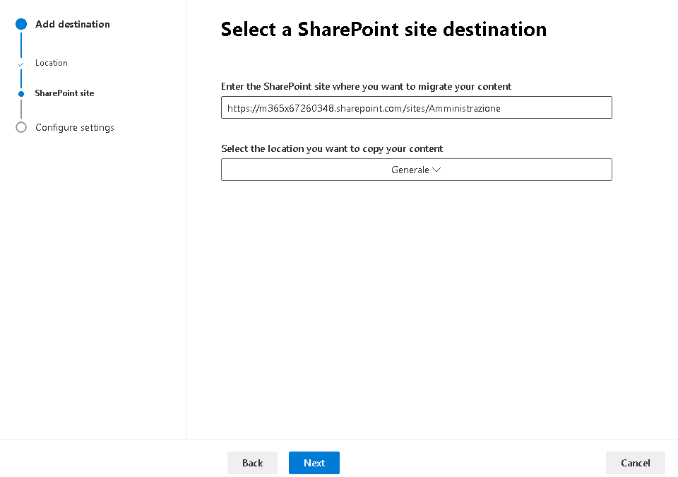

7. Compilare i campi del task:
- **Task name**:

  ```text
  Migrazione Generale da FS on prem a Document Library [Generale]
  ```

8. Selezionare **Preserve file share permission**.
9. Aprire **All settings** e, sotto **Users**, togliere la spunta a **Microsoft Entra ID lookup**.


10. Mettere la spunta a **User mapping file** e caricare il CSV presente in:

  ```text
  Modulo5\Data\Migration.csv
  ```

11. Lasciare il resto delle opzioni sui valori predefiniti.
12. Selezionare **Run**.

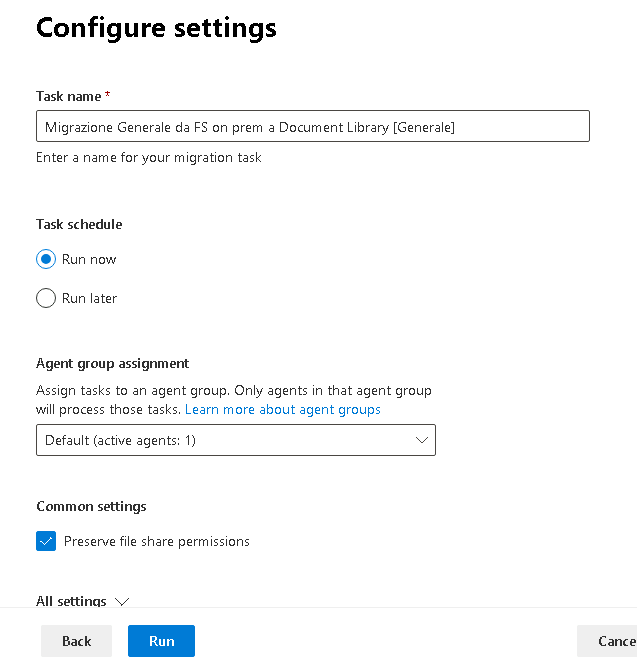

## Passo 5 · Migrazione della cartella user06 verso OneDrive

1. Tornare su **Migration > File share > View task**, sezione **Scan**, individuare l'elemento **`\\SEA-DEV1\user06`**.
2. Selezionare l'elemento e scegliere **Copy to migrations**.
3. Selezionare **OneDrive** come destinazione.

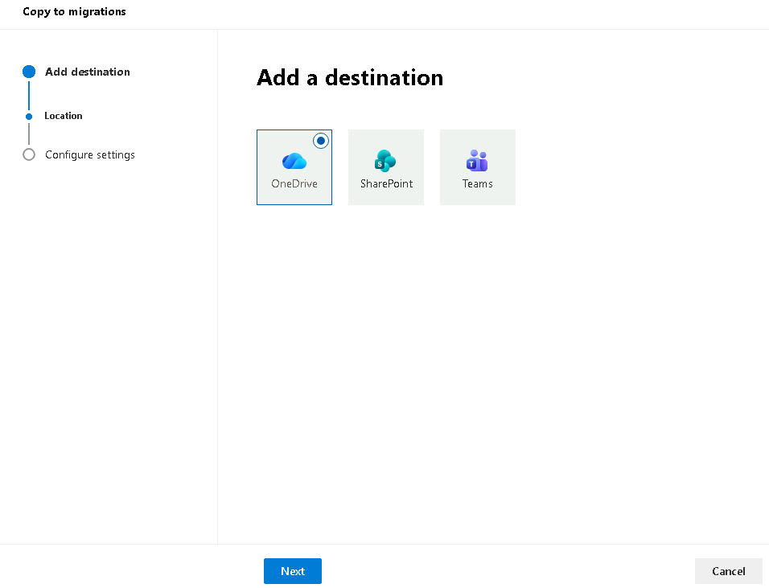

4. Prima di poter inserire l'indirizzo, è necessario **recuperare l'URL del OneDrive di user06** dall'Admin Center:

5. Aprire una nuova scheda su `https://admin.microsoft.com > Users > Active users`.
6. Selezionare **user06**, aprire la scheda **OneDrive**.
7. Selezionare **Create link to files** per ottenere/copiare l'URL del OneDrive personale di `user06` (nel formato `https://tenant_name-my.sharepoint.com/personal/user06_tenant_name_onmicrosoft_com`).

  ```text
  https://tenant_name-my.sharepoint.com/personal/user06_tenant_name_onmicrosoft_com
  ```

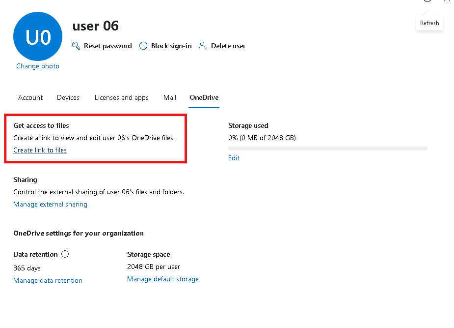

8. Tornare alla schermata di migrazione e incollare l'URL del OneDrive di **user06** appena recuperato.

9. Nella sezione **Select the location you want to copy your content**, selezionare la cartella **`Documents`**.

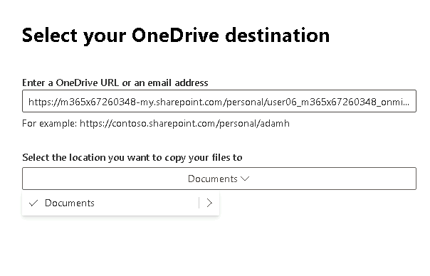

10. Selezionare **Next**.
11. Compilare i campi del task:
    - **Task name**:

      ```text
      Migrazione user06 dati da FS on prem a OneDrive
      ```

    - **Non** selezionare **Preserve file share permission** (a differenza dei task precedenti verso SharePoint).
    - Lasciare il resto delle opzioni sui valori predefiniti.
12. Selezionare **Run**.

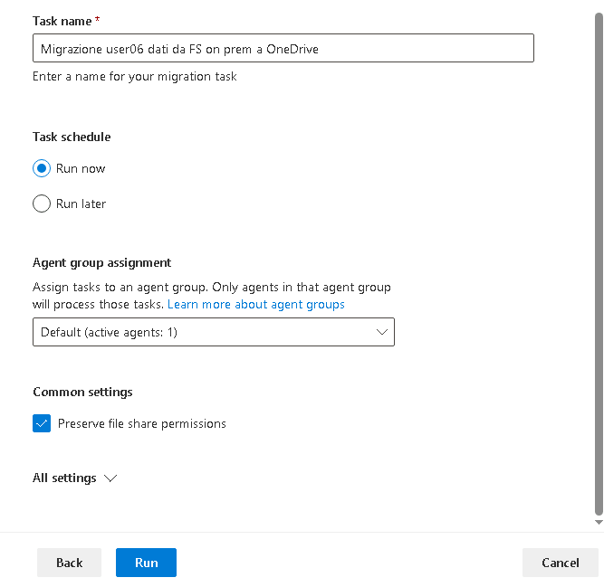

> [!WARNING]
> Il OneDrive di destinazione deve essere **già provisionato** (l'utente deve avervi acceduto almeno una volta, oppure va pre-provisionato con `Request-SPOPersonalSite`), altrimenti il task fallisce.
>
> [Pre-provisioning di OneDrive](https://learn.microsoft.com/sharepoint/pre-provision-accounts)

## Passo 6 · Monitoraggio dell'avanzamento

1. Su **Migrations > File share**, selezionare la scheda **Migration**.
2. Osservare l'avanzamento dei quattro task creati (**Fatture**, **Paghe**, **Generale**, **user06**).
3. Attendere che tutti i task risultino completati, indicati da un **pallino verde** accanto a ciascuno.

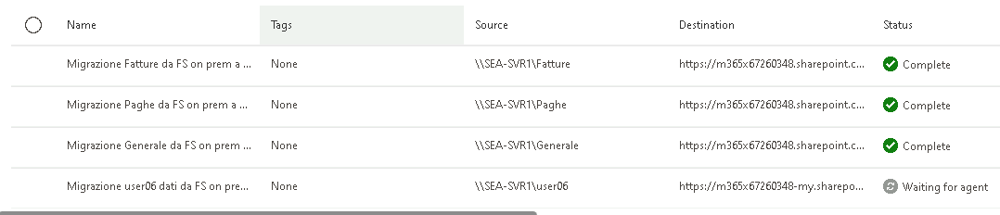

> [!TIP]
> Per ogni task è possibile scaricare il **report** (riepilogo, errori, elementi migrati) per analizzare eventuali file saltati.
>
> [Risolvere i problemi di Migration Manager](https://learn.microsoft.com/sharepointmigration/mm-troubleshoot)

## Passo 7 · Verifica lato user06

1. Aprire una finestra del browser in **modalità anonima/InPrivate**.
2. Accedere a `https://myapps.microsoft.com` con le credenziali di **`user06@TENANT.onmicrosoft.com`**, con password `Computergross@!`.

   ```text
   https://myapps.microsoft.com
   ```

   ```text
   user06@TENANT.onmicrosoft.com
   ```

   ```text
   Computergross@!
   ```

3. Se richiesto, completare il setup della **MFA**.
4. Lanciare l'app **OneDrive** e verificare che i file migrati dal file server (dalla cartella `user06`) siano effettivamente presenti.

   ```text
   user06
   ```

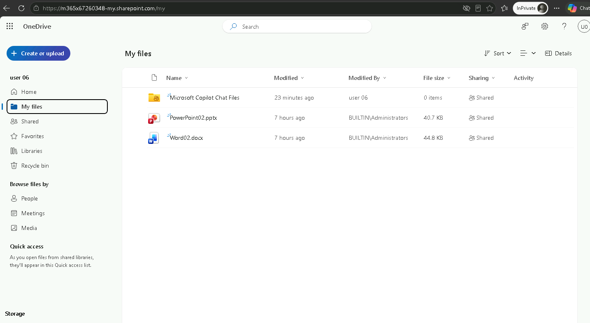

5. Eseguire i seguenti test aprendo l'URL del sito in nuove schede del browser:

**TEST 1** `https://tenant_name.sharepoint.com/sites/Amministrazione/` → **Dà errore** (accesso negato). Questo è il comportamento atteso: i permessi sono stati assegnati alle **singole document library**, non all'intero sito.

```text
https://tenant_name.sharepoint.com/sites/Amministrazione/
```

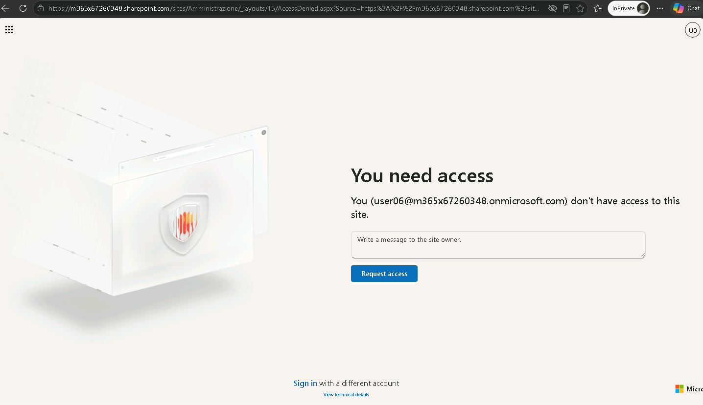

**TEST 2** `https://tenant_name.sharepoint.com/sites/Amministrazione/Generale` → **Fa entrare** (accesso consentito, tramite il gruppo Fatture di cui user06 è membro).

```text
https://tenant_name.sharepoint.com/sites/Amministrazione/Generale
```

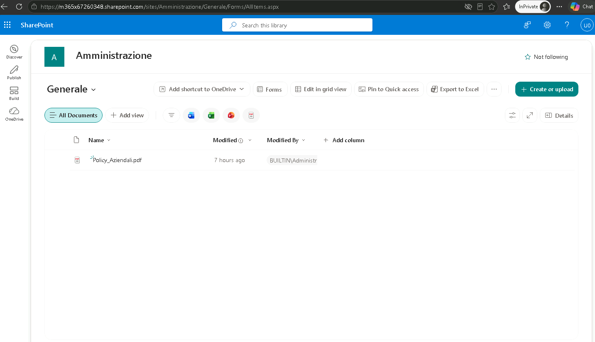

**TEST 3** `https://tenant_name.sharepoint.com/sites/Amministrazione/Fatture` → **Fa entrare** (accesso consentito: user06 appartiene al gruppo Fatture).

```text
https://tenant_name.sharepoint.com/sites/Amministrazione/Fatture
```

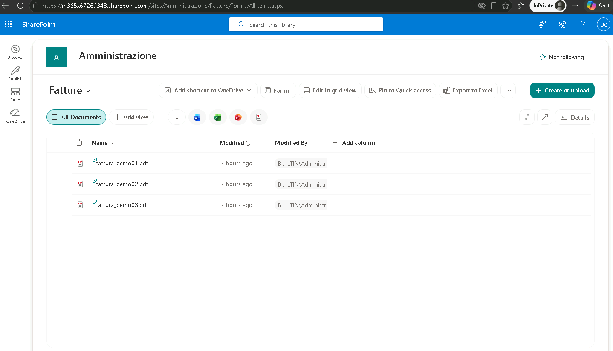

**TEST 4** `https://tenant_name.sharepoint.com/sites/Amministrazione/Paghe` → **Mostra una pagina vuota (blank), senza possibilità di eseguire azioni** (user06 non appartiene al gruppo Paghe, quindi non ha permessi su questa libreria).

```text
https://tenant_name.sharepoint.com/sites/Amministrazione/Paghe
```


6. Al termine dei test, effettuare **Sign out** e chiudere il browser.

## Passo 8 · Verifica lato user07

1. Aprire una nuova finestra del browser in **modalità anonima/InPrivate**.
2. Accedere a `https://myapps.microsoft.com` con le credenziali di **`user07@tenant_name.onmicrosoft.com`**, con password `Computergross@!`.

   ```text
   https://myapps.microsoft.com
   ```

   ```text
   user07@tenant_name.onmicrosoft.com
   ```

   ```text
   Computergross@!
   ```

3. Se richiesto, completare il setup della **MFA**.

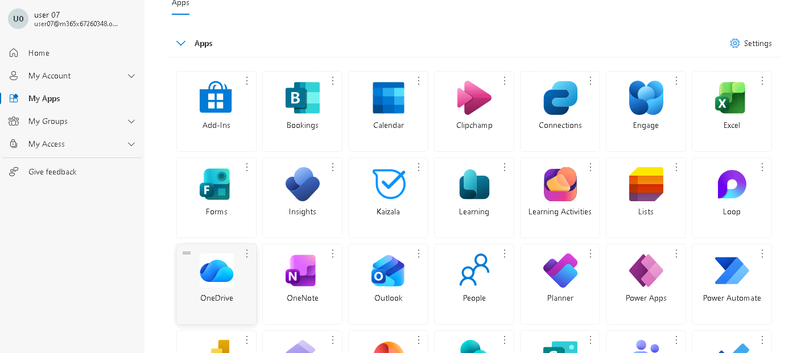

4. Eseguire gli stessi test del Passo 7, aprendo l'URL del sito in nuove schede:

**TEST 1** `https://tenant_name.sharepoint.com/sites/Amministrazione/` → **Dà errore** (stesso motivo del Passo 7: permessi assegnati alle library, non al sito).

```text
https://tenant_name.sharepoint.com/sites/Amministrazione/
```

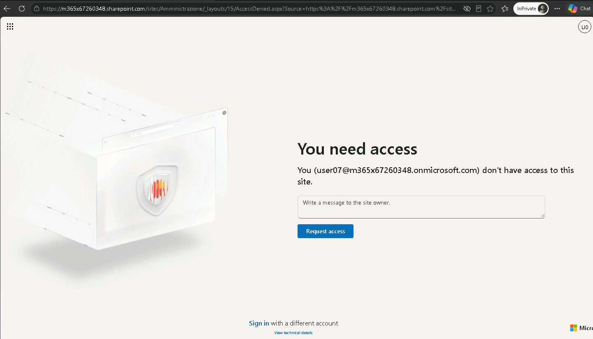

**TEST 2** `https://tenant_name.sharepoint.com/sites/Amministrazione/Generale` → **Fa entrare** (accesso consentito, tramite il gruppo Paghe di cui user07 è membro).

```text
https://tenant_name.sharepoint.com/sites/Amministrazione/Generale
```

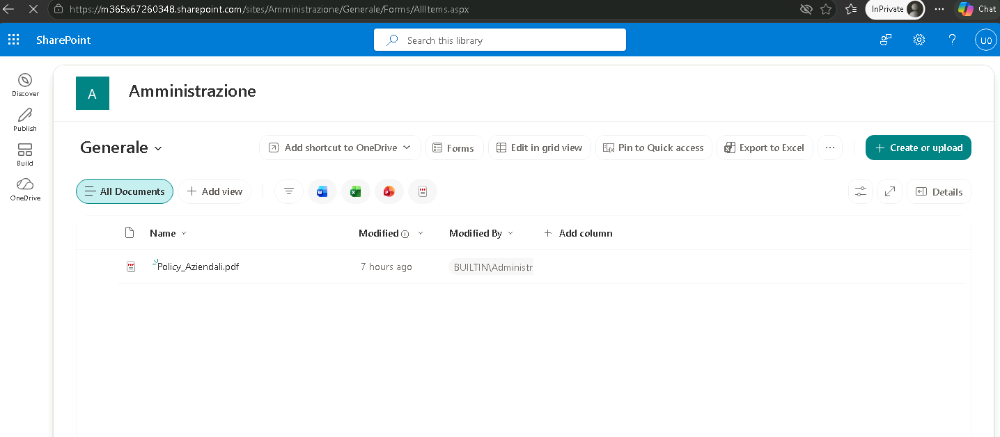

**TEST 3** `https://tenant_name.sharepoint.com/sites/Amministrazione/Paghe` → **Fa entrare** (accesso consentito: user07 appartiene al gruppo Paghe).

```text
https://tenant_name.sharepoint.com/sites/Amministrazione/Paghe
```

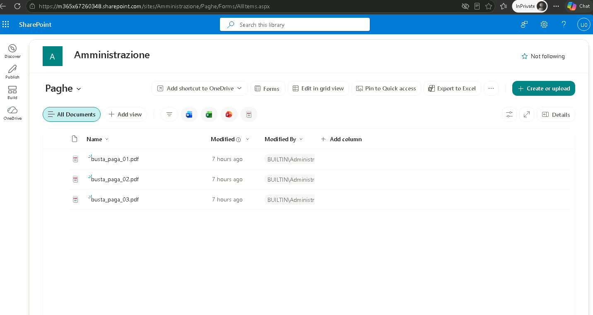

**TEST 4** `https://tenant_name.sharepoint.com/sites/Amministrazione/Fatture` → **Mostra una pagina vuota (blank), senza possibilità di eseguire azioni** (user07 non appartiene al gruppo Fatture).

```text
https://tenant_name.sharepoint.com/sites/Amministrazione/Fatture
```

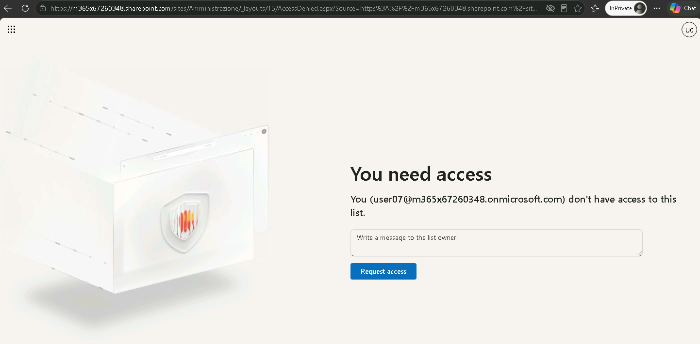

5. Al termine dei test, effettuare **Sign out** e chiudere il browser.

---

[← Esercizio 3](Esercizio-03.md) · [Indice modulo →](README.md)
